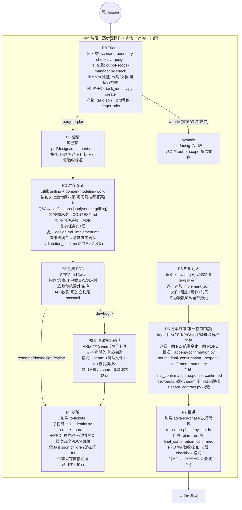
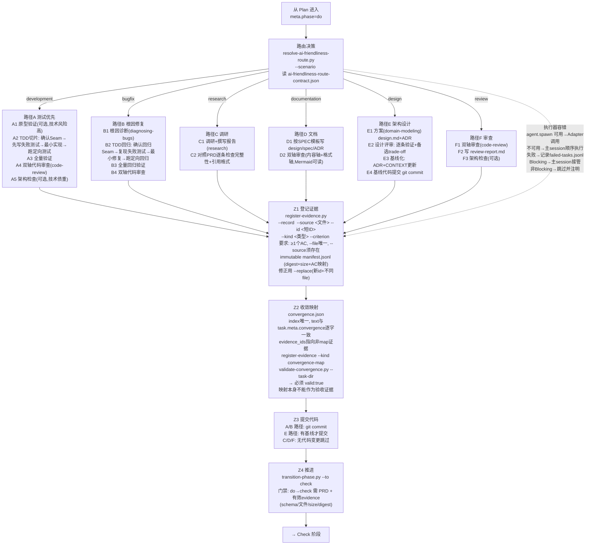
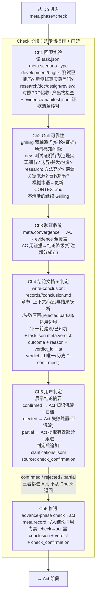
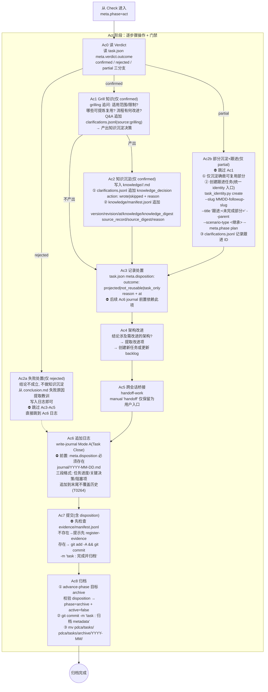

# PDCA 工作流细节图集（v2 详细版）

本图集分四张阶段细节图展开 PDCA 全流程的操作级细节，每张图以
「动作 → 门禁 → 产物」为粒度。总览图见 `docs/pdca-workflow-full.md`。

## 图 0：五阶段总览（产物视角）

```mermaid
flowchart TD
    START((需求/想法)) --> P0["P0 Triage"]
    subgraph PL["Plan"]
        direction TB
        P0["P0 Triage<br/>task.json + triager-brief + prd 骨架"]
        P1["P1 澄清<br/>问题/目标/AC"]
        P2["P2 对齐 Grill<br/>clarifications.jsonl<br/>CONTEXT.md / ADR"]
        P3["P3 合成 PRD<br/>prd.md (SPEC 模板)"]
        P4["P4 拆解<br/>子 task.json (parent/children)"]
        P5["P5 知识注入<br/>implement.jsonl"]
        P6["P6 方案终审<br/>final_confirmation"]
        P7["P7 推进<br/>plan→do"]
        P0-->P1-->P2-->P3-->P4-->P5-->P6-->P7
    end
    subgraph DO2["Do"]
        direction TB
        D0["路径选择 A-F"]
        D1["Z1 register-evidence<br/>evidence/manifest.jsonl"]
        D2["Z2 convergence-map<br/>convergence.json"]
        D3["Z3 git commit (A/B/E)"]
        D4["Z4 推进 do→check"]
        D0-->D1-->D2-->D3-->D4
    end
    subgraph CK["Check"]
        direction TB
        C1["Ch1 回顾实验"]
        C2["Ch2 Grill 可靠性"]
        C3["Ch3 验证收敛"]
        C4["Ch4 conclusion.md + verdict"]
        C5["Ch5 用户判定"]
        C6["Ch6 推进 check→act"]
        C1-->C2-->C3-->C4-->C5-->C6
    end
    subgraph AC2["Act"]
        direction TB
        A0["Ac0 读 Verdict 分支"]
        A1["Ac1 Grill 知识 (confirmed)"]
        A2["Ac2 知识沉淀"]
        A3["Ac3 disposition"]
        A6["Ac6 journal"]
        A7["Ac7 git commit"]
        A8["Ac8 归档 archive/"]
        A0-->A1-->A2-->A3-->A6-->A7-->A8
    end
    P7-->D0
    D4-->C1
    C6-->A0
    A8-->END((归档完成))
```

> 图例：每阶段矩形节点右侧箭头指向下一阶段。详细操作见后续图 1-4。
## 图 1：Plan 阶段操作级细节（flow-plan）

> 图例：`→|"标签"|` 为分支；青色节点为门禁。执行器边界：**P6 前禁止
> agent.spawn 调度，P6 后才可用**；能力不可用由主 session 顺序执行。

## 图 2：Do 阶段操作级细节（flow-do）

> 图例：6 条路径最后汇聚到 Z1-Z4 通用收尾。执行器容错为 Do 阶段全程通用机制。
> Do 退出口：假设不成立/发现新信息 → 回 Plan 重新设计（meta.phase=plan）。

## 图 3：Check 阶段操作级细节（flow-check）

> 图例：Ch1 按场景走不同检查清单；Ch5 三分支判定后**一律进入 Act**，
> 仅处置方式不同（沉淀/失败处置/部分跟进），不存在 Check 回退路径。

## 图 4：Act 阶段操作级细节（flow-act）

> 图例：`⛔` 标记跳过/前置门禁。rejected 直达 Ac6（跳过 Ac3/4/5）；
> partial 跳过 Ac1 但走完整 Ac3-Ac8；confirmed 走全链。
