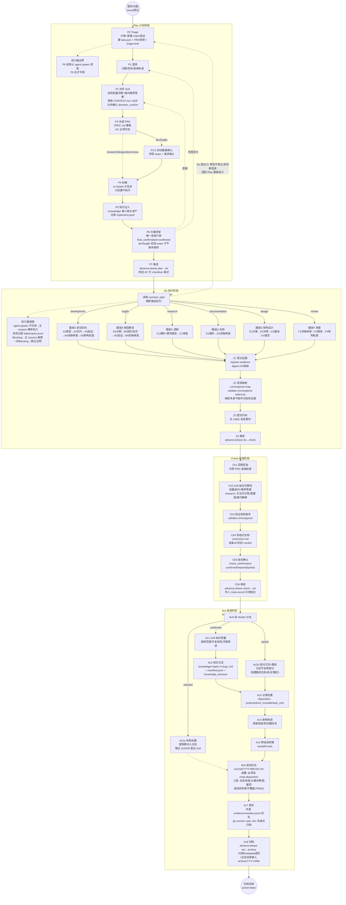

# PDCA 工作流全景图（所有阶段细节）

本图汇总 Plan → Do → Check → Act → Archive 五阶段全流程，每个阶段的子步骤、
门禁、产物与关键脚本。渲染源：`docs/pdca-workflow-full.mmd`。

```mermaid
flowchart TD
    START((需求/问题<br/>issue/想法)) --> P0

    subgraph P["Plan 计划阶段<br/>flow-plan"]
        P0["P0 Triage<br/>分类+查重+claim验证<br/>建 task.json + PRD骨架 + triage-brief"]
        PB["执行器边界<br/>P6 前禁止 agent.spawn 调度<br/>P6 后才可用"]
        P0 -.-> PB
        P0 --> P1["P1 澄清<br/>问题/目标/验收标准"]
        P1 --> P2["P2 对齐 Grill<br/>逐轮批量决策+每问推荐答案<br/>更新 CONTEXT.md / ADR<br/>方向确认 direction_confirm"]
        P2 --> P3["P3 合成 PRD<br/>SPEC.md 模板<br/>AC 必须可测"]
        P3 -->|"dev/bugfix"| P35["P3.5 测试接缝确认<br/>声明 seam + 请求确认"]
        P3 -.->|"research/design/doc/review"| P4
        P35 --> P4["P4 拆解<br/>to-tickets 子任务<br/>只创建不执行"]
        P4 --> P5["P5 知识注入<br/>knowledge/ 最小相关资产<br/>记录 implement.jsonl"]
        P5 --> P6["P6 方案终审<br/>唯一签审门禁<br/>final_confirmation=confirmed<br/>dev/bugfix 校验 seam 子节缺失即拒"]
        P6 -.->|"遗漏"| P2
        P6 -.->|"范围变化"| P1
        P6 --> P7["P7 推进<br/>advance-phase plan→do<br/>校验 AC 为 checkbox 格式"]
    end

    P7 --> D0

    subgraph D["Do 执行阶段<br/>flow-do"]
        D0["读取 scenario_type<br/>解析路由合约"]
        DB2["执行器容错<br/>agent.spawn 不可用→主 session 顺序执行<br/>失败记录 failed-tasks.jsonl<br/>Blocking→主 session 接管 / 非Blocking→跳过注明"]
        D0 -.-> DB2
        D0 -.->|"Do 退出口: 假设不成立/发现新信息<br/>回到 Plan 重新设计"| P0
        D0 -->|"development"| DA["路径A 测试优先<br/>A1原型→A2切片→A3验证<br/>→A4双轴审查→A5架构检查"]
        D0 -->|"bugfix"| DB["路径B 根因修复<br/>B1诊断→B2回归测试<br/>→B3验证→B4双轴审查"]
        D0 -->|"research"| DC["路径C 调研<br/>C1调研+撰写报告→C2审查"]
        D0 -->|"documentation"| DD["路径D 文档<br/>D1编写→D2双轴审查"]
        D0 -->|"design"| DE["路径E 架构设计<br/>E1方案→E2评审→E3基线→E4提交"]
        D0 -->|"review"| DF["路径F 审查<br/>F1双轴审查→F2报告→F3架构检查"]
        DA --> Z1
        DB --> Z1
        DC --> Z1
        DD --> Z1
        DE --> Z1
        DF --> Z1
        Z1["Z1 登记证据<br/>register-evidence<br/>digest+AC映射"]
        Z1 --> Z2["Z2 收敛映射<br/>convergence-map<br/>validate-convergence valid:true<br/>映射本身不能作为验收证据"]
        Z2 --> Z3["Z3 提交代码<br/>仅 A/B/E 有变更时"]
        Z3 --> Z4["Z4 推进<br/>advance-phase do→check"]
    end

    Z4 --> C0

    subgraph CH["Check 检查阶段<br/>flow-check"]
        C0["Ch1 回顾实验<br/>对照 PRD 逐条检查"]
        C0 --> C1["Ch2 Grill 结论可靠性<br/>批量追问+推荐答案<br/>research: 方法充分性/遗漏源/替代解释"]
        C1 --> C2["Ch3 验证收敛条件<br/>validate-convergence"]
        C2 --> C3["Ch4 写结论文档<br/>conclusion.md<br/>逐条AC判定+verdict"]
        C3 --> C4["Ch5 结论确认<br/>check_confirmation<br/>confirmed/rejected/partial"]
        C4 --> C5["Ch6 推进<br/>advance-phase check→act<br/>写入 meta.record 引用结论"]
    end

    C5 --> A0

    subgraph AC["Act 改进阶段<br/>flow-act"]
        A0["Ac0 读 Verdict 分支"]
        A0 -->|"confirmed"| A1["Ac1 Grill 知识质量<br/>适用范围/可复用性/流程改进"]
        A1 --> A2["Ac2 知识沉淀<br/>knowledge/&lt;topic&gt;/&lt;slug&gt;.md<br/>+ manifest.jsonl + knowledge_decision"]
        A0 -->|"rejected"| A2A["Ac2a 失败处置<br/>提取教训入日志<br/>跳过 Ac3/4/5 直达 Ac6"]
        A0 -->|"partial"| A2B["Ac2b 部分沉淀+跟进<br/>沉淀可复用部分<br/>创建跟进任务(标注'跟进')"]
        A2 --> A3["Ac3 记录处置<br/>disposition: projected/not_reusable/task_only"]
        A2A -.-> A6
        A2B --> A3
        A3 --> A4["Ac4 架构改进<br/>提取改进项/创建任务"]
        A4 --> A5["Ac5 跨会话桥接<br/>handoff-work"]
        A5 --> A6["Ac6 追加日志<br/>journal/YYYY-MM-DD.md<br/>前置: 必须有 meta.disposition<br/>三段: 任务进度/关键决策/阻塞项<br/>追加到末尾不覆盖(T0264)"]
        A6 --> A7["Ac7 提交<br/>先查 evidence/manifest.jsonl 存在<br/>git commit: task &lt;id&gt; 完成并归档"]
        A7 --> A8["Ac8 归档<br/>advance-phase act→archive<br/>+归档metadata提交<br/>+任务目录移入 archive/YYYY-MM/"]
    end

    A8 --> END((归档完成<br/>active=false))
```