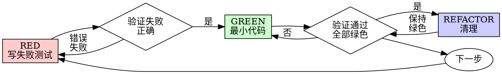

# Superpowers 技能分析报告

> **分析日期：** 2026-09-16
> **分析目标：** 分析 superpowers 技能中可以借鉴到 PDCA 项目的实践
> **数据来源：** https://github.com/obra/superpowers

---

## 目录

1. [Superpowers 技能概览](#1-superpowers-技能概览)
2. [核心技能分析](#2-核心技能分析)
3. [可借鉴的核心实践](#3-可借鉴的核心实践)
4. [具体实现建议](#4-具体实现建议)
5. [文件扩展建议](#5-文件扩展建议)

---

## 1. Superpowers 技能概览

Superpowers 是一个完整的软件开发方法论，包含 14 个技能：

| 技能 | 核心原则 | 可借鉴点 |
|------|---------|---------|
| **brainstorming** | 在创意工作前探索用户意图和需求 | 头脑风暴流程 |
| **dispatching-parallel-agents** | 一个代理一个问题域，并行分派 | 并行代理分派 |
| **executing-plans** | 加载计划，批判性审查，执行所有任务 | 计划执行流程 |
| **finishing-a-development-branch** | 验证测试 → 检测环境 → 呈现选项 → 执行选择 | 分支完成流程 |
| **receiving-code-review** | 验证后再实现，先问后假设 | 代码审查接收 |
| **requesting-code-review** | 早期审查，频繁审查 | 代码审查请求 |
| **subagent-driven-development** | 每个任务一个新子代理 + 两阶段审查 | 子代理驱动开发 |
| **systematic-debugging** | 先找根因，再修复 | 系统化调试 |
| **test-driven-development** | 先写测试，观察失败，写最小代码通过 | TDD铁律 |
| **using-git-worktrees** | 确保工作在隔离的工作区进行 | Git工作树使用 |
| **using-superpowers** | 在任何对话开始时建立技能使用方法 | 技能使用指南 |
| **verification-before-completion** | 证据优先于声明 | 完成前验证 |
| **writing-plans** | 假设工程师没有上下文和判断力 | 计划编写流程 |
| **writing-skills** | 编写技能就是应用于流程文档的TDD | 技能编写流程 |

---

## 2. 核心技能分析

### 2.1 Test-Driven Development (TDD)

**核心原则：**
```
先写测试。观察失败。写最小代码通过。
```

**铁律：**
```
NO PRODUCTION CODE WITHOUT A FAILING TEST FIRST
```

**流程：**


**关键规则：**
- 写代码前没有失败测试？删除，重来
- 没有例外：不保留作为"参考"，不"适配"，不看它
- 删除就是删除
- 测试必须测试真实行为，而不是mock

**常见借口与现实：**

| 借口 | 现实 |
|------|------|
| "太简单不需要测试" | 简单代码也会出错。测试只需30秒。 |
| "我之后再测试" | 之后写的测试会立即通过——这证明不了什么。 |
| "测试后写能达到相同目标" | 测试后写回答"这做什么？"；测试前写回答"这应该做什么？" |
| "已经手动测试过了" | 手动测试是临时的：没有覆盖记录，无法重新运行。 |
| "删除X小时是浪费" | 沉没成本谬误——时间已经花了。真正选择：用TDD重写（高信心）vs 保留并加测试（低信心，可能有bug）。 |
| "需要先探索" | 好的。丢弃探索，用TDD开始。 |

---

### 2.2 Subagent-Driven Development

**核心原则：**
```
每个任务一个新子代理 + 任务审查（规格合规 + 代码质量）+ 最终全分支审查 = 高质量，快速迭代
```

**流程：**

1. **设置：** 工作树、账本检查、读取计划、预飞行审查
2. **分派实现者：** 每个任务一个新子代理
3. **处理报告：** DONE / DONE_WITH_CONCERNS / NEEDS_CONTEXT / BLOCKED
4. **审查任务：** 规格合规 + 代码质量
5. **修复循环：** 最多5轮
   - 第1-3轮：恢复原始实现者
   - 第4-5轮：分派新实现者，使用更强大的模型
6. **完成任务：** 记录完成状态

**关键规则：**
- 永远不要并行分派多个实现子代理（冲突）
- 审查后有发现？修复循环
- 5轮后仍有发现？裁决每个发现
- 记录所有裁决到账本

**模型选择：**
- 机械实现任务：使用快速、便宜的模型
- 集成和判断任务：使用标准模型
- 架构和设计任务：使用最强大的模型

---

### 2.3 Writing Plans

**核心原则：**
```
假设工程师对我们的代码库零上下文，判断力有问题。
```

**计划文档头部：**
```markdown
# [功能名称] 实现计划

> **对于代理工作者：** 必需子技能：使用 superpowers:subagent-driven-development（推荐）或 superpowers:executing-plans 逐任务实现此计划。步骤使用复选框（`- [ ]`）语法跟踪。

**目标：** [一句话描述构建什么]

**架构：** [2-3句话描述方法]

**技术栈：** [关键技术/库]

**规格：** [此计划实现的规格/设计文档路径]

## 全局约束

[规格的项目级要求——版本下限、依赖限制、命名和复制规则、平台要求——每行一个，从规格逐字复制。]

---
```

**任务结构：**
```markdown
### Task N: [组件名称]

**文件：**
- 创建：`exact/path/to/file.py`
- 修改：`exact/path/to/existing.py:123-145`
- 测试：`tests/exact/path/to/test.py`

**接口：**
- 消费：[此任务使用早期任务的内容——确切签名]
- 生产：[后续任务依赖的内容——确切函数名、参数和返回类型]

- [ ] **步骤1：写失败测试**
```python
def test_specific_behavior():
    result = function(input)
    assert result == expected
```

- [ ] **步骤2：运行测试验证失败**
运行：`pytest tests/path/test.py::test_name -v`
预期：FAIL with "function not defined"

- [ ] **步骤3：写最小实现**
```python
def function(input):
    return expected
```

- [ ] **步骤4：运行测试验证通过**
运行：`pytest tests/path/test.py::test_name -v`
预期：PASS

- [ ] **步骤5：提交**
```bash
git add tests/path/test.py src/path/file.py
git commit -m "feat: add specific feature"
```
```

**禁止占位符：**
- "TBD"、"TODO"、"之后实现"、"填写细节"
- "添加适当的错误处理" / "添加验证" / "处理边缘情况"
- "为上述编写测试"（没有实际测试代码）
- "类似于任务N"（重复代码——工程师可能按顺序读取任务）

---

### 2.4 Verification Before Completion

**核心原则：**
```
证据优先于声明，总是如此。
```

**铁律：**
```
NO COMPLETION CLAIMS WITHOUT FRESH VERIFICATION EVIDENCE
```

**门控功能：**
```
在声称任何状态或表达满意之前：

1. 识别：什么命令证明这个声明？
2. 运行：执行完整命令（新鲜、完整）
3. 读取：完整输出，检查退出码，计算失败数
4. 验证：输出是否确认声明？
   - 否：陈述实际状态并附证据
   - 是：陈述声明并附证据
5. 只有然后：做出声明

跳过任何步骤 = 撒谎，不是验证
```

**常见失败：**

| 声明 | 需要 | 不足够 |
|------|------|--------|
| 测试通过 | 测试命令输出：0失败 | 之前的运行，"应该通过" |
| 构建成功 | 构建命令：退出0 | 通过检查，日志看起来好 |
| Bug修复 | 测试原始症状：通过 | 代码更改，假设修复 |
| 需求满足 | 逐行检查清单 | 测试通过 |

---

### 2.5 Systematic Debugging

**核心原则：**
```
永远先找根因，再尝试修复。症状修复是失败。
```

**铁律：**
```
NO FIXES WITHOUT ROOT CAUSE INVESTIGATION FIRST
```

**四个阶段：**

1. **根因调查**
   - 仔细阅读错误消息
   - 一致地重现
   - 检查最近更改
   - 在多组件系统中收集证据
   - 追踪数据流

2. **模式分析**
   - 找到工作示例
   - 与参考比较
   - 识别差异
   - 理解依赖

3. **假设和测试**
   - 形成单一假设
   - 最小化测试
   - 继续前验证
   - 不知道时说"我不知道"

4. **实现**
   - 创建失败测试用例
   - 实现单一修复
   - 验证修复
   - 修复不起作用？返回阶段1

**3+修复失败：质疑架构**
- 每个修复揭示新共享状态/耦合/不同位置的问题
- 修复需要"大规模重构"才能实现
- 每个修复在其他地方创建新症状

**停止并质疑基础：**
- 这个模式从根本上合理吗？
- 我们是"仅凭惯性坚持"吗？
- 应该重构架构 vs 继续修复症状？

---

### 2.6 Brainstorming

**核心原则：**
```
在任何创意工作之前，你必须探索用户意图、需求和设计。
```

**三条路径：**

1. **Spike** — 可行性问题（"我们能..."，"是否可能..."，"快速脏的可以"）
   - 输出是答案，不是保留的代码
   - 报告发现作为建议

2. **Bounded** — 对现有代码的良好范围更改
   - 理解应用程序类型不够——范围意味着更改的流程已经在这里可以读取
   - 没有现有流程可更改？任务不是范围的

3. **Architectural** — 新项目、新子系统、重构组件如何组合
   - 完整流程：问题 → 方法 → 分段设计 → 写规格 → writing-plans技能

**硬门控：**
```
不要调用任何实现技能、编写任何代码、搭建任何项目，
或采取任何实现操作，直到你告诉你的伙伴你打算做什么
并且他们批准了它。
```

---

## 3. 可借鉴的核心实践

### 3.1 TDD 铁律

**Superpowers 做法：**
```
NO PRODUCTION CODE WITHOUT A FAILING TEST FIRST
```

**PDCA 借鉴点：**
- 在 `pdca-do` 中集成 TDD 执行流程
- 创建 TDD 执行模板
- 在任务执行中强制执行 TDD 流程

---

### 3.2 任务简报/报告格式

**Superpowers 做法：**
```markdown
### Task N: [组件名称]
**文件：** Create/Modify/Test
**接口：** Consumes/Produces
- [ ] 步骤1：写失败测试
- [ ] 步骤2：运行测试验证RED
- [ ] 步骤3：写最小实现
- [ ] 步骤4：运行测试验证GREEN
- [ ] 步骤5：提交
```

**PDCA 借鉴点：**
- 扩展 `record-shapes/task.md`，增加 brief/report 模板
- 创建 `task-brief.md` 和 `task-report.md` 记录形状
- 在任务记录中增加进度可视化字段

---

### 3.3 子代理驱动开发

**Superpowers 做法：**
- 每个任务一个新子代理（隔离上下文）
- 两阶段审查：规格合规 + 代码质量
- 最终全分支审查
- 修复循环（最多5轮）

**PDCA 借鉴点：**
- 在 `pdca-do` 中集成子代理驱动开发流程
- 创建子代理分派模板
- 在任务执行中集成审查机制

---

### 3.4 验证优先于声明

**Superpowers 做法：**
```
NO COMPLETION CLAIMS WITHOUT FRESH VERIFICATION EVIDENCE
```

**PDCA 借鉴点：**
- 在 `pdca-check` 中集成验证流程
- 创建验证检查清单
- 在任务完成前强制执行验证

---

### 3.5 系统化调试

**Superpowers 做法：**
```
NO FIXES WITHOUT ROOT CAUSE INVESTIGATION FIRST
```

**PDCA 借鉴点：**
- 在 `pdca-check` 中集成系统化调试流程
- 创建调试检查清单
- 在问题发现时强制执行调试流程

---

### 3.6 头脑风暴

**Superpowers 做法：**
- 三条路径：Spike / Bounded / Architectural
- 在创意工作前必须探索用户意图、需求和设计
- 审批门控：设计批准后才能开始实现

**PDCA 借鉴点：**
- 在 `pdca-plan` 中集成头脑风暴流程
- 创建设计审批检查清单
- 在计划阶段强制执行设计审查

---

## 4. 具体实现建议

### 4.1 短期实现（1-2周）

| 实践 | 实现位置 | 优先级 | 复杂度 |
|------|---------|--------|--------|
| TDD 铁律 | `pdca-do` 技能 | 高 | 中 |
| 任务 brief/report 模板 | `record-shapes/task.md` | 高 | 低 |
| 验证优先于声明 | `pdca-check` 技能 | 高 | 低 |

### 4.2 中期实现（2-4周）

| 实践 | 实现位置 | 优先级 | 复杂度 |
|------|---------|--------|--------|
| 子代理驱动开发 | `pdca-do` 技能 | 中 | 高 |
| 系统化调试 | `pdca-check` 技能 | 中 | 中 |
| 头脑风暴 | `pdca-plan` 技能 | 中 | 中 |

### 4.3 长期实现（1-2月）

| 实践 | 实现位置 | 优先级 | 复杂度 |
|------|---------|--------|--------|
| 依赖扫描 | `pdca-plan` 技能 | 中 | 中 |
| 决策记录 | `ontology/decision` | 中 | 低 |
| 进度可视化 | 新增视图或报告 | 低 | 中 |

---

## 5. 文件扩展建议

### 5.1 记录形状扩展

```
ontology/contracts/record-shapes/
├── task.md                    # 已有，扩展 brief/report 字段
├── task-brief.md              # 新增：任务简报模板
├── task-report.md             # 新增：任务报告模板
├── verification-checklist.md  # 新增：验证检查清单
├── debugging-checklist.md     # 新增：调试检查清单
└── decision-record.md         # 新增：决策记录模板
```

### 5.2 技能扩展

```
skills/
├── pdca-do/SKILL.md           # 扩展：集成TDD和子代理驱动开发
├── pdca-check/SKILL.md        # 扩展：集成验证和调试流程
└── pdca-plan/SKILL.md         # 扩展：集成头脑风暴流程
```

---

## 6. 参考资源

### 6.1 Superpowers 仓库

- **GitHub:** https://github.com/obra/superpowers
- **技能目录:** https://github.com/obra/superpowers/tree/main/skills

### 6.2 核心技能文档

- **TDD:** https://raw.githubusercontent.com/obra/superpowers/main/skills/test-driven-development/SKILL.md
- **Subagent-Driven Development:** https://raw.githubusercontent.com/obra/superpowers/main/skills/subagent-driven-development/SKILL.md
- **Writing Plans:** https://raw.githubusercontent.com/obra/superpowers/main/skills/writing-plans/SKILL.md
- **Verification Before Completion:** https://raw.githubusercontent.com/obra/superpowers/main/skills/verification-before-completion/SKILL.md
- **Systematic Debugging:** https://raw.githubusercontent.com/obra/superpowers/main/skills/systematic-debugging/SKILL.md
- **Brainstorming:** https://raw.githubusercontent.com/obra/superpowers/main/skills/brainstorming/SKILL.md

---

## 7. 总结

Superpowers 技能提供了完整的软件开发方法论，包含：

1. **TDD铁律**：先写测试，观察失败，写最小代码通过
2. **子代理驱动开发**：每个任务一个新子代理 + 两阶段审查
3. **计划编写流程**：假设工程师没有上下文和判断力
4. **验证优先于声明**：没有新鲜验证证据就不能声称完成
5. **系统化调试**：先找根因，再修复
6. **头脑风暴**：在创意工作前探索用户意图和需求

这些实践可以显著提高 PDCA 项目的任务执行质量、代码质量和验证可靠性。建议按照优先级逐步实现这些借鉴实践。

---

*文档生成时间：2026-09-16*
*分析工具：OpenCode + Superpowers Skills*
