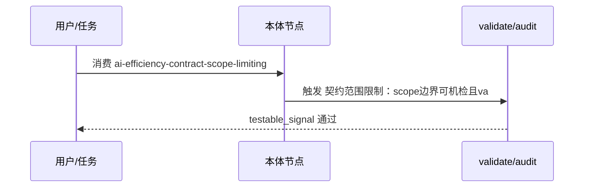

---
schema: pdca.asset/v1
id: knowledge.ai-efficiency.contract-scope-limiting
summary: 契约场景限定原则——机器可读契约必须显式限定适用文档类型，避免对通用文本误报（T0234 发现、T0238 修复）
tags: [ai-efficiency, contract, testing, scope]
scenarios: [plan, check]
phases: [plan, do, check]
source_ids: [T0238-0809-mechanism-fixes, T0234-0809-fastapi-app-verify]
---

# 契约场景限定原则

## 问题（T0234 实测）

契约测试/校验器如果对**任意输入**都检查，会把"不该受约束的文档"误报为违规。
实例：check-design-vocab 是 design-it-twice 的词汇契约校验器，只应约束
接口设计文档；但对 T0234 的 PRD（需求文本）误报 component/service/API/
boundary 四个通用词——需求文本里这些词是正常词汇。

## 修复（T0238）

给契约校验器加**显式场景参数** `--doc-type {design, other}`：
- `design`（默认，向后兼容）：校验词汇契约。
- `other`：跳过检查（vocab_ok=true 空违规），不误报。

```bash
cat design.md | python3 scripts/check-design-vocab.py            # 设计文档，检查
python3 scripts/check-design-vocab.py --doc-type other < prd.md  # 需求文档，跳过
```

## 原则

1. **契约声明适用范围**。任何机器可读契约都要明确"约束哪类文档/场景"，
   否则对适用范围外的输入误报会损害可信度。
2. **默认保持向后兼容**。新参数默认值 = 旧行为（design 检查），现有调用
   不破坏；新增 other 分支显式跳过。
3. **跳过要显式**。跳过不是"不检查"，而是结果携带 `skipped: true` +
   `doc_type` 元信息，调用方可区分"真通过"与"未检查"。

## 时间戳教训（同任务附带）

- states 时间戳**必须由 transition-phase 统一写入**，禁止手工写。
- 手工写（带微秒）与自动写（无微秒）在 datetime 比较时顺序可能颠倒，
  触发 STATE_TIME_ORDER。修复是校验层返回明确 guidance（指向
  transition-phase），而非放宽门禁。
- 已知摩擦：plan→do 转换要求 states.plan 已打时间戳，但初始创建时无——
  候选改进为 transition 自动补写 plan 时间戳（以 final_confirmation 时刻）。

## 复用场景

- 任何契约校验器（seam/词汇/source 术语）都需要场景限定，避免误报。
- 门禁问题应优先增强 guidance 而非放宽校验。


## 时序 — ai-efficiency-contract-scope-limiting 核心流（P0轻量补齐）



Source: `ontology/domain/ai-efficiency-contract-scope-limiting.md:1` + `scripts/ontology-validate.py:1` + `scripts/audit-ontology-fidelity.py:1`

## 正例

```bash
# 正例：testable_signal 可执行
  testable_signal: "运行 grep -q 'contract-scope' ontology/domain/ai-efficiency-contract-scope-limiting.md 且 python3 scripts/ontology-validate.py --ontology-dir ontology 2>&1 | grep -q 'ok'"
# 命中：含 grep -q / python3 scripts 动词且可回归
```

## 反例

```bash
# 反例：泛化signal不可证伪
# testable_signal: "检查本文件内容完整性，且经 validate 校验"
# 错：无可执行动词，无法自动证伪偏离
# 正确：运行 grep -q 'contract-scope' ontology/domain/ai-efficiency-co...
```

## 门禁

- **属性门禁**：`testable_signal` 含 `grep -q`/`python3 scripts` 动词，非泛化
- **溯源门禁**：含 `Source:` 行号
- **本体校验**：`python3 scripts/ontology-validate.py` 0 issues
