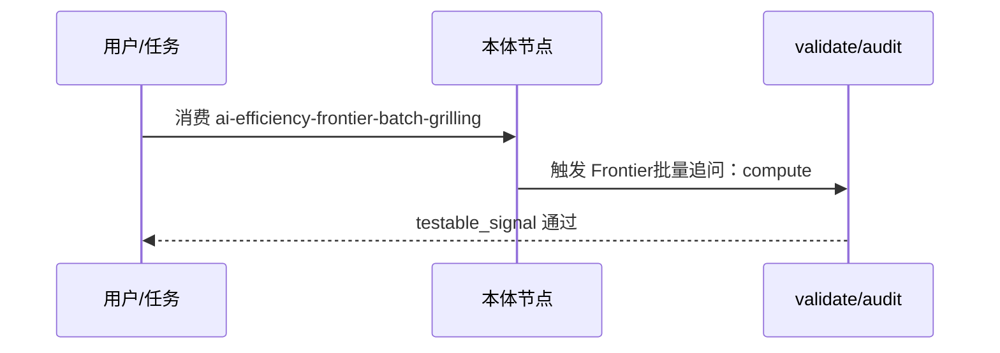

---
schema: pdca.asset/v1
id: knowledge.ai-efficiency.frontier-batch-grilling
summary: grilling 采用 frontier 批量问法——每轮同时提出当前可答的全部决策问题并附推荐答案，用轮数对比证明效率收益
tags: [ai-efficiency, grilling, interaction, pdca, productivity]
scenarios: [plan, check]
phases: [plan, check]
source_ids: [T0230-0809-ai-efficiency-proof]
---

# Grilling Frontier 批量问法

## 核心做法

不再"一次只问一个"地逐轮 grill。每轮提出当前**可回答的全部**决策问题（frontier），每个问题附推荐答案供快速确认，等待用户一次回复全部答案。下一轮只问上一轮未决/新出现的决策。

三个要点：

1. **frontier = 当前全部可答决策**。能问的、有明确选项或推荐项的，本轮全问；不依赖其他答案才能回答的问题不拖到下一轮。
2. **每问附推荐答案**。用户可直接确认，把"开放问答"降级为"确认/修正"，大幅减少来回。
3. **依赖分批**。存在依赖链时按依赖分批（先问上游决策），同一批内问题相互独立。强依赖链仍须串行。

## 日志约定（与门禁兼容）

- 同一轮批量提出的多个问题在 `clarifications.jsonl` 中**共享同一个 `round` 号**，每个问题一条记录。
- `clarification.schema.json` 只 `required: ["source","at"]`，`round` 为非约束字段。
- `append-confirmation.py` 只校验 `source`/`response`，`transition-phase.py` 不解析 `round` 字段——同轮共 round 不会误触任何门禁。

## source 术语一致性（T0231 补充）

- 所有 flow 的 Q&A 记录统一用 `source: "grilling"`（冒号 + 引号），与 grilling 技能规则 6 一致；不残留旧 `"grill"`，不用 `source=grilling` 等号语法。
- 一致性由契约测试守护（`SourceConsistencyContractTest`）：flow-act/flow-check/flow-plan 任一回归旧术语即失败。
- `source` 是自由字符串（非 schema 枚举），此修复是术语治理而非 schema 变更；术语漂移会误导后续会话与日志解析。

## 效率证明方法

收益不能只靠断言，必须可复现：

- **轮数模型单测**：对 `{决策数, 每轮批量容量}` 断言轮数 = `ceil(决策数 / 容量)`，并对依赖分批场景断言按依赖批次数。见 `tests/test_grilling_efficiency.py`。
- **真实会话轮数统计**：脚本读 `clarifications.jsonl`，统计 distinct round（批量问法轮数）与条目数（一次一问轮数），输出压缩比。见 `scripts/grilling-rounds-demo.py`。
- **T0230 实测**：Plan+Check 共 11 条记录；round 1–6 为逐问（6 轮），round 7 一次覆盖 4 个独立问题。批量 8 轮 vs 一次一问 11 轮，压缩 **1.375x**。
- **T0231 Ac1 实测**：flow-act Ac1 的 3 条独立追问同轮批量问，轮数 1 vs 3（3.0x），payload 194 vs 252 bytes（1.30x）。
- **bytes 代理**：上下文成本用 UTF-8 bytes 作零模型依赖代理，非真实 token 计数；仅当 tokenizer 会改变决策时才引入真实 tokenizer（沿用 ai-friendliness-review-methodology 的内容成本约定）。

## 适用边界

- 仅适用于**决策间独立**或只需按依赖分批的场景；强依赖链仍需串行轮次。
- `round` 仅作轮次标识，不承载语义顺序契约。
- 本方法改变提问组织方式，不改变 Plan/Check 门禁判定逻辑。

## 沉淀来源

`records/T0230-0809-ai-efficiency-proof/conclusion.md`（verdict: partial，Q1 计时/Q3 门禁兼容均已闭环）。


## 时序 — ai-efficiency-frontier-batch-grilling 核心流（P0轻量补齐）



Source: `ontology/domain/ai-efficiency-frontier-batch-grilling.md:1` + `scripts/ontology-validate.py:1` + `scripts/audit-ontology-fidelity.py:1`

## 正例

```bash
# 正例：testable_signal 可执行
运行 grep -q 'frontier' scripts/compute-frontier.py && grep -q 'grilling' ontology/domain/skill-grilling.md && python3 scripts/ontology-validate.py --ontology-dir ontology 2>&1 | grep -q 'OK'
# 命中：含 grep -q / python3 scripts 动词且可回归
```

## 反例

```bash
# 反例：泛化signal不可证伪
# testable_signal: "检查本文件内容完整性，且经 validate 校验"
# 错：无可执行动词，无法自动证伪偏离
# 正确：运行 grep -q 'frontier' scripts/compute-frontier.py && grep -q...
```

## 门禁

- **属性门禁**：`testable_signal` 含 `grep -q`/`python3 scripts` 动词，非泛化
- **溯源门禁**：含 `Source:` 行号
- **本体校验**：`python3 scripts/ontology-validate.py` 0 issues

