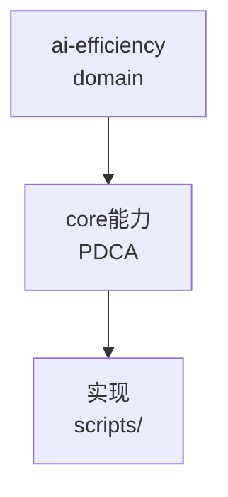

# ai-efficiency（领域知识根节点）

由 ontology/domain/ 迁移而来，作为该领域在本体中的分组与分类根（可被 `domain` 属性引用）。

## 子主题（已迁移为叶节点）
- `ai-execution-and-invocation-contracts` → `ontology:domain/ai-efficiency-ai-execution-and-invocation-contracts`
- `ai-friendliness-review-methodology` → `ontology:domain/ai-efficiency-ai-friendliness-review-methodology`
- `contract-scope-limiting` → `ontology:domain/ai-efficiency-contract-scope-limiting`
- `contract-test-pattern` → `ontology:domain/ai-efficiency-contract-test-pattern`
- `frontier-batch-grilling` → `ontology:domain/ai-efficiency-frontier-batch-grilling`
- `knowledge-assets-and-ai-workflow` → `ontology:domain/ai-efficiency-knowledge-assets-and-ai-workflow`
- `lever-audit-limits` → `ontology:domain/ai-efficiency-lever-audit-limits`
- `mattpocock-skills-enhancement-mechanisms` → `ontology:domain/ai-efficiency-mattpocock-skills-enhancement-mechanisms`
- `skills-candidate-review` → `ontology:domain/ai-efficiency-skills-candidate-review`
- `ticket-dag-ready-set` → `ontology:domain/ai-efficiency-ticket-dag-ready-set`
- `unified-entrypoint-discipline` → `ontology:domain/ai-efficiency-unified-entrypoint-discipline`
- `uplift-assessment-before-adoption` → `ontology:domain/ai-efficiency-uplift-assessment-before-adoption`
- `writing-for-agents-levers` → `ontology:domain/ai-efficiency-writing-for-agents-levers`


## C4 组件 — ai-efficiency（P1补图）



Source: `ontology/domain/ai-efficiency.md:1` + `ontology/concept/ontology-fidelity-criterion.md:1`

## 正例

```bash
# 正例：ai-efficiency 可通过本体复现
grep -q 'ai-efficiency' ontology/domain/ai-efficiency.md && python3 scripts/ontology-validate.py --ontology-dir ontology 2>&1 | grep -q 'OK'
```

## 反例

```bash
# 反例：缺图导致不可视化
# 无 mermaid 时，AI无法从本体还原组件关系，需补图
```

## 门禁

- **图门禁**：`grep -c 'mermaid' ontology/domain/ai-efficiency.md` ≥1
- **溯源门禁**：含 `Source:` 行号
- **校验**：`python3 scripts/ontology-validate.py` 0 issues

