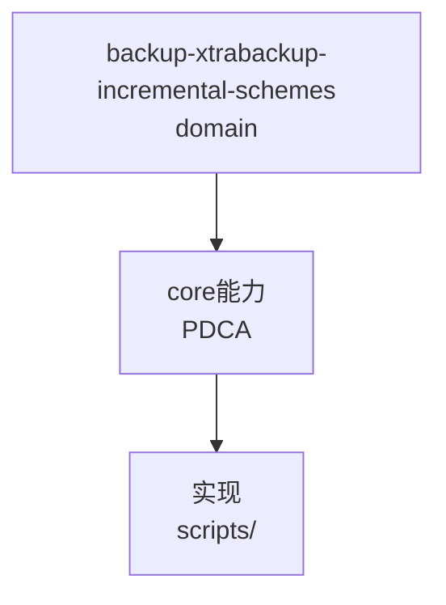

# XtraBackup 8.0 系列增量备份方案速览（通用知识）

来源：任务 T0225 调研。对象：Percona XtraBackup 8.0.25（主要物理增量基准）；对照 MariaDB / Percona Server / 官方 page tracking 版本能力。

## 严格口径

**真增量 = 备份阶段免全表扫描、只读「变化页」**（page tracking / bitmap）。以下均不计入真增量：
- 增量 prepare / apply-log-only / delta 合并 → 还原阶段
- redo log 归档（redo archive）→ 备份一致性通用机制
- `--incremental-history-name/-uuid` → 仅 LSN 起点自动选取
- binlog / PITR / flashback → 逻辑级；CDC(Canal/Debezium)、块级快照(ZFS/LVM/DRBD/云) → 互补替代

## 物理增量识别「变化页」的两种基本方式

1. **全表扫描比对页 LSN（full-scan）**
   - 逐页读 `FIL_PAGE_LSN`，只拷 `page_lsn > incremental_lsn` 的页。
   - 兜底方案、无版本依赖；变化页占比低时存在全读 IO 开销。
   - anchor：`write_filt.cc:125-126`、`xtrabackup.cc:2907-2911`。
2. **服务端页跟踪位图（page tracking / bitmap）**
   - 依赖服务端：Percona Server changed-page bitmap 或 MySQL 官方 page tracking。
   - 只拷位图置位页，大表提速明显；未启用则自动回退全扫描。
   - anchor：`backup_mysql.cc:683-685/2179-2186`（仅 Percona Server 置位）、`changed_page_bitmap.cc:567`、`xtrabackup.cc:4012-4021`（位图回退全扫描）。

## 真增量三路线（严格口径下）

| 路线 | 服务端依赖 | 版本起点 | 消费端 |
|------|-----------|---------|--------|
| **Percona Server changed-page bitmap** | `innodb_track_changed_pages=ON`，`ib_modified_log_*.xbm` | Percona Server 5.5.27 引入 | PXB（本项目 8.0.25 即此路线）；8.0.30 移除 Percona 自研算法 |
| **MySQL 官方 page tracking** | 引擎 8.0.17+（Clone/恢复源页跟踪） | MySQL 8.0.17 | MEB 8.0.18 默认消费；PXB 8.0.27 `--page-tracking`；需 mysqlbackup 组件、单文件系统表空间；DDL bug #106163 |
| **MariaDB 插件位图（已 EOL）** | `INFORMATION_SCHEMA.CHANGED_PAGE_BITMAPS` 插件 + `INNODB_CHANGED_PAGES`，`FLUSH CHANGED_PAGE_BITMAPS` | MariaDB 10.0/10.1（XtraDB）；FLUSH 于 10.1.6 | mariabackup 10.1 只读位图页；10.2+ 换 InnoDB 移除（10.2.6 ignored，MDEV-18985；2024 commit 92f87f2 删代码） |

- 8.0.25 结论：**真/物理增量 = LSN 全扫描（基础，非真增量） + Percona Server changed-page bitmap（真增量）**。`--page-tracking` 无实现（8.0.27 起）。

> 联网佐证分级：MySQL / MEB / MariaDB 的「版本起点」为联网佐证，非本仓源码主证，引用时按住版本起点需在对应发行说明上独立复核。

## 增量参数族

- `--incremental` / `--incremental-basedir` / `--incremental-lsn`：增量起点指定。
- `--incremental-force-scan`：强制跳过位图/页跟踪做全扫描。
- `--incremental-dir`：prepare 时指定增量目录；读其 `xtrabackup_checkpoints` 的 from_lsn/to_lsn。
- `--apply-log-only`：增量 prepare 只前滚 redo+合并 delta，不刷数据页，供连续叠加。
- `--incremental-history-name/-uuid`：从 `PERCONA_SCHEMA.xtrabackup_history` 自动取上次备份 to_lsn 作为起点（注意：非真增量，属起点选取）。

## 版本边界（易踩坑，8.0 系列）

- 8.0.25：**无** `--page-tracking`（8.0.27 才有）；`--rollback-only`、`--redo-lag` 已移除（全仓无符号）。
- 8.0.30：移除 Percona changed-page 算法，只留 full-scan + 官方 page tracking。
- 8.4.0-3+：增量 prepare 支持并行合并 `.delta`（`--prepare --parallel`）。
- 官方 page tracking 需：mysqlbackup 组件、单文件系统表空间；存在 DDL bug #106163。

## 参考

- docs.percona.com/percona-xtrabackup/8.0/page-tracking.html、create-incremental-backup.html
- dev.mysql.com/doc/mysql-enterprise-backup/8.4/en/mysqlbackup.incremental.html
- dev.mysql.com/blog-archive/innodb-clone-and-page-tracking/


## C4 组件 — backup-xtrabackup-incremental-schemes（P1补图）



Source: `ontology/domain/backup-xtrabackup-incremental-schemes.md:1` + `ontology/concept/ontology-fidelity-criterion.md:1`

## 正例

```bash
# 正例：backup-xtrabackup-incremental-schemes 可通过本体复现
grep -q 'backup-xtrabackup-incremental-schemes' ontology/domain/backup-xtrabackup-incremental-schemes.md && python3 scripts/ontology-validate.py --ontology-dir ontology 2>&1 | grep -q 'OK'
```

## 反例

```bash
# 反例：缺图导致不可视化
# 无 mermaid 时，AI无法从本体还原组件关系，需补图
```

## 门禁

- **图门禁**：`grep -c 'mermaid' ontology/domain/backup-xtrabackup-incremental-schemes.md` ≥1
- **溯源门禁**：含 `Source:` 行号
- **校验**：`python3 scripts/ontology-validate.py` 0 issues

