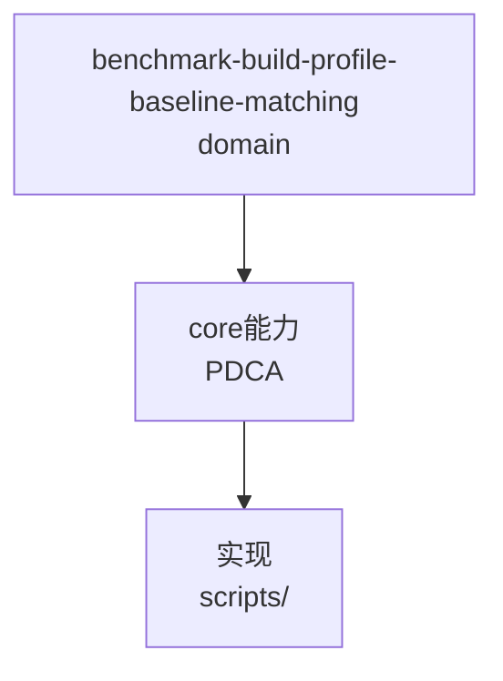

# 基准对照与并发测试的验证口径陷阱

来源: records/T0381-0823-async-object-lifecycle/conclusion.md
对象: backupstream 及同类 C/C++ 异步基础设施项目的性能对照与生命周期测试

## 陷阱一：基准口径必须匹配项目真实构建配置

T0381 统一 post 入口改造后，Debug（CMAKE_BUILD_TYPE=Debug，即 -O0）构建下
reactor_post 吞吐显示 -40% 回退；改用项目实际构建配置（build-make 为
-O3 -DNDEBUG）配对复测后实为 +37%（合并函数消除双层转发在 -O3 下获益，
-O0 下反而因函数体增大/寄存器压力放大开销）。

**规则**：
- 基线对照两侧必须使用项目真实交付配置（查 compile_commands.json / Makefile 的优化级别），不是 CMake 默认 Debug。
- Debug 构建的相对差异不可作为回退判据；发现大偏差先换口径复测再下结论。
- 配对交替采样取中位比值（见 paired-comparison-noise.md）；单侧自身波动超过疑似差异时判定为宿主噪声。

## 陷阱二：异步完成路径测试须断言终态不变量而非中间时序

WAIT 背压测试曾断言"submit 返回 0 后回调必然已执行"——但 submit 成功只保证
入队（所有权转移恰好一次），派发时序取决于 owner 线程调度。Debug 下 worker
较慢掩盖问题，TSan 改变时序后必现失败。

**规则**：
- 提交类 API 的测试断言用终态守恒：`callbacks + discards == 提交成功数`，
  且每项恰好一次终态边；不依赖"是否来得及派发"。
- 需要观察派发时给有限排空窗口（有界 yield/sleep 循环）但不强制其完成。
- TSan 下的偶发失败优先怀疑被测测试的时序假设，其次才是产品竞态——
  本例两者都真实存在价值：测试竞态修复后产品代码经连续多轮 sanitizer 验证。

## 适用边界

- 口径规则适用于一切吞吐/延迟对照场景；终态不变量适用于所有"提交→异步执行"
  所有权转移协议的测试（post/work item/completion 类 API）。


## C4 组件 — benchmark-build-profile-baseline-matching（P1补图）



Source: `ontology/domain/benchmark-build-profile-baseline-matching.md:1` + `ontology/concept/ontology-fidelity-criterion.md:1`

## 正例

```bash
# 正例：benchmark-build-profile-baseline-matching 可通过本体复现
grep -q 'benchmark-build-profile-baseline-matching' ontology/domain/benchmark-build-profile-baseline-matching.md && python3 scripts/ontology-validate.py --ontology-dir ontology 2>&1 | grep -q 'OK'
```

## 反例

```bash
# 反例：缺图导致不可视化
# 无 mermaid 时，AI无法从本体还原组件关系，需补图
```

## 门禁

- **图门禁**：`grep -c 'mermaid' ontology/domain/benchmark-build-profile-baseline-matching.md` ≥1
- **溯源门禁**：含 `Source:` 行号
- **校验**：`python3 scripts/ontology-validate.py` 0 issues

