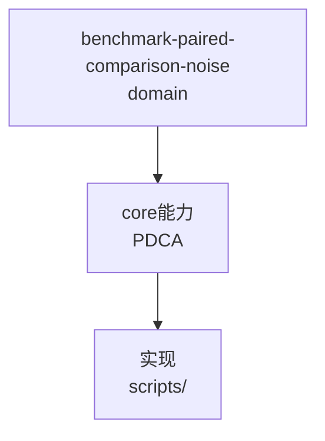

# 噪声环境下性能断言：配对对比测量

来源: records/T0215-0804-rpc-epoll-multireactor/conclusion.md

## 问题

多线程并发基准（本机跑 LLM 客户端/IDE 等）下，单次进程内多 round 的吞吐
方差可达 ±20%（实测 790~1130 MB/s），单次均值比率在 0.89~0.998 间波动。
5% 阈值的"均值 ≥ 0.95×"断言无法用单次测量稳定判定，可能误判通过/失败。

## 模式：配对对比

- **交替执行**：基准配置 A、B 交替各跑 N 个独立进程（N≥4），而不是先跑完
  A 再跑 B。抵消负载随时间漂移。
- **成对比率 + 总体均值**：逐对计算 A/B 比率，报告中位数/均值；同负载漂移
  在配对内被抵消。
- **判定以配对均值比率为准**：配对均值比率 0.984 稳定 ≥ 0.95 判通过，即使
  单次比率出现过 0.89。
- **报告置信**：写明单次 min/max 与配对均值，暴露噪声水平，避免结论掩盖
  测量不确定性。

## 适用边界

- 适用于可重复启动的进程级基准（server 可起停）；对常驻进程内部基准改用
  更长的采样窗口 + 取中位数。
- 系统负载本身波动 > 断言阈值时，配对对比只是可靠下限；更严格需空闲机器
  或 cgroup 隔离 CPU。


## C4 组件 — benchmark-paired-comparison-noise（P1补图）



Source: `ontology/domain/benchmark-paired-comparison-noise.md:1` + `ontology/concept/ontology-fidelity-criterion.md:1`

## 正例

```bash
# 正例：benchmark-paired-comparison-noise 可通过本体复现
grep -q 'benchmark-paired-comparison-noise' ontology/domain/benchmark-paired-comparison-noise.md && python3 scripts/ontology-validate.py --ontology-dir ontology 2>&1 | grep -q 'OK'
```

## 反例

```bash
# 反例：缺图导致不可视化
# 无 mermaid 时，AI无法从本体还原组件关系，需补图
```

## 门禁

- **图门禁**：`grep -c 'mermaid' ontology/domain/benchmark-paired-comparison-noise.md` ≥1
- **溯源门禁**：含 `Source:` 行号
- **校验**：`python3 scripts/ontology-validate.py` 0 issues

