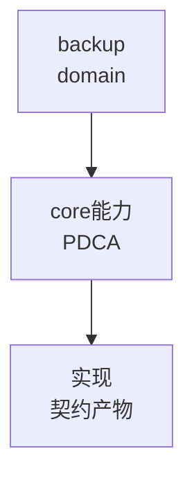

# backup（领域知识根节点）

由 ontology/domain/ 迁移而来，作为该领域在本体中的分组与分类根（可被 `domain` 属性引用）。

## 子主题（已迁移为叶节点）
- `gs-roach-gm-encrypt-support` → `ontology:domain/backup-gs-roach-gm-encrypt-support`
- `ob-backup-gm-encrypt-support` → `ontology:domain/backup-ob-backup-gm-encrypt-support`
- `xtrabackup-incremental-schemes` → `ontology:domain/backup-xtrabackup-incremental-schemes`


## C4 组件 — backup（P1补图）



Source: `ontology/domain/core/backup.md:1` + `ontology/concept/ontology-fidelity-criterion.md:1`

## 正例

```bash
# 正例：backup 可通过本体复现
```

结构审查使用 ontology:concept/ontology-creation-gate；旧工作流命令已移除。
## 反例

```bash
# 反例：缺图导致不可视化
# 无 mermaid 时，AI无法从本体还原组件关系，需补图
```

## 使用与验证边界

结构审查按 ontology:concept/ontology-creation-gate。正文中的领域断言需在授权的实际源码版本中核对；原历史路径和记录不是当前任务已执行证据。图表、行数或测试骨架数量不作为默认通过条件。
