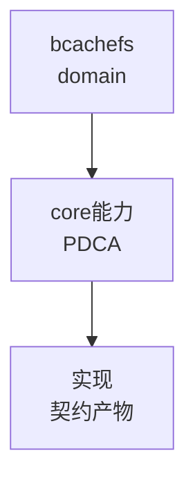

# Bcachefs 领域

bcachefs 为 COW btree 文件系统，用户态 `bcachefs-tools` (Rust+C) + 内核模块 `fs/` 双交付，`DKMS` 构建。下钻 12 叶 `ontology:entity/bcachefs-*` 与系统聚合 `ontology:entity/bcachefs-system`。

## 组成

- 工具链：`Cargo workspace + Make + DKMS` 三构建（`Cargo.toml:1` `Makefile:13` `dkms/dkms.conf.in:1`）
- 运行时：`journal(jset/bset)` `btree(bkey/bset/node)` `alloc(bucket/gc)` `sb(superblock)` `recovery(26+ passes)`
- 边界：`bch_bindgen/build.rs:404 + fs/build.rs:1 + fs/codegen.rs:21` 双向绑定


## C4 组件 — bcachefs（P1补图）



Source: `ontology/domain/core/bcachefs.md:1` + `ontology/concept/ontology-fidelity-criterion.md:1`

## 正例

```bash
# 正例：bcachefs 可通过本体复现
```

结构审查使用 ontology:concept/ontology-creation-gate；旧工作流命令已移除。
## 反例

```bash
# 反例：缺图导致不可视化
# 无 mermaid 时，AI无法从本体还原组件关系，需补图
```

## 使用与验证边界

结构审查按 ontology:concept/ontology-creation-gate。正文中的领域断言需在授权的实际源码版本中核对；原历史路径和记录不是当前任务已执行证据。图表、行数或测试骨架数量不作为默认通过条件。
