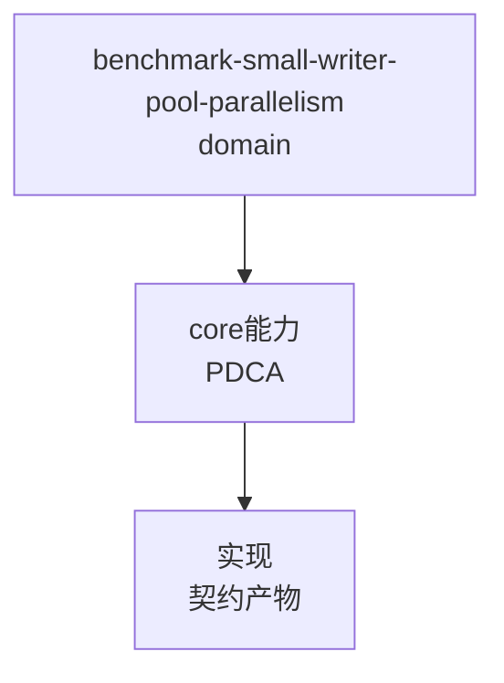

# Small Writer Pool Parallelism

When a client receives packed small files, tune local writer concurrency with paired GET measurements rather than assuming more workers is faster.

## Reusable pattern

- Keep the default synchronous path unchanged unless the measurements justify a behavior change.
- Bound the producer queue and expose enqueue, completion, peak queue, peak active, backpressure, and failure counters through an existing progress channel.
- Latch the first worker error, clear pending work, stop accepting frames, and drain only at ordering barriers before hardlinks, directory metadata, or TREE_END.
- Compare workers `0/1/2/4/8` in paired samples, then repeat the selected candidate under checksum and strict durability.

## Round 60 result

On the tested host with 10000 small files and four pairs, worker 1 regressed against worker 0, worker 4 had the best average throughput in the baseline matrix, and worker 8 did not improve over worker 4. The safe disposition was to keep default worker 0 and use worker 4 only as an explicit deployment candidate.

This result is workload- and storage-dependent; repeat the paired matrix on the target host before changing defaults.


## C4 组件 — benchmark-small-writer-pool-parallelism（P1补图）



Source: `ontology/domain/core/benchmark-small-writer-pool-parallelism.md:1` + `ontology/concept/ontology-fidelity-criterion.md:1`

## 正例

```bash
# 正例：benchmark-small-writer-pool-parallelism 可通过本体复现
```

结构审查使用 ontology:concept/ontology-creation-gate；旧工作流命令已移除。
## 反例

```bash
# 反例：缺图导致不可视化
# 无 mermaid 时，AI无法从本体还原组件关系，需补图
```

## 使用与验证边界

结构审查按 ontology:concept/ontology-creation-gate。正文中的领域断言需在授权的实际源码版本中核对；原历史路径和记录不是当前任务已执行证据。图表、行数或测试骨架数量不作为默认通过条件。
