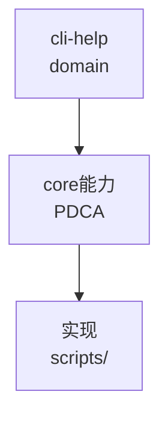

# cli-help（领域知识根节点）

由 ontology/domain/ 迁移而来，作为该领域在本体中的分组与分类根（可被 `domain` 属性引用）。

## 子主题（已迁移为叶节点）
- `cli-help-regression` → `ontology:domain/cli-help-cli-help-regression`


## C4 组件 — cli-help（P1补图）



Source: `ontology/domain/cli-help.md:1` + `ontology/concept/ontology-fidelity-criterion.md:1`

## 正例

```bash
# 正例：cli-help 可通过本体复现
grep -q 'cli-help' ontology/domain/cli-help.md && python3 scripts/ontology-validate.py --ontology-dir ontology 2>&1 | grep -q 'OK'
```

## 反例

```bash
# 反例：缺图导致不可视化
# 无 mermaid 时，AI无法从本体还原组件关系，需补图
```

## 门禁

- **图门禁**：`grep -c 'mermaid' ontology/domain/cli-help.md` ≥1
- **溯源门禁**：含 `Source:` 行号
- **校验**：`python3 scripts/ontology-validate.py` 0 issues

