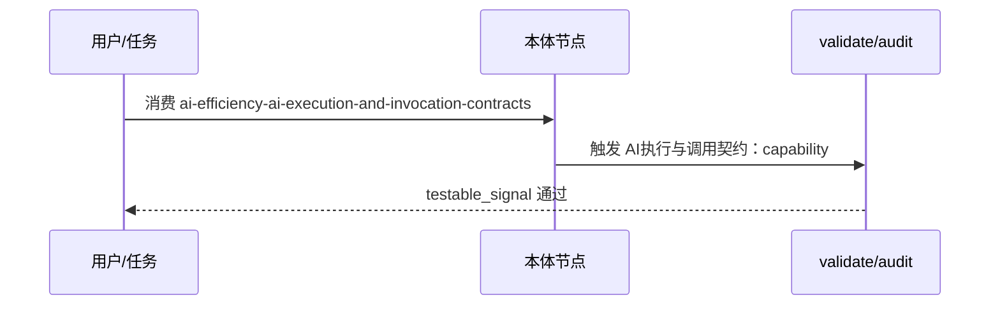

---
schema: pdca.asset/v1
id: knowledge.ai-efficiency.ai-execution-and-invocation-contracts
summary: 用独立 execution/invocation contract、公共 resolver 和故障注入提升 AI 工作流的可判定性
tags: [ai-efficiency, workflow, contracts, evaluation, pdca]
scenarios: [development, bugfix, research, documentation, design, review]
phases: [plan, do, check, act]
source_ids: [R0161]
---

# AI 执行与技能调用合约

## 分层原则

不要把场景路由、路径内执行顺序和技能调用权限放进同一个事实源：

- **route contract** 只决定 scenario 进入哪条 Do 路径。
- **execution contract** 只决定 development/bugfix 路径内的 test-first 顺序、切片验证和最终验证语义。
- **invocation contract** 只声明用户入口 alias 与调用边；技能名称和 `invocation` 类型继续由 SKILL frontmatter 提供。

职责分离让每一层可以独立故障注入，也避免复制类型字段造成漂移。

## 执行循环

development 和 bugfix 的最小垂直切片应按以下顺序执行：

1. 确认预先约定的 Seam。
2. 写出失败的行为/回归测试。
3. 做最小实现或修复。
4. 完成切片后运行定向测试或 typecheck。
5. 所有切片完成后运行全量验证，再做双轴代码审查。

证据只需记录完成切片的定向验证，以及最终全量验证和审查；不伪造每次微循环的运行回执。顺序应由公共 resolver 验证实际 flow 文档，而不是只检查标题或关键字是否存在。

## 调用权限

- flow 和 automatic skill 只能调用 automatic worker。
- manual skill 是用户入口，可以委托 automatic worker，但不应成为内部 flow 的直接目标。
- alias 必须解析到现有 manual entry；entry 文档暴露的 alias 与 contract 必须双向一致。
- 每一条显式 `$PDCA_HOME/skills/<name>/SKILL.md` 引用都必须有已声明且类型合法的调用边。

将 triage、domain-modeling、handoff 等共享工作抽成 automatic worker，同时保留 manual 薄壳入口，可同时满足用户显式进入和流程自动编排。

## 验证与边界

公共 resolver 应输出稳定错误码；fixture 至少覆盖正常路径、顺序交换、非法 manual edge、未知/stale alias、缺失引用和生命周期 gate 反例。内容 baseline 只能检查成本和断链，不能替代行为合约验证。

这些机制证明的是文档、导航、调用权限和生命周期判断的确定性一致性，不是真实 LLM 成功率、遵循率、token、延迟、成本或多 Agent 效果。后者必须由固定 runner、保留任务集和前后配对指标单独验证。


## 时序 — ai-efficiency-ai-execution-and-invocation-contracts 核心流（P0轻量补齐）



Source: `ontology/domain/ai-efficiency-ai-execution-and-invocation-contracts.md:1` + `scripts/ontology-validate.py:1` + `scripts/audit-ontology-fidelity.py:1`

## 正例

```bash
# 正例：testable_signal 可执行
运行 grep -q 'capability-protocol' ontology/concept/capability-protocol.md 且 python3 scripts/ontology-validate.py --ontology-dir ontology 2>&1 | grep -q 'OK'
# 命中：含 grep -q / python3 scripts 动词且可回归
```

## 反例

```bash
# 反例：泛化signal不可证伪
# testable_signal: "检查本文件内容完整性，且经 validate 校验"
# 错：无可执行动词，无法自动证伪偏离
# 正确：运行 grep -q 'capability-protocol' ontology/concept/capability...
```

## 门禁

- **属性门禁**：`testable_signal` 含 `grep -q`/`python3 scripts` 动词，非泛化
- **溯源门禁**：含 `Source:` 行号
- **本体校验**：`python3 scripts/ontology-validate.py` 0 issues

