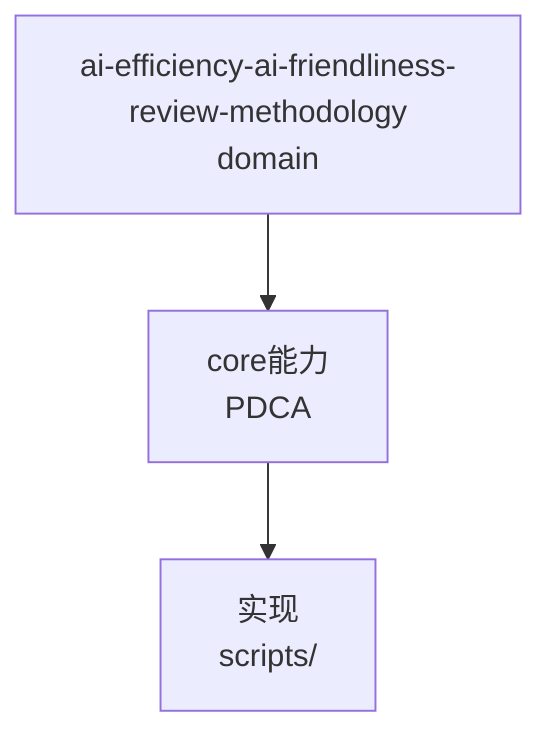

---
schema: pdca.asset/v1
id: knowledge.ai-efficiency.ai-friendliness-review-methodology
summary: 用可执行门禁、故障注入和配对实验判断工作流改动是否真实提升 AI
tags: [ai-efficiency, workflow, evaluation, pdca]
scenarios: [development, bugfix, research, documentation, design, review]
phases: [plan, do, check, act]
source_ids: [R0135-ai-friendliness-hardening, R0140-agent-workflow-landscape, R0141-convergence-validator, R0160]
---

# AI 工作流友好度审查方法

## 价值门槛

每项改动必须直接改善至少一项：门禁正确率、导航成功率、上下文成本或故障恢复，并具备当前可运行的验证。没有消费者、失败模式或配对证据的规则、指标和协议不进入仓库。新增门禁至少要用同一缺陷输入证明它能改变旧门禁的错误判断，否则只是形式复杂度。

## GQM 评测

1. Goal：先声明希望改善的 AI 行为。
2. Question：定义能证伪改善的具体问题。
3. Metric：选择会改变保留/删除决策的信号。

自动指标与定性 rubric 分开，不合成缺乏依据的总分。效果判断优先使用机器 pass/fail、明确错误码和相同输入的前后配对。

### T0435-T0437 改进效果验证

| Question | Metric | Baseline | 观察窗口 |
|----------|--------|----------|----------|
| Q1：新增概念节点是否被流程正确消费？ | ontology_fragment 消费率 | T0435 前 | T0435-T0437 |
| Q2：导航成功率是否提升？ | 路由成功率 | T0435 前 | T0435-T0437 |
| Q3：上下文成本是否降低？ | context load (UTF-8 bytes) | T0435 前 | T0435-T0437 |
| Q4：故障恢复是否改善？ | 门禁失败率 | T0435 前 | T0435-T0437 |

效果判定：improved / neutral / regressed。仅 improved 可形成 verified decision。

## 四类验证

- 合约：用 schema 和跨文件不变量拒绝伪确认、无效证据、矛盾状态及路径越界。
- 导航：检查入口引用、能力探测，以及缺失可选能力时的显式 fallback。
- 成本：只精简 Pareto 高成本候选，并预先规定最小效果量。
- 故障注入：正常路径与失败路径使用固定夹具，失败必须得到预期错误码。

## 可执行评测合约

- 将场景到执行路径的映射放入严格、机器可读的 contract；公共 resolver 只读取 contract，Markdown 只保留面向人的说明。必须同时测试 resolver 行为和文档锚点，不能用标题存在证明路由正确。
- 夹具应构造保持标题不变但交换映射的反例，以验证 oracle 能拒绝契约漂移。引用故障必须删除实际被引用的受控文件，不能由测试分支直接返回预期错误码。
- 共享阶段语义用一个完整成功链和按转换分组的关键失败反例覆盖。成功链只经公共相邻 transition 生成 receipt；Plan 的确认、Do 的 PRD/evidence/convergence、Check 的 conclusion/verdict/确认和 Act 的 disposition 均应由真实 gate 拒绝缺失输入。
- bytes baseline 必须覆盖全部当前审计资产，新增、遗漏、陈旧或超预算都 fail-closed。更新 baseline 是版本控制中的显式治理动作，必须有非空理由，并同时通过断链检查和相关 deterministic fixture，不能以提高 baseline 掩盖行为回归。

## 内容成本

UTF-8 bytes 可作为零模型依赖的稳定代理，但不得称为真实 token。只有当 tokenizer 会改变候选或决策时才引入；若候选相同，应删除 tokenizer 依赖。任何精简都必须同时达到预设降幅并通过相同夹具。

## 证据边界

- 确定性流程夹具不能外推为真实 LLM 成功率。
- 能力探测结果只对当前环境和会话有效。
- 未覆盖场景必须披露，不能用“零回归”概括所有任务。
- 证据必须包含 digest，并明确映射到验收条件。
- convergence map、索引和摘要清单等控制产物只能描述证据关系，不得计为验收证据或给自身作证。

## 治理层与运行时分层

- PDCA 治理层负责目标、PRD、用户签审、证据、结论和知识闭环；这些长期约束不应绑定某个 Agent 框架。
- Agent 运行时负责模型调用、工具审批、事件 trace、调用预算和节点恢复，只在出现真实自动执行消费者后引入。
- 当前没有运行时消费者时，优先改进能直接改变确定性判断的门禁，例如验收条件与证据映射、研究来源链以及全局校验噪声。
- 整体框架迁移、默认多 Agent、空 trace/checkpoint 协议等建议，若不能通过相同输入的前后配对证明收益，则不实施或删除。

## 当前实现

- 严格校验：`schemas/`、`scripts/validate-workflow.py`
- 能力诊断：`scripts/pdca-doctor.py`
- 内容审查：`scripts/audit-skill-content.py`
- 配对基准：`scripts/run-ai-friendliness-fixtures.py`
- 综合记录：`records/R0135-ai-friendliness-hardening/conclusion.md`
- 可执行路由与生命周期评测：`pdca/ai-friendliness-route-contract.json`、`scripts/resolve-ai-friendliness-route.py`、`scripts/run-ai-friendliness-fixtures.py`
- 内容预算：`pdca/skill-content-baseline.json`、`scripts/audit-skill-content.py --check-budget`


## C4 组件 — ai-efficiency-ai-friendliness-review-methodology（P1补图）



Source: `ontology/domain/ai-efficiency-ai-friendliness-review-methodology.md:1` + `ontology/concept/ontology-fidelity-criterion.md:1`

## 正例

```bash
# 正例：ai-efficiency-ai-friendliness-review-methodology 可通过本体复现
grep -q 'ai-efficiency-ai-friendliness-review-methodology' ontology/domain/ai-efficiency-ai-friendliness-review-methodology.md && python3 scripts/ontology-validate.py --ontology-dir ontology 2>&1 | grep -q 'OK'
```

## 反例

```bash
# 反例：缺图导致不可视化
# 无 mermaid 时，AI无法从本体还原组件关系，需补图
```

## 门禁

- **图门禁**：`grep -c 'mermaid' ontology/domain/ai-efficiency-ai-friendliness-review-methodology.md` ≥1
- **溯源门禁**：含 `Source:` 行号
- **校验**：`python3 scripts/ontology-validate.py` 0 issues

