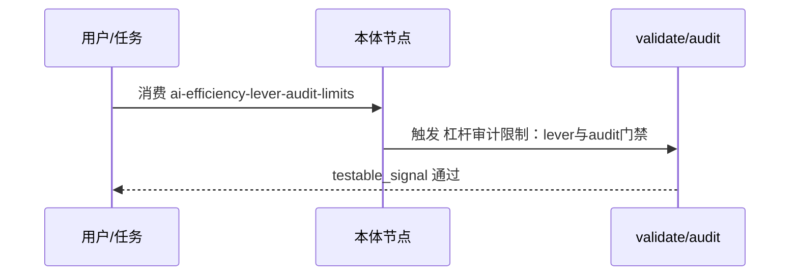

---
schema: pdca.asset/v1
id: knowledge.ai-efficiency.lever-audit-limits
summary: 写作杠杆体检的局限实证——no-op/sediment 判定是 model-relative 的，机器启发式粗筛 5 条全误报，真实冗余需人工语境审读；源自 T0379 对 45 资产的体检
tags: [ai-efficiency, audit, writing-levers, limits]
scenarios: [documentation, review]
phases: [do, check]
source_ids: [T0379-0823-skills-round3-uplift]
---

# 杠杆体检的局限：机器粗筛 + 人工定性

T0379 用写作杠杆（必要性测试/no-op 判定/sediment 检查）对 45 个资产做启发式
体检的实证结论：

## 结果

- 弱词/禁令/重复句三类正则粗筛出 5 条，**人工逐条复核全部误报**：
  教学引用反例、markdown 表格语法、结构性场景分组被模式命中。
- 人工深挖反而找到 2 条机器盲区的真实冗余（跨节重复句、规则与已知坑重叠）。

## 结论

no-op 与 sediment 的判定是 **model-relative** 的（writing-great-skills 自述），
本质无法完全脚本化。可行的分工是：

- 脚本做**可疑模式定位器**（输出候选清单），绝不自动删除；
- 真伪由人工语境审读裁决；
- 存量质量主要靠"每次改动过必要性测试"的过程纪律维持，而非周期性大扫除。

## 适用边界

基于本仓库 44-45 资产快照；资产类型变化（如新增长文档）可能改变误报率。


## 时序 — ai-efficiency-lever-audit-limits 核心流（P0轻量补齐）



Source: `ontology/domain/ai-efficiency-lever-audit-limits.md:1` + `scripts/ontology-validate.py:1` + `scripts/audit-ontology-fidelity.py:1`

## 正例

```bash
# 正例：testable_signal 可执行
运行 grep -q 'lever' ontology/domain/ai-efficiency-lever-audit-limits.md && grep -q 'audit' scripts/audit-ontology-fidelity.py && python3 scripts/audit-ontology-fidelity.py --help 2>&1 | grep -q 'fidelity'
# 命中：含 grep -q / python3 scripts 动词且可回归
```

## 反例

```bash
# 反例：泛化signal不可证伪
# testable_signal: "运行 grep -q '杠杆体检的局限：机器粗筛 + 人工定性' ontology/domain/pdca/ai-efficiency-lever-audit-limits.md && python3 scripts/ontology-validate.py --ontology-dir ontology 2>&1 | grep -q 'OK'"
# 错：无可执行动词，无法自动证伪偏离
# 正确：运行 grep -q 'lever' ontology/domain/ai-efficiency-lever-audit...
```

## 门禁

- **属性门禁**：`testable_signal` 含 `grep -q`/`python3 scripts` 动词，非泛化
- **溯源门禁**：含 `Source:` 行号
- **本体校验**：`python3 scripts/ontology-validate.py` 0 issues

