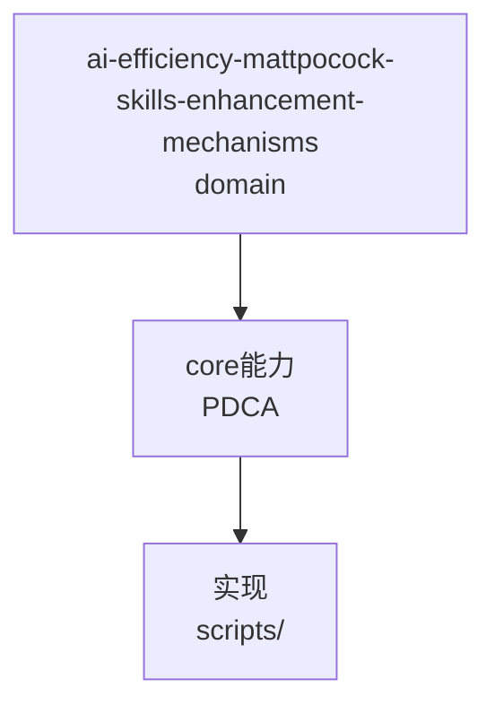

---
schema: pdca.asset/v1
id: knowledge.ai-efficiency.mattpocock-skills-enhancement-mechanisms
summary: mattpocock/skills v1.2.3 提升 AI 的机制全景——四大失效模式驱动设计法、双轨触发的薄组合器架构、phase-boundary 五选项树、grounding 依赖图写作法、深模块 lint 化；含与 pdca-workflow 的 16 域对照结论
tags: [ai-efficiency, skills, workflow, grilling, tdd, architecture, docs]
scenarios: [development, bugfix, research, documentation, design, review]
phases: [plan, do, check, act]
source_ids: [T0370-0823-skills-ai-enhancement]
---

# mattpocock/skills 提升 AI 的机制（增量沉淀）

> 全景报告见 `records/T0370-0823-skills-ai-enhancement/report.md`。本文只记录
> 现有知识库（frontier-batch-grilling T0230、writing-for-agents-levers T0245）
> 未覆盖的增量。

## 1. 失效模式驱动设计法

该项目先枚举 AI 四大失效模式再设计技能矩阵，每个技能可回溯到它治的病：

| 失效模式 | 修复技能族 |
|---------|-----------|
| #1 对齐失败（做出来的不是我想要的） | grilling 决策树族 |
| #2 冗长歧义（20 词说 1 词的事） | CONTEXT.md 共享语言 + wait-what 一句话纠偏 |
| #3 代码跑不起来（盲飞） | tdd @ pre-agreed seams + diagnosing-bugs 反馈回路 |
| #4 泥球化（AI 加速熵增） | codebase-design 深模块词汇 + improve-codebase-architecture 热点扫描 |

**迁移价值**：设计任何技能/流程资产时先写"它治哪个失效模式"；治不了明确病的技能不该存在。

## 2. 双轨触发 + 薄组合器架构画像

- 36 技能 = user-invoked 21 / model-invoked 15；编排动作归人点火，可复用纪律允许模型自主拉起。
- 体量规律：**流程越密技能越厚（wayfinder 11.9KB），原语越纯越薄（grill-me 7 行）**。
- 组合器模式：grill-with-docs 全文 3 行（调 grilling+domain-modeling 两个 Skill tool 调用），场景差异用几行包装表达，语义零漂移。
- 参考型资产必须挂在 driver 技能之下——codebase-design 曾被 agent 当流程乱跑烧掉 100k token（issue #449）。

## 3. Phase Boundary 五选项决策树

session 内阶段切换点按序问，第一个 yes 获胜：
①能继续吗（下一阶段要本阶段作 primary source）→ Continue；
②上下文与后续无关 → /clear；
③需要跨 harness/目录/同事/支线分叉 → /handoff；
④任务可 AFK → Subagent；
⑤否则 /compact（默认但非首选）。
底层是一手源（信息全噪声大）/二手源（有损低噪空间大）交换表：只有留下的成本大于收益才付有损代价。mid-phase 永不决策。

## 4. Grounding 依赖图写作法（writing-shape/beats）

概念必须 grounding 后才能被后续块依赖：读者带来（prerequisite）或先前块引入（introduced）。每 beat 声明 requires/grounds 两组概念，候选续写只能从当前 grounded 集合可达——**选择空间被依赖图机械约束**。是"grilling session inverted"。适用于长文档/课程的分段生成。

## 5. 提示词纪律失效时降级为工具强制

setup-ts-deep-modules 用 dependency-cruiser 四条 error 规则把深模块词汇强制化（入口点边界/包内自由/测试走入口/无环）。当某纪律靠 SKILL.md 措辞维持不住时，正确动作是写成 lint/gate 脚本——与 pdca 的 schema/receipt 门禁同构，验证了 pdca 路线。

## 6. 与 pdca-workflow 对照结论

16 能力域逐项对照见报告附A。核心结论：
- pdca 强在**流程刚性与证据链**（schema/gate/evidence/convergence 硬门禁）。
- 对方强在**文档经济学与上下文卫生**（双负载核算、引导词、phase-boundary 树）。
- 待落地差距：P8 双负载核算合入 writing-great-skills；P7 phase-boundary 决策树入 flow-do 收尾；prototype-branch 证据类型；research 场景补可验证信号要求。

## 适用边界

基于 v1.2.3 静态快照；该项目活跃迭代，量化数据会过时。"对 AI 的提升点"为机制推理+作者自述证据，未受控实测。


## C4 组件 — ai-efficiency-mattpocock-skills-enhancement-mechanisms（P1补图）



Source: `ontology/domain/ai-efficiency-mattpocock-skills-enhancement-mechanisms.md:1` + `ontology/concept/ontology-fidelity-criterion.md:1`

## 正例

```bash
# 正例：ai-efficiency-mattpocock-skills-enhancement-mechanisms 可通过本体复现
grep -q 'ai-efficiency-mattpocock-skills-enhancement-mechanisms' ontology/domain/ai-efficiency-mattpocock-skills-enhancement-mechanisms.md && python3 scripts/ontology-validate.py --ontology-dir ontology 2>&1 | grep -q 'OK'
```

## 反例

```bash
# 反例：缺图导致不可视化
# 无 mermaid 时，AI无法从本体还原组件关系，需补图
```

## 门禁

- **图门禁**：`grep -c 'mermaid' ontology/domain/ai-efficiency-mattpocock-skills-enhancement-mechanisms.md` ≥1
- **溯源门禁**：含 `Source:` 行号
- **校验**：`python3 scripts/ontology-validate.py` 0 issues

