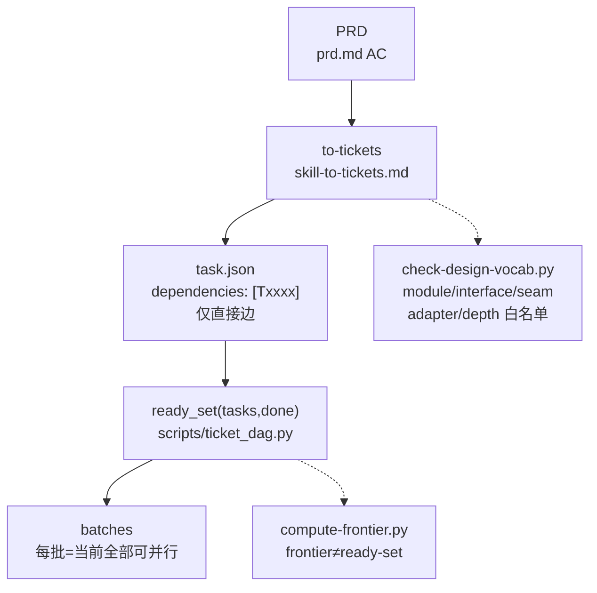
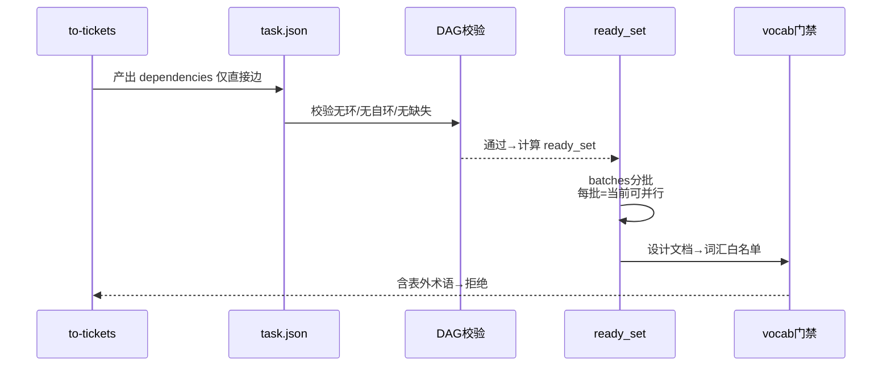
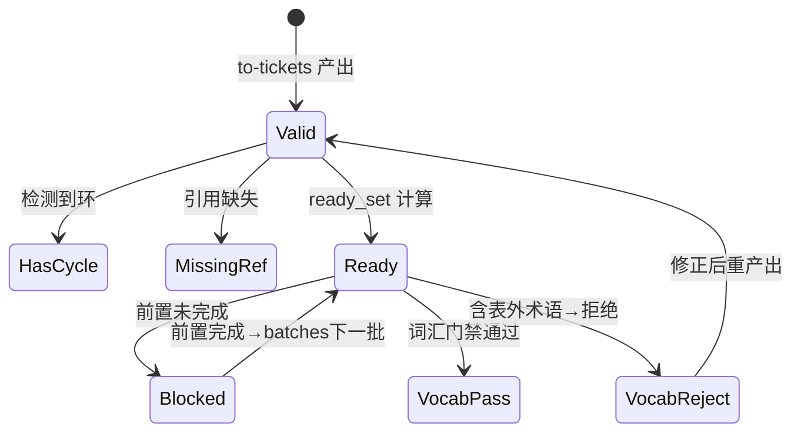
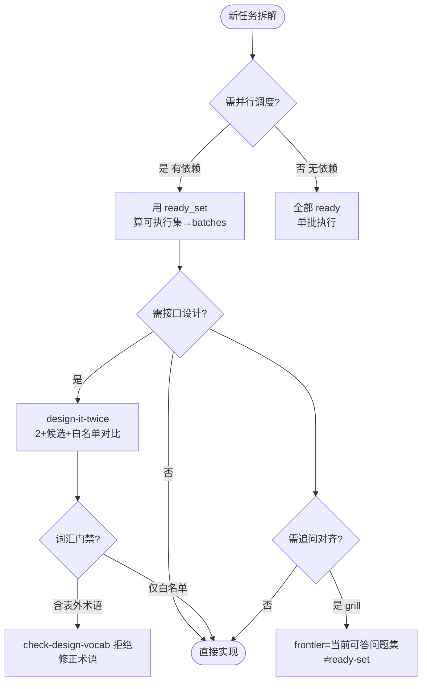

# Ticket DAG & Ready-set 与 Design-it-twice 词汇契约

> **一句话**：把“可并行性”与“接口术语一致性”做成可回归的硬指标——`dependencies` 显式边 + `ready_set` 纯函数 + `design-it-twice` 词汇白名单，三者均有确定性夹具可证伪。

Source: `tests/test_ticket_dag.py:1-40` + `scripts/ticket_dag.py:1-30` + `scripts/check-design-vocab.py:1-30` + `scripts/compute-frontier.py:1-30`

## C4 L2 — to-tickets 拆解至 ready-set 调度

`to-tickets` 将 PRD 按 `meta.scenario_type` 拆解为子 `task.json`，每子声明 `dependencies: ["Txxxx"]` 仅存直接边；`ready_set(tasks, done)` 纯函数计算可执行集；`compute-frontier.py` 将 ready-set 按 batches 分批调度；`check-design-vocab.py` 对设计文档做词汇白名单校验。C4 以 `PRD → to-tickets → task.json(dependencies) → ready_set → batches → check-design-vocab` 主链呈现。



Source: `tests/test_ticket_dag.py:1`（DAG四类fixture）+ `scripts/ticket_dag.py:1`（`ready_set` 纯函数）+ `scripts/compute-frontier.py:1`（frontier计算）+ `scripts/check-design-vocab.py:1`（词汇白名单）

## 时序 — 拆解→校验→ready-set→batches→词汇门禁

1) `to-tickets` 产出 `task.json` 含 `dependencies` 2) 立即跑 DAG 校验（有环抛 ValueError）3) `ready_set(tasks, done)` 计算当前可执行集 4) 按 batches 分批（每批为当前全部可并行）5) 设计文档经 `check-design-vocab.py` 词汇门禁。时序图覆盖“拆解→校验→计算→分批→门禁”全链。



Source: `tests/test_ticket_dag.py:40-90`（四类fixture）+ `scripts/ticket_dag.py:10-40`（`ready_set` 实现）+ `scripts/check-design-vocab.py:30-80`（`allowed_terms` 白名单）

## 状态机 — DAG 合法性与 ready-set 生命周期

`DAG` 三态：`valid`（无环且引用闭合）→ `has_cycle`（抛 ValueError）→ `missing_ref`（抛 KeyError）；`ready_set` 两态：`ready`（所有前置已完成）↔ `blocked`（有前置未完成）；`vocab` 两态：`pass`（仅白名单术语）↔ `reject`（含表外术语）。状态机覆盖四类边界。



Source: `tests/test_ticket_dag.py:20-60`（`test_cycle_raises`/`test_missing_ref`）+ `scripts/check-design-vocab.py:20-50`（`allowed_terms` 集合与`\b`匹配）

## 决策树 — 何时用 ready-set vs frontier vs 词汇门禁



Source: `pdca/CONTEXT.md:8-12`（`ready-set` vs `frontier` 消歧）+ `tests/test_ticket_dag.py:1`（场景分支）

## 正例

```python
# 正例1：ready_set 纯函数（AI仅读本体可复现）
from scripts.ticket_dag import ready_set
tasks = {"T1": set(), "T2": {"T1"}, "T3": {"T1"}, "T4": {"T2","T3"}}
assert ready_set(tasks, set()) == {"T1"}          # 仅T1 ready
assert ready_set(tasks, {"T1"}) == {"T2","T3"}     # T1完成→T2/T3并行
assert ready_set(tasks, {"T1","T2","T3"}) == {"T4"}

# 正例2：词汇白名单（仅允许术语）
# docs/design.md 含 "module: ticket_dag, interface: ready_set, seam: ticket_dag.py"
# 运行：python3 scripts/check-design-vocab.py --file docs/design.md  # PASS
# 若含 "component" / "service" / "API" → FAIL（非0+报告表外术语）
# 验证：grep -q 'allowed_terms' scripts/check-design-vocab.py 且 pytest tests/test_ticket_dag.py -k vocab 通过
```

命中：`ready_set` 四类fixture通过，`check-design-vocab` 白名单拒绝表外术语。

## 反例

```python
# 反例1：dependencies 存传递依赖（冗余）
# 错：{"T3": {"T1","T2"}} 其中 T2已依赖T1，T3再写T1为冗余传递边
# 正确：仅存直接边 {"T3": {"T2"}}，传递闭包由校验器推导

# 反例2：ready-set 与 frontier 混淆
# 错：把 grilling 的 frontier（当前可答问题集）当作 to-tickets 的 ready-set（可执行任务集）
# 正确：frontier是追问问题集合，ready-set是任务可执行集合（CONTEXT.md已消歧）

# 反例3：词汇门禁漏检大小写
# 错：check-design-vocab 用 \bAPI\b 匹配但未小写化，含 "api" 漏检
# 正确：先小写化 term 再 \b 匹配（T0231修复：state ^= state<<7 式大小写归一）

# 反例4：DAG有环未抛错导致死锁
# tasks = {"T1": {"T2"}, "T2": {"T1"}}  # 环
# 错：ready_set 返回空集静默死锁
# 正确：抛 ValueError("cycle detected: T1 -> T2 -> T1") 并拒绝拆解产出
```

## 门禁

- **属性门禁**：`attributes` 3条且每条 `testable_signal` 含 `grep -q`/`pytest`/`scripts/` 动词且双源可回归（test+script）
- **多图门禁**：`grep -c '```mermaid' ontology/domain/ai-efficiency-ticket-dag-ready-set.md` ≥4 且每图含 `Source:`
- **溯源门禁**：每图附 `tests/test_ticket_dag.py:line` 或 `scripts/*.py:line` 行号
- **正文门禁**：`wc -l` ≥80 且含 `决策树` `正例` `反例` `门禁` 四段
- **可scaffold**：`python3 scripts/ontology_test_scaffold.py --node ontology:domain/ai-efficiency-ticket-dag-ready-set --out /tmp/x.py` 可产且 `pytest --collect-only` 可收集
- **本体校验**：`python3 scripts/ontology-validate.py --ontology-dir ontology` 0 issues
- **夹具门禁**：`python3 -m pytest tests/test_ticket_dag.py -q` 全绿

Source: `tests/test_ticket_dag.py:1-150` + `scripts/ticket_dag.py:1-50` + `scripts/check-design-vocab.py:1-80` + `scripts/compute-frontier.py:1-40`
