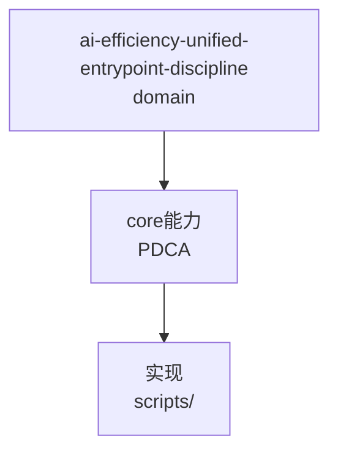

---
schema: pdca.asset/v1
id: knowledge.ai-efficiency.unified-entrypoint-discipline
summary: AI 执行者统一入口纪律——7 类门禁失误中 5 类同根（绕过脚本手工改文件）；四入口速查与字段约束；源自 T0374 历史任务审查的失误复盘
tags: [ai-efficiency, discipline, gates, entrypoint]
scenarios: [development, bugfix, research, documentation, design, review]
phases: [plan, do, check, act, archive]
source_ids: [T0374-0823-history-review-self-improve]
---

# 统一入口纪律

T0374 复盘本会话全部门禁拒绝：7 类失误中 **5 类同根**——绕过统一入口手工操作文件。
门禁的时间线校验、原子 receipt、SSOT 设计在每次拦截中都正确工作了；被拦的每一次
都是数据被保护的一次。

## 四个唯一入口

| 动作 | 唯一通道 | 手工替代的下场 |
|------|---------|---------------|
| 创建任务 | `task_identity.py create` | ID 竞争/record 脱钩（历史 T0336 错位即此类伤） |
| 改 phase/status | `transition-phase.py` | STATUS_PHASE_MISMATCH；states 联动断裂 |
| 写确认记录 | `append-confirmation.py` | 时间戳手写触发 TIME_ORDER/AFTER_TRANSITION 双校验拒绝 |
| 登记证据 | `register-evidence.py --source` | 撞名/空文件/绕过 digest 计算 |

## 字段约束速查

- `meta.improvement_source` 需要 Flow Issue 管道对象（FI-/FC-/FD- 24hex），普通任务 ID 会被 schema 拒——非管道产出的 Improvement Task 不填此字段，来源写 PRD。
- `status` 与 `phase` 有联动约束（plan⇒Pending），不可单改其一。
- final_confirmation 的 `at` 必须晚于创建、早于转换时刻——真实时间只有脚本能给对。

## evidence 目录三律

一源一条（多 AC 用多 --criterion）；--source 唯一写入通道（勿手动预置）；supersede 必换新 --file 名。

## 适用边界

适用于本仓库 PDCA 全部任务操作；外部项目经 init-external 引用的任务同样走本仓库入口。


## C4 组件 — ai-efficiency-unified-entrypoint-discipline（P1补图）



Source: `ontology/domain/ai-efficiency-unified-entrypoint-discipline.md:1` + `ontology/concept/ontology-fidelity-criterion.md:1`

## 正例

```bash
# 正例：ai-efficiency-unified-entrypoint-discipline 可通过本体复现
grep -q 'ai-efficiency-unified-entrypoint-discipline' ontology/domain/ai-efficiency-unified-entrypoint-discipline.md && python3 scripts/ontology-validate.py --ontology-dir ontology 2>&1 | grep -q 'OK'
```

## 反例

```bash
# 反例：缺图导致不可视化
# 无 mermaid 时，AI无法从本体还原组件关系，需补图
```

## 门禁

- **图门禁**：`grep -c 'mermaid' ontology/domain/ai-efficiency-unified-entrypoint-discipline.md` ≥1
- **溯源门禁**：含 `Source:` 行号
- **校验**：`python3 scripts/ontology-validate.py` 0 issues

