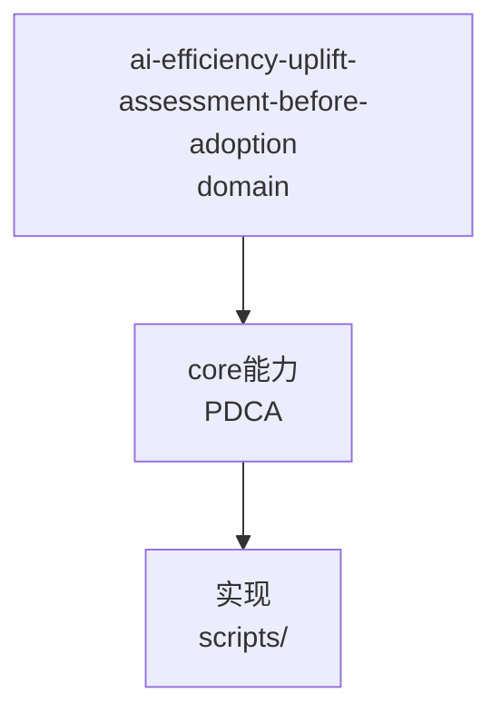

---
schema: pdca.asset/v1
id: knowledge.ai-efficiency.uplift-assessment-before-adoption
summary: 外部实践引进前的立项前评估法——现状核实防重复建设、五维评估、触发条件型观察层；源自 T0371 对 mattpocock/skills 引进的评估实践
tags: [ai-efficiency, assessment, adoption, methodology]
scenarios: [development, bugfix, research, documentation, design, review]
phases: [plan, check, act]
source_ids: [T0371-0823-evaluate-uplift-potential]
---

# 外部实践引进前的评估法

把外部项目/文章的实践引入本仓库前，先过三道静态评估：

## 1. 现状核实（防重复建设）

逐候选项核对本地文件到 file:line。T0371 实测：11 项候选中 2 项 already-done、1 项 mostly-done——外部报告的建议若跳过此步会直接造成重复建设。

## 2. 五维评估（对 partial/gap 项）

收益 / 成本 / 风险 / 依赖 / **验证方式**。验证方式必须在评估期设计好（回溯抽查/配对实验/故障注入），实施任务只执行不发明。

## 3. 触发条件型观察层

收益存疑或成本偏高者不直接否决也不立即做，转为带**量化触发条件**的观察项（如"记录率<50% 才硬化"、"词条>60 才拆分"）。把要不要做从主观辩论转为可测量决策。

## 路线图收敛原则

尊重内容预算等既有约束机制：增补优先落在非锚点文件、绕开持平 baseline；"全面铺开"永远让位于"聚焦组合"——1 立即 + 2 短期的实施概率远高于 9 条并进。

## 适用边界

适用于流程/技能/文档类改动立项；代码 bug 不走此法（走 triage）。触发条件的度量口径以触发时重测为准。


## C4 组件 — ai-efficiency-uplift-assessment-before-adoption（P1补图）



Source: `ontology/domain/ai-efficiency-uplift-assessment-before-adoption.md:1` + `ontology/concept/ontology-fidelity-criterion.md:1`

## 正例

```bash
# 正例：ai-efficiency-uplift-assessment-before-adoption 可通过本体复现
grep -q 'ai-efficiency-uplift-assessment-before-adoption' ontology/domain/ai-efficiency-uplift-assessment-before-adoption.md && python3 scripts/ontology-validate.py --ontology-dir ontology 2>&1 | grep -q 'OK'
```

## 反例

```bash
# 反例：缺图导致不可视化
# 无 mermaid 时，AI无法从本体还原组件关系，需补图
```

## 门禁

- **图门禁**：`grep -c 'mermaid' ontology/domain/ai-efficiency-uplift-assessment-before-adoption.md` ≥1
- **溯源门禁**：含 `Source:` 行号
- **校验**：`python3 scripts/ontology-validate.py` 0 issues

