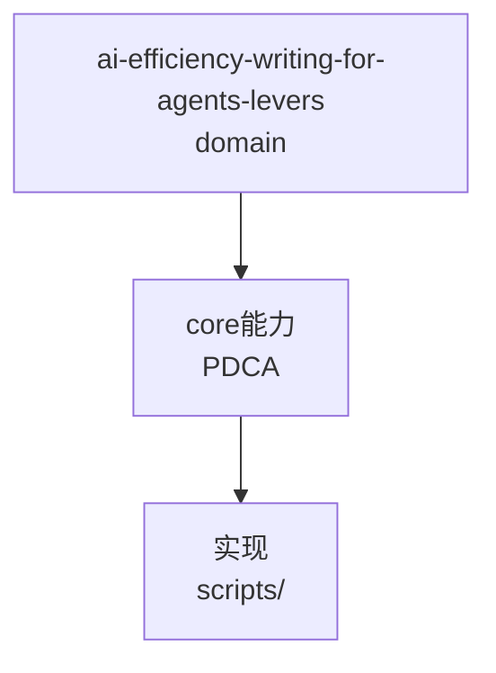

---
schema: pdca.asset/v1
id: knowledge.ai-efficiency.writing-for-agents-levers
summary: 为 AI 写文档的 4 个杠杆——锚定词（leading words）/指针措辞（pointer wording）/双负载（two loads）/no-op 模型相对判定；来源 mattpocock writing-for-agents，已增补至本地 writing-great-skills（T0245 实例）
tags: [ai-efficiency, writing, docs, skills, agents, tokens]
scenarios: [plan, do, act]
phases: [plan, do, act]
source_ids: [T0245-0809-writing-for-agents-levers]
---

# 为 AI 写文档的 4 个杠杆

写给 agent 消费的文档（skill/AGENTS.md/知识资产）与给人写的不同——同一
过程可预测，而非同一输出。四个杠杆（已增补至 skills/writing-great-skills/）：

## L1 锚定词（leading words）

用预训练已有的词锚定一类行为，重复以 **token** 而非句子，招募模型先验：

- _tight_ → "快速、确定性、低开销"的紧凑反馈循环
- _red_ → "可证伪的失败信号"（红灯，二值可观察）

- 自造词不招募先验，要用定义 token 偿还 → 优先已有词
- 三处同义短语指一概念 → 收拢为单 token
- 双赢：更少 token + 更锋利的触发钩子

## L2 指针措辞（pointer wording）

上下文指针的**措辞**（非目标）决定触发可靠性；弱措辞=方差 bug：
先改措辞，改不锋利才内联。

- 前置首词：指针靠首词做触发工作
- 一分支一触发词：同义改写=一分支写两遍，收拢
- 常载指针每轮花费 token，比正文更需修剪

## L3 双负载（two loads）

每个新增文档/指针花两种预算之一：

- **context load**：常载材料每轮 token 成本（无论是否触发都在花）
- **cognitive load**：人工索引成本——非最小化对象，花在人工判断处

渐进披露（推指针后）主要不是 token 优化，是**保护信息层级**的手段。
inline 每分支都需的；推 pointer 只有某些分支达的。

## L4 no-op 的模型相对判定

"是否改变默认行为"是**模型相对**的：两人争论一句是否 no-op，实为争论
默认行为——用运行文档解决，不用辩论。

- 太弱的词是 no-op（_be thorough_）→ 换更强词（_relentless_）
- 失败时删整句，不删词

## L5 深模块词汇（codebase-design）

用精确的架构术语替代模糊的通用词，让 agent 在讨论代码结构时零歧义。

## L6 重新 pitch（wait-what）

当 agent 的输出没有命中预期时，触发重新 pitch 机制——用共享语言重新表述需求，而非猜测。

## 复用场景


- 编写/审查任何 skill、AGENTS.md、知识资产、flow 文档。
- 结合 audit-skill-content 的内容预算做文档瘦身（去沉积、收锚定词）。

## 边界

- 杠杆是写作时的判定标准，不是自动检查；契约测试只守护"章节存在"，
  不守护"用法正确"。
- 锚定词依赖模型先验——跨模型族（如中文模型）先验词不同，需本地验证。


## C4 组件 — ai-efficiency-writing-for-agents-levers（P1补图）



Source: `ontology/domain/ai-efficiency-writing-for-agents-levers.md:1` + `ontology/concept/ontology-fidelity-criterion.md:1`

## 正例

```bash
# 正例：ai-efficiency-writing-for-agents-levers 可通过本体复现
grep -q 'ai-efficiency-writing-for-agents-levers' ontology/domain/ai-efficiency-writing-for-agents-levers.md && python3 scripts/ontology-validate.py --ontology-dir ontology 2>&1 | grep -q 'OK'
```

## 反例

```bash
# 反例：缺图导致不可视化
# 无 mermaid 时，AI无法从本体还原组件关系，需补图
```

## 门禁

- **图门禁**：`grep -c 'mermaid' ontology/domain/ai-efficiency-writing-for-agents-levers.md` ≥1
- **溯源门禁**：含 `Source:` 行号
- **校验**：`python3 scripts/ontology-validate.py` 0 issues

