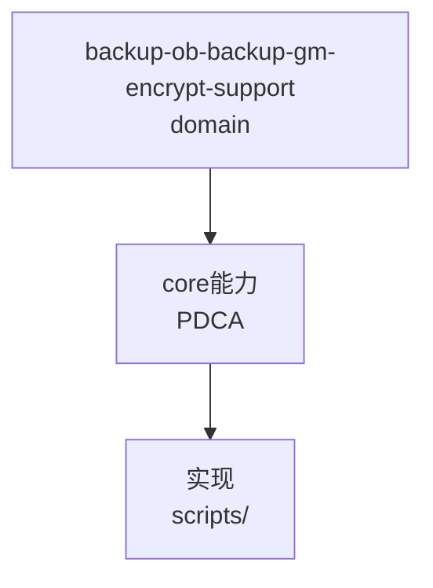

# OceanBase 备份加密与国密 SM4 能力边界

- 来源: records/T0229-0810-ob-backup-gm-encrypt-verify/conclusion.md
- 适用: OB 4.2.x 开源（commit 3abcb163）/ 真集群 4.2.1.1
- 日期: 2026-08-10

## 一句话结论

**OB 备份加密逻辑存在（PASSWORD / PASSWORD_ENCRYPTION / TRANSPARENT_ENCRYPTION / DUAL_MODE），但 4.2.1.1 无"备份独立选 SM4"开关，备份自身不产出 SM4 密文；备份传输维度 OB 自身不发起国密握手，需介质侧国密网关做 SM2/SM3/SM4 TLS 终止。**

## 分层结论

| 层 | 加密能力 | 国密支持 |
|----|---------|---------|
| 备份存储（口令加密 PASSWORD_ENCRYPTION） | 备份口令派生密钥加密，AES 族 | ❌ 无 SM4 选项（算法取值表空占位 `{"None",""}`，`ob_config.cpp:40-41`） |
| 备份存储（透明加密 TRANSPARENT_ENCRYPTION） | 无口令（源引擎 TDE 为库自身能力，不在备份国密范围内） | ❌ 备份不产出 SM4 密文 |
| 备份传输（OB→S3/OSS） | AWS SDK 标准 HTTP(S)/TLS | ❌ 无 SM2/SM3/SM4 套件（`ob_storage_s3_base.cpp:195`） |
| OB 内部 TLS（节点间通信） | easy_ssl / ussl-hook | ✅ 国密套件 `ECC-SM2-WITH-SM4-SM3` 存在，但仅 `OB_USE_BABASSL` 商业构建生效，且不覆盖备份介质链路（`easy_ssl.c:83-87,1014`） |
| 底层加密引擎 | EVP 全模式 | ✅ SM4 CBC/ECB/OFB/CFB/CTR/GCM 实现齐全（`ob_encryption_util_os.cpp:85-92`），`is_sm_algorithm` 声明无实现（`ob_encryption_util.h:249-250`）→ 启用路径留给安全版/企业版（`OB_BUILD_TDE_SECURITY` 默认 ON） |

## 关键证据

- 备份加密四模式枚举 `src/share/ob_encryption_util.h:224-234`；备份加密会话变量 `__ob_backup_encryption_mode__`/`__ob_backup_encryption_passwd__`（`ob_backup_struct.h:385-386`）。
- SM4 仅出现在透明加密元数据合法性白名单（`is_encryption_meta_valid`，`ob_config.cpp:1224-1238`），非用户可选算法入口。
- 真集群只读探测：`tde_method=none`（三节点），`SHOW PARAMETERS LIKE '%encryption%'` 无备份加密配置项。
- 官方命令语法（知识库《如何为全量备份集和增量备份集设置加密密码》）：`SET ENCRYPTION ON IDENTIFIED BY 'pw' ONLY` / 恢复前 `SET DECRYPTION IDENTIFIED BY 'pw'` / `ALTER SYSTEM BACKUP [INCREMENTAL] TENANT = t`；视图 `CDB_OB_BACKUP_JOBS` 含 `ENCRYPTION_MODE`/`PASSWD` 列；密码错误报 `ERROR 9047 invalid password for backup`。

## 与同类（gs_roach）差异

- gs_roach（GaussDB）：备份工具自身传输+存储均 AES 无 SM4；OB：备份工具层逻辑类似，备份自身均不产出 SM4 密文。
- 共识模式：**备份工具国密 = 介质侧网关（传输）+ 介质侧存储加密（S3/OSS/NFS 后端 ZFS 可选 SM4）**，备份工具本身不提供 SM4 直选。

## 边界

- 企业版"备份口令加密直选 SM4"无法从开源证明，需企业版文档/实测终判（备份自身国密需介质侧网关或介质静态加密承担）。
- **源引擎 TDE（Oracle 租户表空间 SM4 等）属数据库自有能力**，本备份方案不以源 TDE 沿袭作为国密实现路径（已在文档中剔除该表述）。
- OB 开源社区镜像不支持 Oracle 租户模式 → 无法在本地显式测 SM4-CBC；需企业版或 Oracle 模式租户实测。


## C4 组件 — backup-ob-backup-gm-encrypt-support（P1补图）



Source: `ontology/domain/backup-ob-backup-gm-encrypt-support.md:1` + `ontology/concept/ontology-fidelity-criterion.md:1`

## 正例

```bash
# 正例：backup-ob-backup-gm-encrypt-support 可通过本体复现
grep -q 'backup-ob-backup-gm-encrypt-support' ontology/domain/backup-ob-backup-gm-encrypt-support.md && python3 scripts/ontology-validate.py --ontology-dir ontology 2>&1 | grep -q 'OK'
```

## 反例

```bash
# 反例：缺图导致不可视化
# 无 mermaid 时，AI无法从本体还原组件关系，需补图
```

## 门禁

- **图门禁**：`grep -c 'mermaid' ontology/domain/backup-ob-backup-gm-encrypt-support.md` ≥1
- **溯源门禁**：含 `Source:` 行号
- **校验**：`python3 scripts/ontology-validate.py` 0 issues

