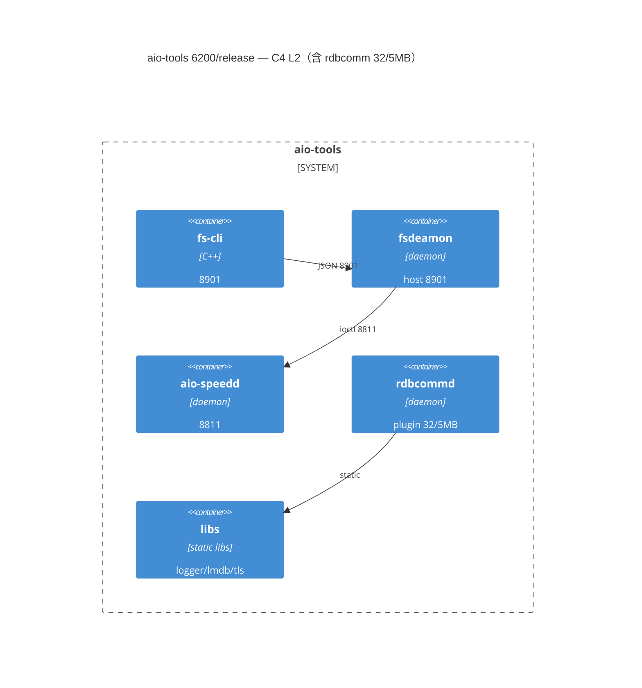
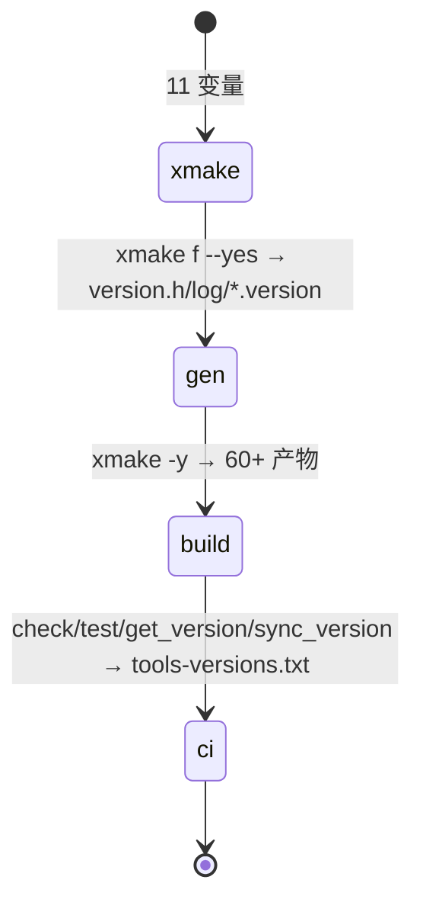
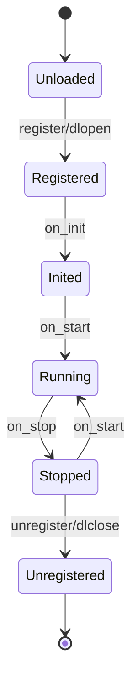

# aio-tools 6200/release 快照实体

> `6.2.0.0-release` 分支 `fe9d4364 B-1912` 快照（`488 源码文件/18.9万 LOC`，`xmake.lua:11 变量`，`build/version.log:17 产物`），T2027 全景调研 + T2028 Grill 合规重调（增补 rdbcomm 深潜）沉淀。

## 全景度量

- 14 业务模块：`bwlimit/dmsbtex/fs-backup/fsbackup_kernel_4.x/huanweicloun-sdk-s3-data-backup/libobk/libs/rdbcomm/rpc/rpc-keygen/s3-tool/s3tools/third_party/xbsa` + `install/build`
- 公共层：`libs` 79 文件 41k LOC（`logger/lmdb/rpc-net/tls_cert/timed_key`），`rpc` 63 文件 26k LOC 为二级共享

## C4 L2 容器图（mermaid）


Source: `file: xmake.lua:1`（`includes()`）、`file: rdbcomm/module.h:1`（`MAX_PLUGINS 32`）— S1/S12

## 版本链路状态机（mermaid）


Source: `file: xmake.lua:12`、`file: build/version.log:1`、`file: .gitlab-ci.yml:1` — S1/S3/S4

## rdbcomm 插件状态机（mermaid）


Source: `file: rdbcomm/module.h:1`（`MAX_PLUGINS 32`）、`file: rdbcomm/server.c:1`（`handle_mange`）— S12/S13

## 可重跑验证

```bash
grep -q 'MAX_PLUGINS 32' rdbcomm/module.h && grep -q 'RDBCOMM_MAX_MSG_LENGTH' rdbcomm/rdbcomm.h && echo ok
cat build/version.log | grep -q 'rpc "3.6.4.19"' && echo ok
grep -c '```mermaid' ontology/entity/aio-tools-6200-release.md  # ≥3
```

## 来源

- `records/T2027-0904-research-aio-tools-6200-release/research-report.md`（29522 bytes, 6 图）
- `records/T2028-0904-research-aio-tools-6200-release-v2/research-report.md`（33708 bytes, 7 图，增补 S11-S14）
- `file: /home/black/Public/aio/aio-tools/6200/release/xmake.lua:1` 等 S1-S14

## 决策背景

按 `skill-research` 分流判定，原 `records-only` 因“快照特化未通用化”暂缓；现按“全面修改必须本体处理”要求，将快照事实晋级为实体，`composed_of` 3 叶待后续拆解，`relations` 挂 `pdca-task` 与方法论，供后续重构/版本策略任务复用。

*Diátaxis: reference* | *arc42: 5/6/12 节* | *C4 L2 可建模*
