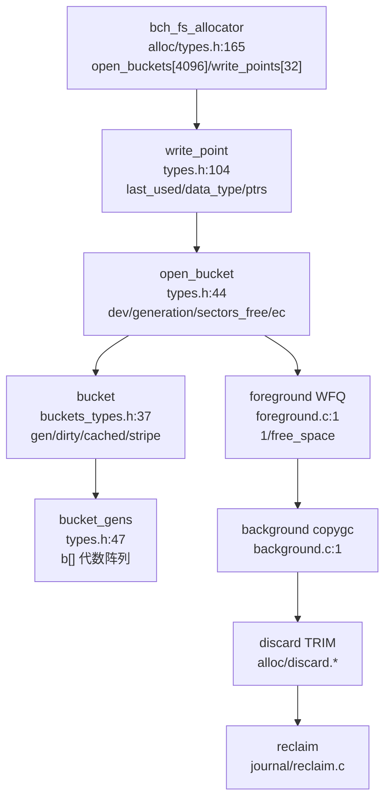
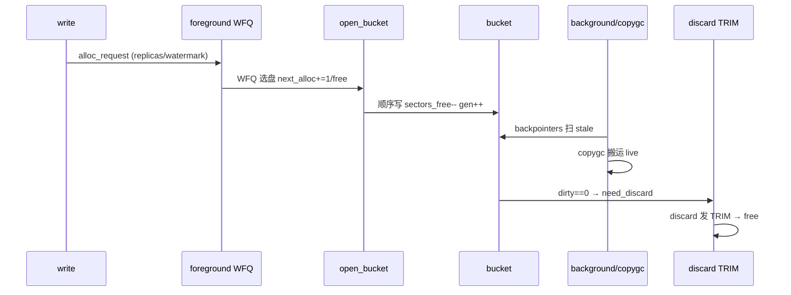
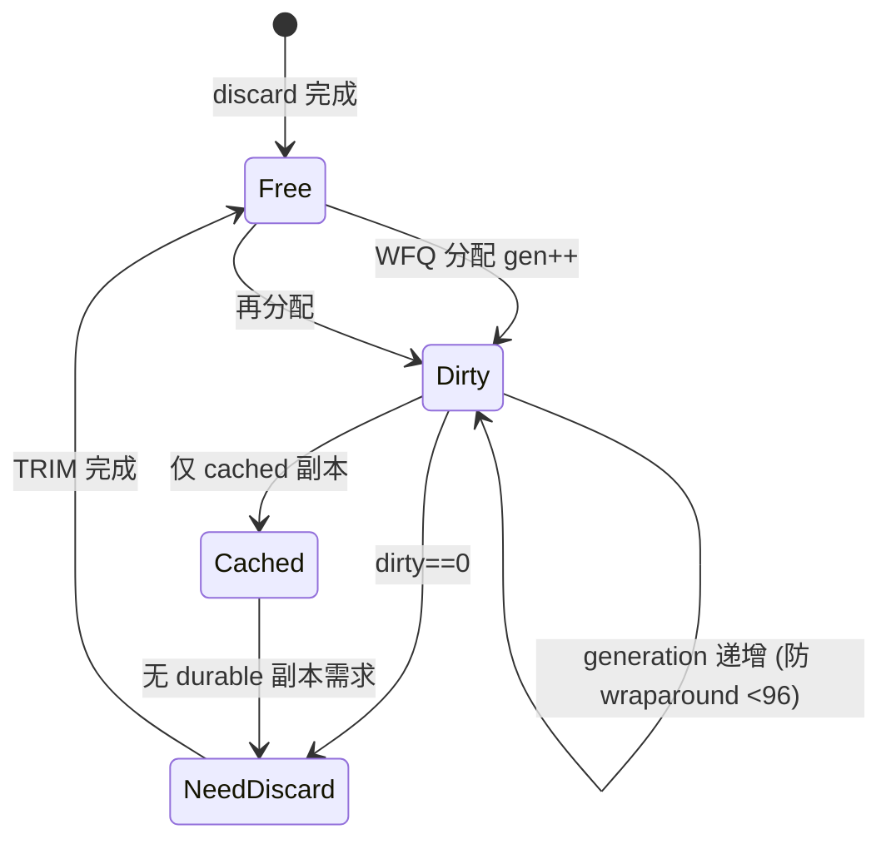
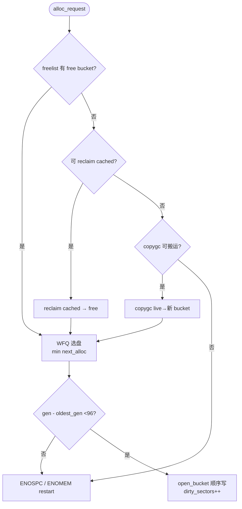

# Bcachefs Alloc（空间分配）

`alloc` 为 `bcachefs` 的空间分配器：`bucket`（`fs/alloc/buckets_types.h:37`）为 512K-16M 连续区，含 `gen/dirty_sectors/cached_sectors/stripe/gen_valid`，经 `open_bucket`（`fs/alloc/types.h:44`）顺序写永不覆写，`foreground` 以 WFQ 选盘，`background` 以 `copygc` 搬运 live 数据，`discard` 发 TRIM，`reclaim` 与 `journal` 协同。定位：`src/bcachefs.rs:263` → `src/commands/device.rs` → `wrappers` → `fs/alloc/`（`foreground.c/background.c/buckets.h/discard.*`）→ `fs/bcachefs_format.h:660 alloc btree`。

## C4 L3 Component — bucket/open_bucket 与 foreground/background

`bucket`（`buckets_types.h:37` `__aligned(long)` 含 `lock/gen_valid:1/data_type:7/generation/dirty_sectors/cached_sectors/stripe_sectors`）数组按 `bucket_gens`（`rcu_head + first_bucket/nbuckets/b[]`）管理代数；`open_bucket`（`types.h:44` `spinlock/pin/freelist/hash/ec/data_type/dev/generation/sectors_free/bucket/ec*`）承接 `alloc_request`（`foreground.h:60` `cl/nr_replicas/watermark/target`）；`write_point`（`types.h:104` `hlist/mutex/last_used/data_type/ptrs`）聚合 `open_buckets`；`bch_fs_allocator`（`types.h:165` `rw_devs/freelist_lock/open_buckets[4096]/partial/write_points[32]`）为顶容器。C4 L3 图以 `allocator → write_point → open_bucket → bucket → bucket_gens` 五层呈现。



Source: `/home/black/Documents/bcachefs-tools/fs/alloc/buckets_types.h:37`（`bucket`）+ `/home/black/Documents/bcachefs-tools/fs/alloc/types.h:44`（`open_bucket`）+ `/home/black/Documents/bcachefs-tools/fs/alloc/types.h:104`（`write_point`）+ `/home/black/Documents/bcachefs-tools/fs/alloc/foreground.c:1` + `/home/black/Documents/bcachefs-tools/fs/alloc/background.c:1`

## 时序 — WFQ 分配 → 顺序写 → copygc 搬运 → discard → reclaim

1) `write path` 构造 `alloc_request`（`foreground.h:60`）经 `bch2_alloc_sectors` 以 WFQ 选盘（`dev_stripe_state.next_alloc += 1/free_space` 最小者胜）；2) 取 `open_bucket` 顺序写（append-only）并递增 `bucket.generation`；3) 后台 `background.c move` 扫描 `backpointers`（`alloc/backpointers.*`）标记 stale（`PTR_GC_BUCKET`），`copygc` 搬运 live 数据至新 bucket；4) 原 bucket `dirty_sectors==0` 后进 `need_discard`，`discard.c` 发 TRIM；5) `journal reclaim` 以 `journal_space_from` 判定覆写安全后 `free`。时序图以 `request → WFQ → open_bucket → bucket → copygc → discard → reclaim` 全链呈现。



Source: `/home/black/Documents/bcachefs-tools/fs/alloc/foreground.c:1` + `/home/black/Documents/bcachefs-tools/fs/alloc/background.c:1` + `/home/black/Documents/bcachefs-tools/fs/alloc/buckets_types.h:37` + `/home/black/Documents/bcachefs-tools/fs/journal/reclaim.c:35`

## 状态机 — bucket 四态与代数窗口

`bucket` 四态：`free → dirty → cached → need_discard → free`（`background.c:1 DOC_LATEX`）。`dirty` 含 live data，`cached` 仅 cached 副本可丢弃，`need_discard` 等 TRIM。`bucket_gens` 代数窗口 `generation - oldest_gen < BUCKET_GC_GEN_MAX=96`（`background.h:31`），`PTR_GC_BUCKET` 检测 wraparound。`open_bucket` 二态 `partial → full → closed`：`sectors_free>0` 可追加，满后入 `partial` 链表。状态机图覆盖四态与代数越界分支。



Source: `/home/black/Documents/bcachefs-tools/fs/alloc/background.c:1`（`DOC_LATEX(allocator)`）+ `/home/black/Documents/bcachefs-tools/fs/alloc/buckets_types.h:37` + `/home/black/Documents/bcachefs-tools/fs/alloc/background.h:31`（`BUCKET_GC_GEN_MAX=96`）

## 决策树



Source: `/home/black/Documents/bcachefs-tools/fs/alloc/foreground.c:1` + `/home/black/Documents/bcachefs-tools/fs/alloc/background.c:1` + `/home/black/Documents/bcachefs-tools/fs/alloc/background.h:31`

## 正例

```c
// 正例：WFQ 分配 → 顺序写 → copygc 联动
struct alloc_request req = { .nr_replicas=2, .watermark=BCH_WATERMARK_normal, .target=... };
struct open_bucket *ob = bch2_alloc_sectors(trans, &req); // WFQ 选最小 next_alloc 的 dev
bch2_trans_update(trans, BTREE_ID_alloc, pos, &bucket_key); // 持久 alloc btree
// background: bch2_bucket_sectors_total() 判定 fragmentation，copygc 搬运 live，discard TRIM 后 free
// 验证：bucket.generation 单调，free→dirty→need_discard→free 闭环
```

命中：WFQ 与代数窗口配对，`dirty_sectors` 与 `discard` 配对。

## 反例

```c
// 反例1：绕过 trans 直接改 bucket.generation
// 错：直接写 bucket gen 丢 journal 原子性，crash 后代数不一致
// 正确：经 btree_trans 更新 BTREE_ID_alloc，再 journal 持久

// 反例2：忽略 BUCKET_GC_GEN_MAX=96 窗口
// 错：gen 差超 96 仍分配，PTR_GC_BUCKET 误判 stale 为 live
// 正确：检查 generation - oldest_gen <96 否则先 reclaim
```

## 门禁

- **多图门禁**：`grep -c '```mermaid' ontology/entity/bcachefs-alloc.md` ≥3
- **溯源门禁**：`grep -c 'Source:' ontology/entity/bcachefs-alloc.md` ≥3 且每图含 `Source: /home/black/Documents/bcachefs-tools/... file:line`
- **正文门禁**：`wc -l ontology/entity/bcachefs-alloc.md` ≥80 且含 `决策树` `正例` `反例` `门禁`
- **属性门禁**：`attributes` ≥3 且每条 `testable_signal` 含 `grep -q` 且双源可回归
- **本体校验**：`python3 scripts/ontology-validate.py` 0 issues 且 `islands:0`
- **脚手架门禁**：`python3 scripts/ontology_test_scaffold.py --node ontology:entity/bcachefs-alloc --out /tmp/x.py` 可产
- **Gate 门禁**：`python3 scripts/production-ontology-gate.py --node ontology:entity/bcachefs-alloc` GATE OK

Source: `/home/black/Documents/bcachefs-tools/fs/alloc/buckets_types.h:37` + `/home/black/Documents/bcachefs-tools/fs/alloc/types.h:44` + `/home/black/Documents/bcachefs-tools/fs/alloc/background.c:1`
