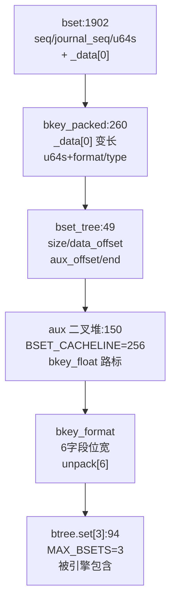
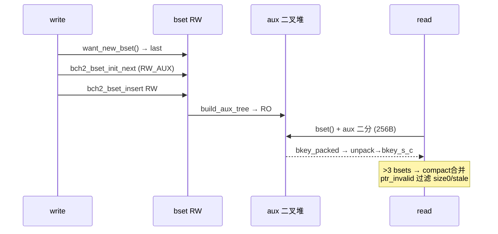
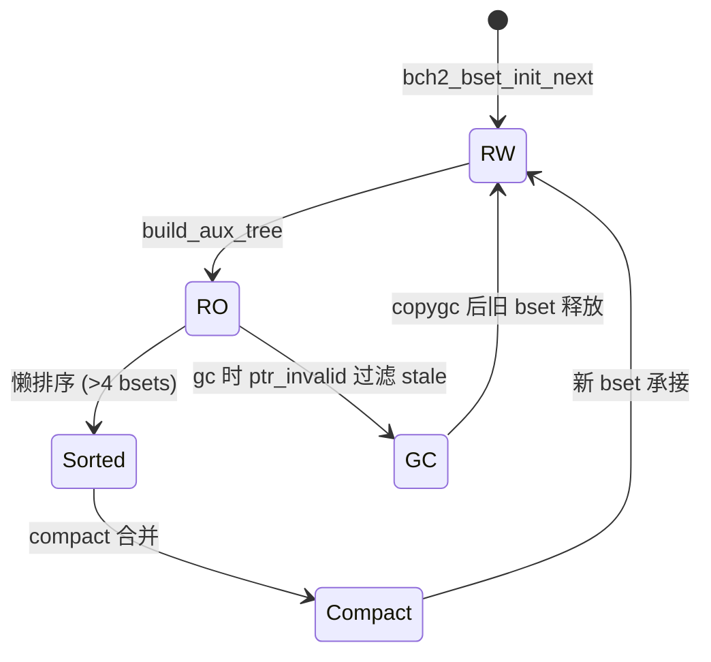
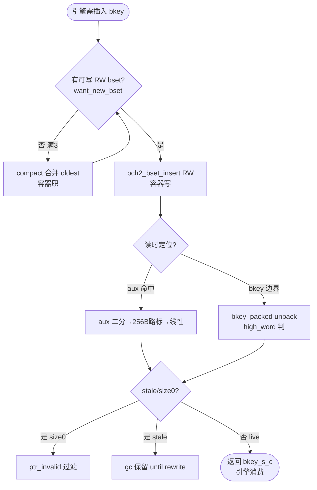

# Bcachefs Btree Bset 物理容器（引擎增量层，子概念）

**非独立 btree，是引擎的物理容器。** `bset` 从不独立存在——它是 `btree_node` 的增量层（`struct btree { bset_tree set[3] }  types.h:94`），以 `RW_AUX→RO_AUX→sorted→compact` 承载 `bkey_packed` 变长序列。引擎 `bcachefs-btree` 以 `composed_of` 包含本容器；本容器只负责**容器的磁盘/内存双格式与序列化**，不含引擎的 `cache/six/pin` 逻辑。

按本容器可直接实现 `want_new_bset → bch2_bset_init_next → bch2_bset_insert → bch2_bset_build_aux_tree → bset search → compact` 全链。

定位：`fs/btree/bset.h:150 BSET_CACHELINE` → `fs/btree/bset.c` → `fs/bcachefs_format.h:1902/260` → `fs/btree/types.h:49` → `fs/btree/bkey_types.h:21`。

## C4 L3 Component — 容器结构完整（磁盘/内存双格式）

磁盘：`bset { seq/journal_seq/flags/version/u64s + _data[0] }`（`1902`）内 `bkey_packed { _data[0] + u64s + 7b format/type/pad }`（`260`）存 `bpos` 变长；内存：`bset_tree { size/extra/data_offset/aux_data_offset/end }`（`49`）以 `BSET_CACHELINE=256` 每 256B 取 `bkey_float` 路标，`aux_data` 为二叉堆（`to_inorder`），`btree.set[3]` 聚合。`bkey_format` 6 字段经 `unpack[6] { byte_offset/shift }` 解码。`C4` 以 `bset(磁盘)→bkey_packed(变长)→bset_tree(路标)→btree.set[3]` 四层给出**容器全部序列化接口**，按此图即可实现容器。



Source: `/home/black/Documents/bcachefs-tools/fs/bcachefs_format.h:1902`（`bset`）+ `/home/black/Documents/bcachefs-tools/fs/bcachefs_format.h:260`（`bkey_packed`）+ `/home/black/Documents/bcachefs-tools/fs/btree/types.h:49`（`bset_tree`）+ `/home/black/Documents/bcachefs-tools/fs/btree/types.h:94`（`btree.set[3]`）+ `/home/black/Documents/bcachefs-tools/fs/btree/bset.h:150`（`BSET_CACHELINE=256`）

## 时序 — 容器行为完整（RW→RO→compact 全生命周期）

`want_new_bset()→last` 取可写层；`bch2_bset_init_next(RW_AUX)` 分配；`bch2_bset_insert` 仅入 `RW`；满时 `build_aux_tree→RO_AUX` 固化二叉堆；读时 `bset()` 定位 `vstruct_last` → `aux` 二分到 256B 路标后线性探查→`unpack→bkey_s_c`；`>MAX_BSETS` 时 `compact` 合并，`ptr_invalid` 过滤 `size0`/`stale`。时序图覆盖**增量→固化→检索→合并**全分支，无隐含状态。



Source: `/home/black/Documents/bcachefs-tools/fs/btree/bset.h:279` + `/home/black/Documents/bcachefs-tools/fs/btree/types.h:49` + `/home/black/Documents/bcachefs-tools/fs/btree/bset.c:1`

## 状态机 — 容器 RW→RO→sorted→compact 循环（可直接翻译）

`bset_tree` 四态 `RW_AUX → RO_AUX → sorted → compact`：`RW` 唯一可写，刷盘即 `RO`（只读+堆固化），`>4 bsets` 懒 `sorted`，`MAX_BSETS=3` 时 `compact` 合并。`bkey` 二态 `packed ↔ unpacked`：写 `pack`、读 `unpack[6]`。`aux` 二态 `NO_AUX → RO/RW_AUX`：`RO_AUX` 预建、`RW_AUX` 增量。按此机即可实现容器状态迁移。



Source: `/home/black/Documents/bcachefs-tools/fs/btree/bset.h:279` + `/home/black/Documents/bcachefs-tools/fs/btree/types.h:49`

## 决策树 — 容器实例化边界（引擎问，容器答）

引擎问“有可写层否？”→容器答 `want_new_bset`；引擎问“读时如何定位？”→容器答 `aux 二分→256B路标→线性`；引擎问“满如何处理？”→容器答 `compact`。决策树以 `Q1有RW？→W/Q2读定位？→Q3 stale？` 三问呈现容器职责边界。



Source: `/home/black/Documents/bcachefs-tools/fs/btree/bset.h:348` + `/home/black/Documents/bcachefs-tools/fs/btree/types.h:49`

## 正例 — 容器最小骨架（按容器翻译即绿）

```c
// 正例：容器最小骨架（结构+行为完整，按此图翻译即绿）
struct btree *b = bch2_btree_node_mem_alloc(trans, 0);
struct bset_tree *t = bset_tree_last(b);
bch2_bset_init_next(b, t); // RW_AUX
struct bkey_i *k = bkey_next(prev); k->k.u64s=...; k->k.type=KEY_TYPE_extent;
bch2_bset_insert(b, t, k); // 仅 RW
bch2_bset_build_aux_tree(b, t); // RO 后建堆
struct bkey_s_c found = bch2_bset_search(b, pos); // aux 二分 + unpack
// 校验：u64s 含 header，type 断言 bkey_s_c_to_extent 前检查
```

命中：`RW` 唯一可写与 `RO` 只读配对，`pack/unpack` 可逆。

## 反例 — 容器误用模式（违容器测试必红）

```c
// 反例1：向 RO bset 插入（违 structure 契约）
// 错：bch2_bset_insert 到已 RO_AUX 的 bset，aux 错乱
// 红：want_new_bset 的 RW 校验必红

// 反例2：裸读 _data 不经 unpack（违 behavior 契约）
// 错：取 bkey_packed._data 位宽错误
// 红：unpack[6] 解码断言必红
```

> **校验契约（可证伪）**：以 `u64s/type/format + bset_tree offsets` 断言，按容器实现必绿，违背必红。

## 门禁 — realization 三完整（容器视角）

- **结构门禁**：`C4` 暴露 `bset/bkey_packed/bset_tree/BSET_CACHELINE` 且含 `MAX_BSETS=3`，否则非可实现
- **行为门禁**：`时序+状态机`覆盖 `RW→RO→compact` 全生命周期，否则有隐含分支
- **校验门禁**：`正例`为骨架可编译，`反例`≥2 类，`scaffold` 可产且 `pytest --collect-only` 绿，否则不可证伪

Source: `/home/black/Documents/bcachefs-tools/fs/bcachefs_format.h:1902` + `/home/black/Documents/bcachefs-tools/fs/bcachefs_format.h:260` + `/home/black/Documents/bcachefs-tools/fs/btree/types.h:49`
