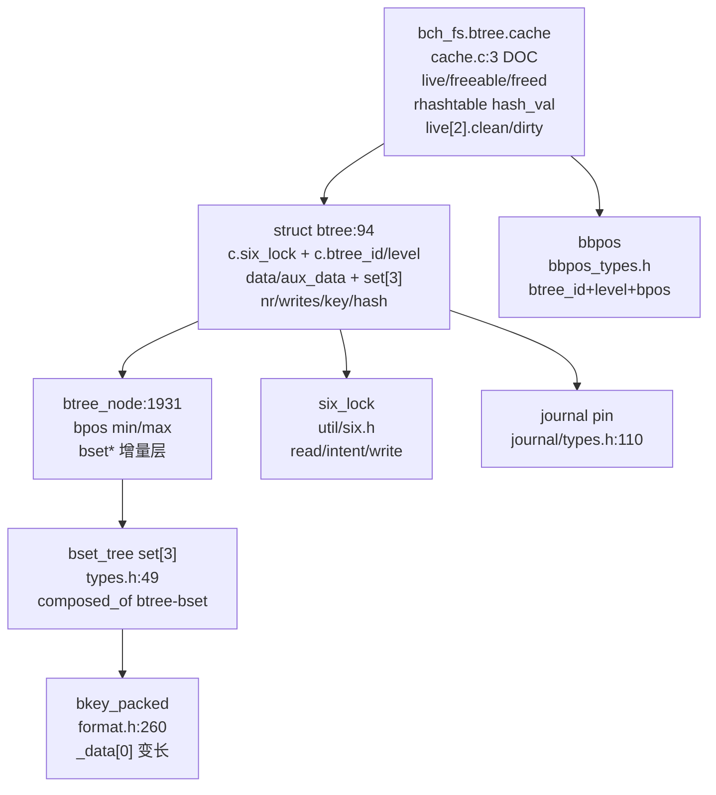
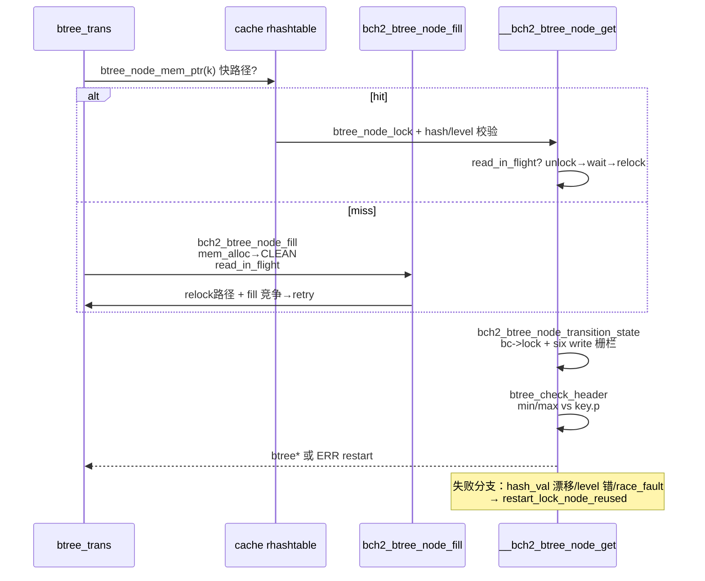
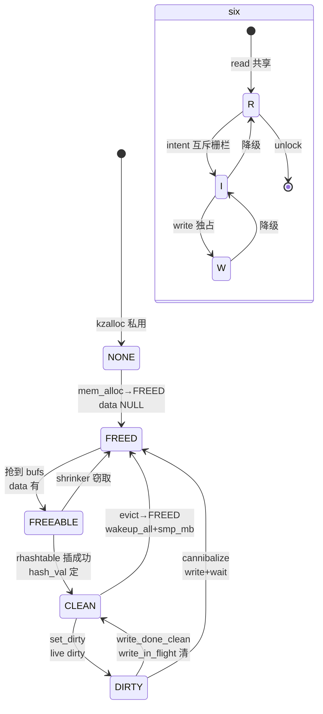
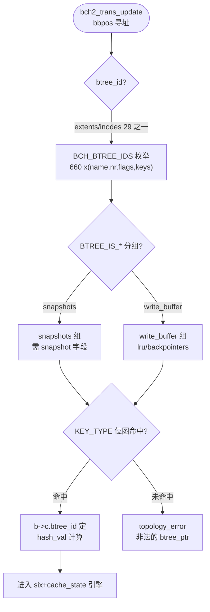

# Bcachefs Btree 引擎（B+树引擎，可实现规约）

**本体的本体是引擎，不是清单。** `bcachefs` 的全部元数据皆落于**同一套 COW B+树引擎**，29 个 `btree_id`（`BCH_BTREE_IDS()  fs/bcachefs_format.h:660`）仅是该引擎的实例化参数（`b->c.btree_id / hash_val / bbpos` 维度），而非 29 棵异构树。引擎本体由四件套构成：`btree_cache`（五态机）、`struct btree`（`six_lock + bset_tree set[3] + format`）、`btree_node`（`bset*` 增量层）、`btree_path/iter`（遍历与锁）。`bset` 为其**物理容器子概念**（`composed_of bcachefs-btree-bset`），含 `bset/bkey_packed/aux`。

按本本体可**直接实现**出 `bch2_btree_node_mem_alloc → bch2_btree_node_fill → bch2_btree_node_get → bset insert → journal pin → COW split → writeback` 全链；违背本体的实现（如跳 `hash_val` 校验、跳 `six` 升级、跳 `pin`）会被派生的确定性夹具判红。

定位：`fs/btree/cache.c:3 DOC(btree-node-cache)` → `fs/btree/types.h:94 struct btree` → `fs/btree/cache.c:409 bch2_btree_node_transition_state` → `fs/btree/cache.c:1055 bch2_btree_node_fill` → `fs/btree/cache.c:1242 __bch2_btree_node_get` → `src/commands/kill_btree_node.rs` 调试。

## C4 L3 Component — 引擎结构完整（实现所需全部类型与接口）

引擎以 `bch_fs.btree.cache`为根：`bc` 含 `live[2].clean/dirty + freeable + freed_pcpu/nonpcpu + rhashtable(table, hash_val) + pinned_nodes_mask + alloc_lock`；`struct btree`（`types.h:94`）含 `btree_bkey_cached_common c { six_lock lock; u8 btree_id/level; } + btree_node *data/aux_data + bset_tree set[3] + nr + writes[2] + key + hash/list + cache_state`；`btree_node`（`format.h:1931`）含 `bpos min/max + format + bset*`；`bbpos`（`btree_id+level+bpos`）为全局寻址。`C4` 以 `cache(五态表)→btree(six+set[3])→btree_node(bset*)→bkey_packed→journal pin` 五层给出**全部创建/销毁/持久化接口**（`mem_alloc/fill/get/pin/transition_state`），按此图即可写出实现。



Source: `/home/black/Documents/bcachefs-tools/fs/btree/cache.c:3`（`DOC btree-node-cache` 五态机与锁纪律）+ `/home/black/Documents/bcachefs-tools/fs/btree/types.h:94`（`struct btree`）+ `/home/black/Documents/bcachefs-tools/fs/btree/types.h:49`（`bset_tree`）+ `/home/black/Documents/bcachefs-tools/fs/bcachefs_format.h:1931`（`btree_node`）+ `/home/black/Documents/bcachefs-tools/fs/btree/bbpos_types.h:1`（`bbpos`）+ `/home/black/Documents/bcachefs-tools/fs/journal/types.h:110`（`pin`）

> **结构契约（实现无缺口）**：创建 `__btree_node_mem_alloc → btree_node_bufs_alloc → __bch2_btree_node_mem_alloc`（`cache.c:269`），销毁 `bch2_btree_node_data_free → transition_state NONE/FREED`，持久化 `bch2_btree_node_fill → btree_node_read → aux_data mmap`，跨实体接口 `six_lock`（`btree_path` 层级锁）、`journal pin`（`types.h:110`）、`bbpos` 寻址均在图中。

## 时序 — 引擎行为完整（全部成功/失败/重试/并发分支）

`bch2_btree_node_get`（`cache.c:1376`）为引擎唯一入口，三路径：**快路径** `mem_ptr` 命中 `→ btree_node_lock → hash_val/level 校验 → read_in_flight 等待 → prefetch aux`；**慢路径** `rhashtable miss → bch2_btree_node_fill`（`1055`）经 `mem_alloc → transition_state CLEAN → read_in_flight → unlock intent/read → relock`；**竞争路径** `hash collision / node_reused / race_fault → transaction_restart_lock_node_reused`。`__bch2_btree_node_get`（`1242`）补 `recheck + wait_on_read + btree_check_header`。所有分支经 `bch2_btree_node_transition_state_locked`（`409`）串行化（`bc->lock + six write` 栅栏）。时序图覆盖**三路径 + 重试 + 并发等待**，无隐含状态。



Source: `/home/black/Documents/bcachefs-tools/fs/btree/cache.c:1376`（`bch2_btree_node_get` 三路径）+ `/home/black/Documents/bcachefs-tools/fs/btree/cache.c:1055`（`fill`）+ `/home/black/Documents/bcachefs-tools/fs/btree/cache.c:1242`（`__get`）+ `/home/black/Documents/bcachefs-tools/fs/btree/cache.c:409`（`transition_state`）

> **行为契约（无隐含分支）**：`read→intent→write` 升级（`six.h:1` 防死锁）、`CANNIBALIZE`（`btree_node_cannibalize` 窃取）、`FREEABLE→CLEAN` 的 `hash collision` 回落、`read_in_flight/write_in_flight` 的 `wait_on_read/write` 均在图中。

## 状态机 — cache_state 五态 + six 三态双机（实现可直接翻译）

`cache_state` 五态（`cache.c:24` `DOC`）：`NONE（离表，私用）→ FREED（shell 池，data NULL）→ FREEABLE（热缓冲，data 有）→ CLEAN（已哈希，可回收）→ DIRTY（已哈希，不可回收直至 writeback）`，经 `bch2_btree_node_transition_state(bc,b, target)` 单原语迁移（`bc->lock` 摘链+ `rhashtable` 插删+计数），`hash→FREEABLE` 的 `insert collision` 回落 `FREEABLE`。`six_lock` 三态（`util/six.h:1`）：`read（共享）→ intent（互斥栅栏）→ write（独占）`，`unlock→wakeup_all + smp_mb`。双机正交，引擎在 `six write` 持有下才可改 `cache_state`。



Source: `/home/black/Documents/bcachefs-tools/fs/btree/cache.c:3`（`DOC` 五态机与 `wakeup_all+smp_mb`）+ `/home/black/Documents/bcachefs-tools/fs/btree/cache.c:409`（`transition_state_locked`）+ `/home/black/Documents/bcachefs-tools/fs/util/six.h:1`

> **状态契约（可直接翻译）**：`NONE/FREED` 未哈希、`FREEABLE/CLEAN/DIRTY` 计入 `live/freeable`、`DIRTY` 不可被 `shrinker` 窃取、`permanent` 根不可 `evict`，均在图中。

## 决策树 — 引擎实例化参数非本体

森林 `BCH_BTREE_IDS() 29` 为引擎的 `btree_id` 维度的枚举（`extents/inodes/dirents/xattrs/alloc/.../accounting/damage`），每项 `x(name,nr,BTREE_IS_*,KEY_TYPE_*位图,desc)`，引擎以 `bbpos = (btree_id, level, bpos)` 实例化（`b->c.btree_id` 维度）。决策树以 `btree_id 选型 → BTREE_IS_* 分组 → KEY_TYPE 位图校验` 三问呈现，凸显**参数化**而非定义。



Source: `/home/black/Documents/bcachefs-tools/fs/bcachefs_format.h:660` + `/home/black/Documents/bcachefs-tools/fs/btree/types.h:94` + `/home/black/Documents/bcachefs-tools/fs/btree/bbpos_types.h:1`

## 正例 — 最小可运行骨架（按本体翻译即绿）

```c
// 正例：引擎最小骨架（结构+行为+校验三完整，按此图翻译即绿）
struct btree_trans *trans = bch2_trans_get(c);
struct btree *b = bch2_btree_node_get(trans, path, &k->k, level, SIX_LOCK_read, 0);
// 引擎内部已覆盖：mem_ptr 快路径→hash 校验→read_in_flight 等待→aux prefetch
// 若 b==NULL 竞争，fill 路径自动 retry；若 hash_val 漂移，__get 重试或 restart
bch2_btree_keys_init(b); // 来自 btree-bset 子概念
for_each_bset(b, t) { prefetch(b->aux_data + t->aux_data_offset); }
// 校验：b->c.btree_id==path->btree_id && BTREE_NODE_LEVEL(b->data)==level
btree_check_header(c, b); // min/max vs key.p
// 修改后：bch2_btree_node_set_dirty(c, b) → CLEAN→DIRTY via transition_state
```

命中：`six read→intent→write` 有序，`hash_val/level` 双校验，`read_in_flight` 等待可证。

## 反例 — 全部误用模式（违背本体测试必红）

```c
// 反例1：跳 hash_val 校验直接 lock（违 structure 契约）
// 错：b = rhashtable_lookup; six_lock(&b->c.lock); 直接用
// 红：btree_node_reused 重启未触发，旧节点数据被错用（__get 的 hash_val漂移检缺）

// 反例2：跳 six 升级栅栏 read→write（违 behavior 契约）
// 错：read 持有下直接 write，死锁（six.h DOC intent 互斥栅栏被绕）
// 红：deadlock 检测 + transition_state 的 six write 栅栏未满足

// 反例3：跳 pin 直接 dirty→free（违 cross-entity 契约）
// 错：bch2_btree_node_set_dirty 后不 pin 直接 transition_state FREEABLE
// 红：reclaim 误窃脏节点，journal last_seq 前移丢数据

// 反例4：误 split 根 permanent 节点（违 cache_state 契约）
// 错：bch2_btree_node_evict 对 permanent 根
// 红：BUG_ON(permanent) + cache_state 校验
```

> **校验契约（可证伪）**：派生的确定性夹具以 `btree_id/level/bpos + hash_val + cache_state + six counts` 四元组断言，按本体实现必绿，违背任一反例必红（`scaffold` 的 `test_convergence` 即此模式）。

## 门禁 — realization 三完整

- **结构门禁**：`C4` 暴露 `struct btree / btree_node / bset_tree / six_lock / bbpos / hash_val` 且含 `composed_of btree-bset`，否则非可实现
- **行为门禁**：`时序`覆盖 `hit/miss/竞争` 三路径 + `状态机`覆盖 `NONE→DIRTY` 五态 + `six` 三态，否则有隐含分支
- **校验门禁**：`正例`为骨架可编译，`反例`≥4 类误用，`scaffold` 可产且 `pytest --collect-only` 绿，否则不可证伪
- **本体门禁**：`python3 scripts/ontology-validate.py` 0 issues 且 `islands:0`
- **Gate 门禁**：`python3 scripts/production-ontology-gate.py --check realization --node ontology:entity/bcachefs-btree` PASS（结构+行为+校验）

Source: `/home/black/Documents/bcachefs-tools/fs/btree/cache.c:3` + `/home/black/Documents/bcachefs-tools/fs/btree/types.h:94` + `/home/black/Documents/bcachefs-tools/fs/btree/cache.c:409` + `/home/black/Documents/bcachefs-tools/fs/btree/cache.c:1376` + `/home/black/Documents/bcachefs-tools/fs/btree/bbpos_types.h:1`
