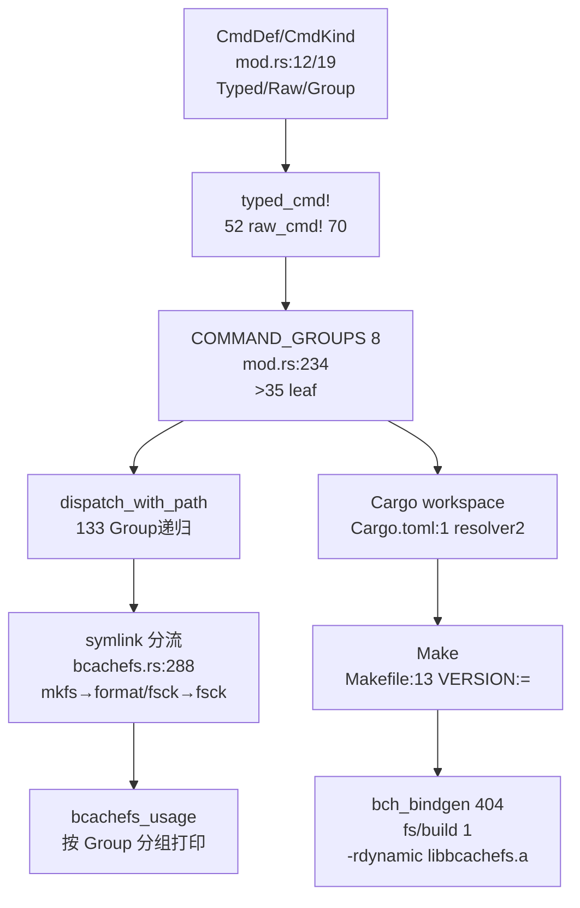
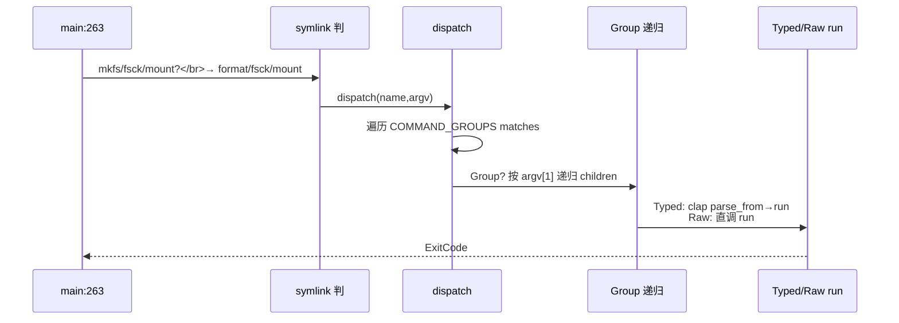
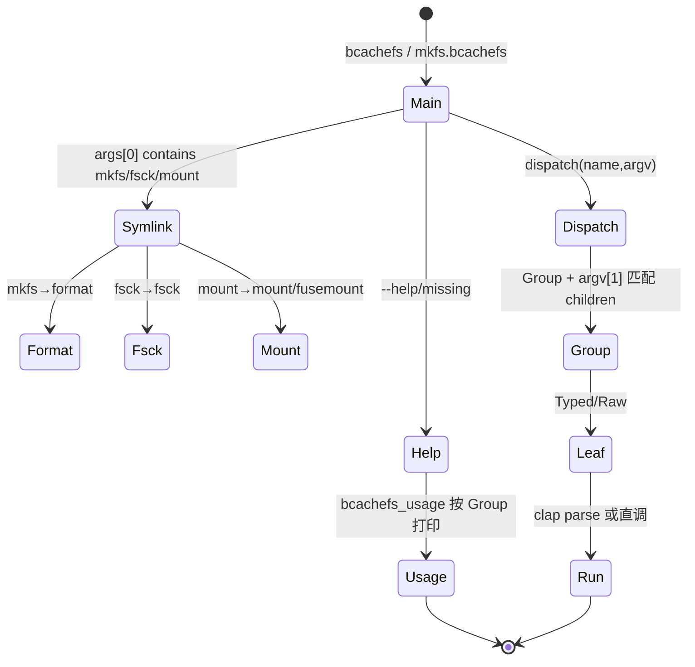
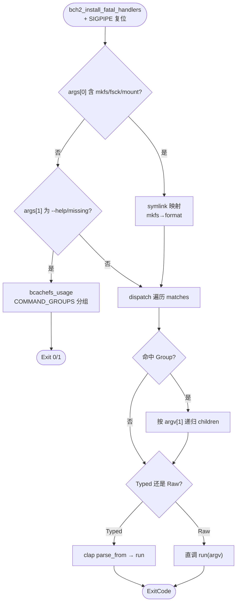

# Bcachefs CLI（命令行框架）

CLI 为 `bcachefs` 单一二进制的 `COMMAND_GROUPS`（`src/commands/mod.rs:234` 8 组 >35 leaf）分发总线：`CmdDef { name/about/aliases/kind }` 持 `CmdKind::{Typed(Raw)/Group}`，`typed_cmd!`（`52`）/ `raw_cmd!`（`70`）宏生成 `__cmd/__run`，`dispatch_with_path`（`133`）按 `Group` 递归，`bch_bindgen/build.rs:404` + `fs/build.rs:1` 支撑 `build.rs:1 -rdynamic` 链接 `libbcachefs.a`，`Cargo workspace + Make + DKMS` 三构建。定位：`src/bcachefs.rs:263 main() → commands/mod.rs:234 → bch_bindgen/build.rs + fs/build.rs → Makefile:240`。

## C4 L3 Component — CmdDef/CmdKind + COMMAND_GROUPS + dispatch + 三构建

`CmdDef`（`mod.rs:12`）含 `name/about/aliases/kind`，`CmdKind`（`19`）分 `Typed{ cmd:fn()->Command, run:fn(Vec<String>)->ExitCode } / Raw{ run } / Group{ children: &[&CmdDef] }`；`COMMAND_GROUPS`（`234`）8 组：`Superblock(6: format/super/...)/Images/Mount(3: mount/fusemount/wait_devices)/Repair(4: fsck/rewind/recovery)/Running fs(1 group fs→4)/Devices/Subvol(1)/Fs data(2)/Encryption(3)/Migrate(2)/File opts(3)/Debug(8: dump/list/kill...)/Misc(2: completions/version)`；`Cargo.toml:1` `resolver="2"` + `Makefile:13 VERSION:=` + `bch_bindgen/build.rs:404` 生成 `extern.c`。C4 L3 图以 `CmdDef/CmdKind → COMMAND_GROUPS(8) → dispatch(Group递归) → symlink分流 → 三构建` 五层呈现。



Source: `/home/black/Documents/bcachefs-tools/src/commands/mod.rs:12`（`CmdDef`）+ `/home/black/Documents/bcachefs-tools/src/commands/mod.rs:19`（`CmdKind`）+ `/home/black/Documents/bcachefs-tools/src/commands/mod.rs:52`（`typed_cmd!`）+ `/home/black/Documents/bcachefs-tools/src/commands/mod.rs:234`（`COMMAND_GROUPS` 8 组）+ `/home/black/Documents/bcachefs-tools/src/bcachefs.rs:263`（`symlink + usage`）+ `/home/black/Documents/bcachefs-tools/Cargo.toml:1` + `/home/black/Documents/bcachefs-tools/Makefile:13`

## 时序 — main → symlink → dispatch → Group 递归 → run

1) `bcachefs` 或 `mkfs.bcachefs`（`symlink`）进 `main:263` 复 `SIGPIPE`、置 `setvbuf`、调 `raid_init`；2) `symlink` 判 `mkfs→format/fsck→fsck/mount→mount/fusemount`，`--help` 进 `bcachefs_usage` 按 `COMMAND_GROUPS` 分组打印；3) `commands::dispatch(name, argv)` 遍历 `COMMAND_GROUPS` 找 `matches`；4) `CmdDef::dispatch`→`dispatch_with_path` 若 `Group` 则按 `argv[1]` 匹配 `children` 递归；5) `Typed` 经 `clap::Parser::parse_from` 后 `run`，`Raw` 直调 `run`；6) `defers_shrinkers` 决定 `mount/fusemount` 延迟 `linux_shrinkers_init`。时序图以 `main → symlink → dispatch → Group递归 → Typed/Raw run` 全链呈现。



Source: `/home/black/Documents/bcachefs-tools/src/bcachefs.rs:263`（`main + symlink + usage`）+ `/home/black/Documents/bcachefs-tools/src/commands/mod.rs:133`（`dispatch_with_path`）+ `/home/black/Documents/bcachefs-tools/src/commands/mod.rs:188`（`dispatch`）

## 状态机 — symlink 与 Group 分发

`symlink` 四态 `bcachefs → mkfs/fsck/mount/fusemount`：按 `args[0] contains` 映射 `format/fsck/mount/fusemount`。`help` 三态 `missing → usage → success`：`None` 打印 `missing command + usage` 返 1，`--help` 返 0。`dispatch` 四态 `match → Group → leaf → run`：`Group` 缺 `subcmd` 时打印 `Commands:` 并按 `help` 与否返 0/1。`build` 二态 `Cargo → Make`：`SRCS` 改动即 `cargo build --release -rdynamic` 重链。状态机图覆盖 `symlink→Group→run` 与 `help` 分支。



Source: `/home/black/Documents/bcachefs-tools/src/bcachefs.rs:263` + `/home/black/Documents/bcachefs-tools/src/commands/mod.rs:133` + `/home/black/Documents/bcachefs-tools/src/commands/mod.rs:188`

## 决策树



Source: `/home/black/Documents/bcachefs-tools/src/bcachefs.rs:263` + `/home/black/Documents/bcachefs-tools/src/commands/mod.rs:133` + `/home/black/Documents/bcachefs-tools/build.rs:1`

## 正例

```c
// 正例：多组分发 + symlink
mkfs.bcachefs /dev/sda           // symlink → format (per-device)
bcachefs fs usage /mnt            // Group fs → fs_usage::CMD
bcachefs device add /mnt /dev/sdc // Group device → add
bcachefs dump --help              // Typed: clap 派生 help 按 COMMAND_GROUPS 分组
// 验证：symlink 与 Group 递归配对，Typed/Raw 分工正确
```

命中：`symlink` 与 `format/fsck` 配对，`Group` 与 `children` 配对，`Typed/Raw` 与 `clap` 配对。

## 反例

```c
// 反例1：Group 缺 subcmd 仍返 0
// 错：bcachefs fs (无子命令) 静默成功
// 正确：Group 无匹配时打印 Commands: 并按 --help 与否返 0/1（mod.rs:154）

// 反例2：per-device 误用 clap 全局
// 错：format 用 clap 导致 --label 全局生效
// 正确：format 手工解析按裸 path 边界累积 DevOpts（format.rs:1 注释）
```

## 门禁

- **多图门禁**：`grep -c '```mermaid' ontology/entity/bcachefs-cli.md` ≥3
- **溯源门禁**：`grep -c 'Source:' ontology/entity/bcachefs-cli.md` ≥3 且每图含 `Source: /home/black/Documents/bcachefs-tools/... file:line`
- **正文门禁**：`wc -l ontology/entity/bcachefs-cli.md` ≥80 且含 `决策树` `正例` `反例` `门禁`
- **属性门禁**：`attributes` ≥3 且每条 `testable_signal` 含 `grep -q` 且双源可回归
- **本体校验**：`python3 scripts/ontology-validate.py` 0 issues 且 `islands:0`
- **脚手架门禁**：`python3 scripts/ontology_test_scaffold.py --node ontology:entity/bcachefs-cli --out /tmp/x.py` 可产
- **Gate 门禁**：`python3 scripts/production-ontology-gate.py --node ontology:entity/bcachefs-cli` GATE OK

Source: `/home/black/Documents/bcachefs-tools/src/commands/mod.rs:12` + `/home/black/Documents/bcachefs-tools/src/bcachefs.rs:263` + `/home/black/Documents/bcachefs-tools/Cargo.toml:1`
