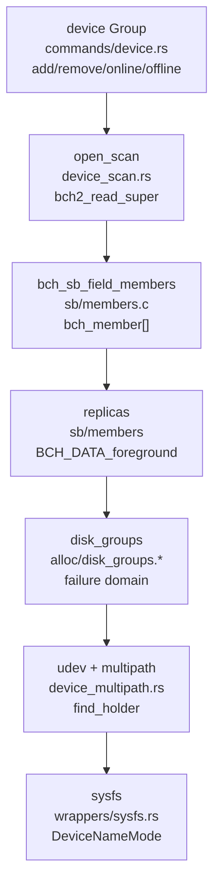
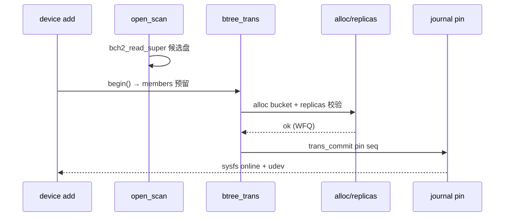
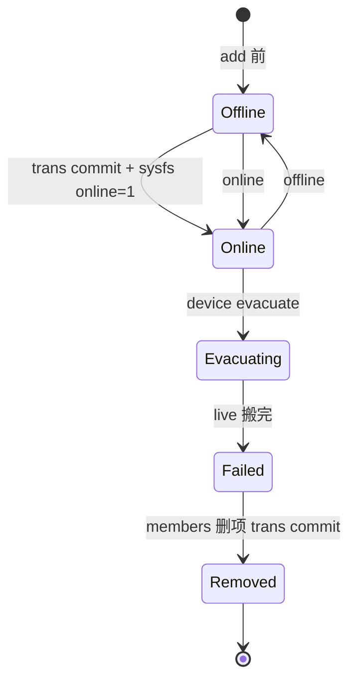
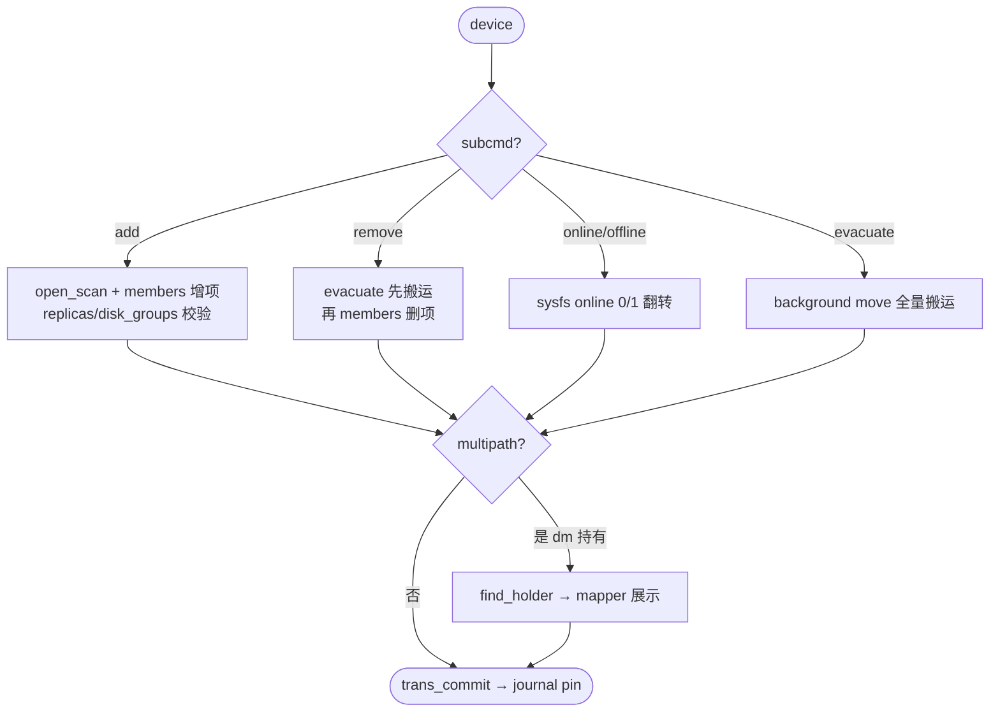

# Bcachefs Device（设备管理）

`device` 为 `Group` 多态命令（`src/commands/device.rs` → `src/commands/mod.rs:214` 聚合），`add/remove` 经 `bch2_trans_update(sb_field_members)` 原子提交，`replicas` 与 `disk_groups` 决定副本落盘域，`udev` 规则与 `device_multipath` 感知多路径，`online/offline` 经 `sysfs`。定位：`src/commands/device.rs → device_scan.rs:open_scan → wrappers/bdev/sysfs → fs/sb/members.c → fs/alloc/*`。

## C4 L3 Component — device 组 + members + replicas 故障域

`device.rs` 声明 `Group { add/remove/online/offline/evacuate/fail }` 各 `CmdDef`，`add` 时 `DevOpts` 经 `device_scan::open_scan` 扫描 super；`bch_sb_field_members`（`sb/members.c` 实现 `validate/to_text`）持 `bch_member { uuid/bucket_size/nbuckets/first_bucket/state }` 数组；`replicas`（`sb/members` 字段）与 `disk_groups`（`alloc/disk_groups.*`）按 `BCH_DATA_*`（`format.h`）分区 `foreground/background`；`device_multipath.rs:find_multipath_holder` 识别 `dm-multipath` 并 `warn_multipath_component`。C4 L3 图以 `device Group → members → replicas/disk_groups → udev/multipath → sysfs` 五层呈现。



Source: `/home/black/Documents/bcachefs-tools/src/commands/device.rs:1` + `/home/black/Documents/bcachefs-tools/src/device_scan.rs:1` + `/home/black/Documents/bcachefs-tools/fs/sb/members.c:1` + `/home/black/Documents/bcachefs-tools/fs/alloc/disk_groups.h:1` + `/home/black/Documents/bcachefs-tools/src/device_multipath.rs:1`

## 时序 — device add/remove 的 trans 原子提交

1) `bcachefs device add --target foreground /mnt /dev/sdc` → `device.rs` 解析 `target`→`BCH_DATA_foreground`；2) `open_scan` 读候选盘 `super`；3) `bch2_trans_begin` 在 `BTREE_ID_alloc`/`members` 上预留；4) `bch2_trans_update` 改 `sb_field_members` 并 `foreground` 分配 `bucket` 验证 `replicas`；5) `bch2_trans_commit` 经 `journal pin` 原子落盘；6) `sysfs` 置 `online`，`udev` 触发。`remove/offline` 逆向：先 `evacuate` 搬运再 `members` 删项。时序图以 `add → scan → trans → alloc → journal → sysfs` 全链呈现。



Source: `/home/black/Documents/bcachefs-tools/src/commands/device.rs:1` + `/home/black/Documents/bcachefs-tools/fs/sb/members.c:1` + `/home/black/Documents/bcachefs-tools/fs/btree/types.h:645`

## 状态机 — device 在线态

`member` 五态 `offline → online → evacuating → failed → removed`：`add` 后 `online`，`evacuate` 搬运 live 后 `failed`，`remove` 清 `members` 项。`multipath` 二态 `single → multipath`：`find_multipath_holder` 命中即 `mapper_names` 展示。`sysfs` 二态 `online 0/1`：由 `trans_commit` 翻转。状态机图覆盖 `online→evacuating→removed` 往返。



Source: `/home/black/Documents/bcachefs-tools/src/commands/device.rs:1` + `/home/black/Documents/bcachefs-tools/fs/sb/members.c:1`

## 决策树



Source: `/home/black/Documents/bcachefs-tools/src/commands/device.rs:1` + `/home/black/Documents/bcachefs-tools/src/device_multipath.rs:1`

## 正例

```c
// 正例：add 前扫描后提交
bcachefs device add --target foreground /mnt /dev/sdc
// → open_scan 读 sdc super → trans 更新 members (add) → alloc 校验 replicas=2 → journal pin → sysfs online
// 验证：members.validate 通过，replicas 跨 disk_groups 满足
```

命中：`open_scan` 与 `trans_commit` 配对，`replicas` 与 `disk_groups` 配对。

## 反例

```c
// 反例1：未 evacuate 直接 remove
// 错：live 数据仍在待删盘，remove 后数据丢失
// 正确：先 device evacuate 搬完再 remove

// 反例2：忽视 multipath 直接加 dm 子盘
// 错：加入 /dev/sda（实为 dm-0 子盘），双重计算
// 正确：find_multipath_holder 警告并要求加 mapper 设备
```

## 门禁

- **多图门禁**：`grep -c '```mermaid' ontology/entity/bcachefs-device.md` ≥3
- **溯源门禁**：`grep -c 'Source:' ontology/entity/bcachefs-device.md` ≥3 且每图含 `Source: /home/black/Documents/bcachefs-tools/... file:line`
- **正文门禁**：`wc -l ontology/entity/bcachefs-device.md` ≥80 且含 `决策树` `正例` `反例` `门禁`
- **属性门禁**：`attributes` ≥3 且每条 `testable_signal` 含 `grep -q` 且双源可回归
- **本体校验**：`python3 scripts/ontology-validate.py` 0 issues 且 `islands:0`
- **脚手架门禁**：`python3 scripts/ontology_test_scaffold.py --node ontology:entity/bcachefs-device --out /tmp/x.py` 可产
- **Gate 门禁**：`python3 scripts/production-ontology-gate.py --node ontology:entity/bcachefs-device` GATE OK

Source: `/home/black/Documents/bcachefs-tools/src/commands/device.rs:1` + `/home/black/Documents/bcachefs-tools/fs/sb/members.c:1` + `/home/black/Documents/bcachefs-tools/src/device_multipath.rs:1`
