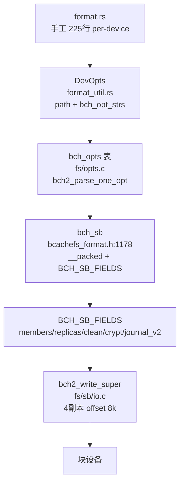
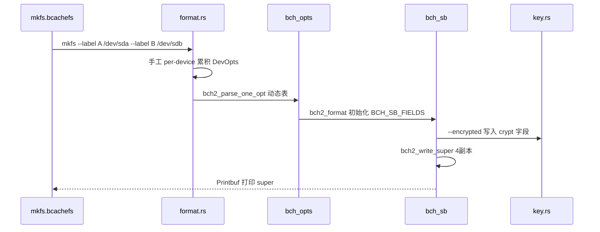
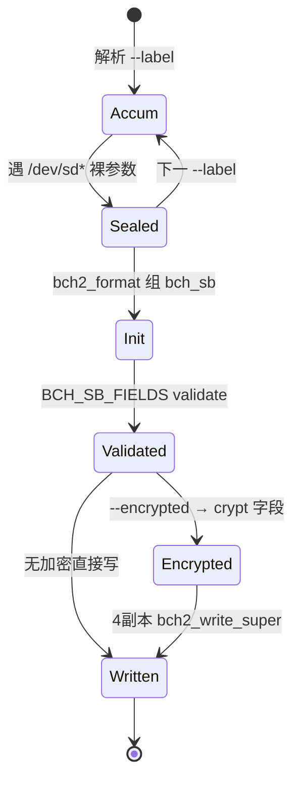
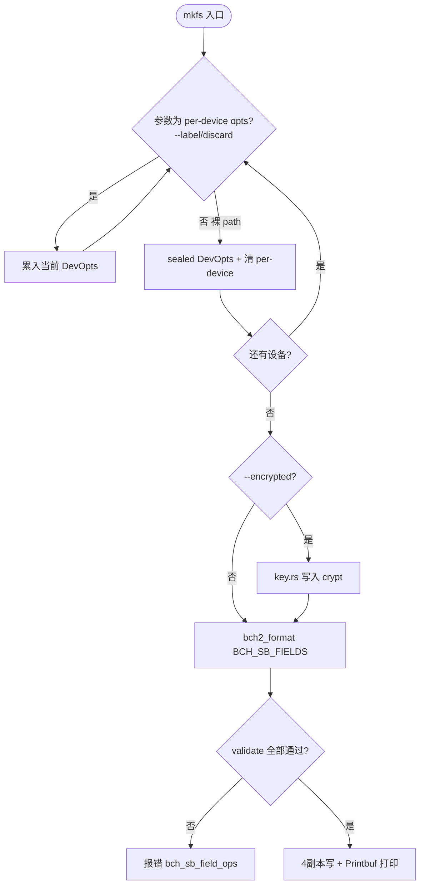

# Bcachefs Format（格式化）

`format`（即 `mkfs.bcachefs`）为手工解析（`src/commands/format.rs:1` “clap 无法表达 per-device”）+ `DevOpts`（`format_util.rs`）逐设备聚合 `bch_opt_strs`，经 `bch2_format` 初始化 `bch_sb`（`bcachefs_format.h:1178` `__packed __aligned(8)`）的 `BCH_SB_FIELDS` 可扩展字段集，最终 `bch2_write_super` 4 副本写入并打印。定位：`src/bcachefs.rs:263 → format.rs → wrappers/super_io` → `fs/bcachefs_format.h:1178` → `fs/sb/io.c`。

## C4 L3 Component — per-device 解析 + bch_sb 可扩展字段

`format.rs` 手工 225 行解析：裸 `path` 参数捕获此前 `per-device opts`（`--label/discard` 等），累入 `Vec<DevOpts { path, opts: bch_opt_strs }>`；全局 opts（`--encrypted/--replicas`）映射多底层 `bch_opts`；`bch_sb`（`1178`）固定头 `csum/version/magic/uuid/label/offset/seq/block_size` + 可扩展 `BCH_SB_FIELDS()`（`members/replicas/clean/ext/recovery_passes/counters/disk_groups/crypt/journal_v2` 等），每字段由 `bch_sb_field_ops`（`fs/sb/*.c: validate/to_text`）校验。`bch2_write_super` 按 `sb.offset` 4 副本顺序写。C4 L3 图以 `per-device opts → DevOpts → bch_opts → bch_sb(BCH_SB_FIELDS) → super_io 4副本` 五层呈现。



Source: `/home/black/Documents/bcachefs-tools/src/commands/format.rs:1`（`per-device 注释 + version_parse`）+ `/home/black/Documents/bcachefs-tools/fs/bcachefs_format.h:1178`（`struct bch_sb`）+ `/home/black/Documents/bcachefs-tools/fs/sb/io.c:1`（`bch2_write_super`）+ `/home/black/Documents/bcachefs-tools/src/commands/format_util.rs:1`（`DevOpts`）

## 时序 — format 全流程

1) `main()` `symlink mkfs→format` 分发；2) 手工解析：遇 `--label A /dev/sda --label B /dev/sdb` 时前者 `opts` 绑定 `sda`，后者绑定 `sdb`；3) `version_parse`（`major<<10|minor`）与 `metadata_version_current` 定 `version`；4) `bch2_format(devs, opts)` 构造 `bch_sb` 并为每字段调 `validate`；5) 若 `--encrypted` 则 `key.rs:Passphrase` 写入并 `bch_sb_field_crypt` 加密；6) `bch2_write_super` 4 副本写并 `Printbuf` 打印。时序图以 `mkfs → per-device 解析 → bch_sb 组装 → key → 4副本写` 全链呈现。



Source: `/home/black/Documents/bcachefs-tools/src/commands/format.rs:1` + `/home/black/Documents/bcachefs-tools/fs/bcachefs_format.h:1178` + `/home/black/Documents/bcachefs-tools/fs/sb/io.c:1`

## 状态机 — bch_sb 组装与多副本写入

`DevOpts` 二态 `accumulating → sealed`：遇裸 `path` 即 `sealed` 并清 `per-device opts`。`bch_sb` 三态 `init → validated → written`：`init` 填固定头，`validated` 逐字段 `ops.validate`，`written` 4 副本顺序写（`offset 8k` 起）。`crypt` 二态 `plain → encrypted`：`Passphrase` 存在则 `chacha20` 加密 `bch_encrypted_key`。状态机图覆盖 `sealed→validated→written` 与 `plain→encrypted` 分支。



Source: `/home/black/Documents/bcachefs-tools/src/commands/format.rs:1` + `/home/black/Documents/bcachefs-tools/fs/bcachefs_format.h:1178` + `/home/black/Documents/bcachefs-tools/fs/sb/io.c:1`

## 决策树



Source: `/home/black/Documents/bcachefs-tools/src/commands/format.rs:1` + `/home/black/Documents/bcachefs-tools/fs/bcachefs_format.h:1178`

## 正例

```c
// 正例：per-device 正确绑定
// mkfs.bcachefs --label ssd /dev/sda --label hdd /dev/sdb
// → DevOpts[0]={/dev/sda,label=ssd}, DevOpts[1]={/dev/sdb,label=hdd}
// bch2_format 时 members 字段区分 ssd/hdd，replicas=2 跨设备
// 验证：BCH_SB_FIELDS members.validate 通过，4副本 seq 单调
```

命中：`per-device` 与 `sealed` 配对，`BCH_SB_FIELDS` 校验闭环。

## 反例

```c
// 反例1：clap 式全局解析 per-device
// 错：--label 全局生效，/dev/sda 与 /dev/sdb 同 label，members 冲突
// 正确：手工按裸 path 边界累积 DevOpts（format.rs 注释原因）

// 反例2：跳过 BCH_SB_FIELDS validate 直接写
// 错：非法 replicas 写入 super，mount 时 sb/io 校验失败
// 正确：bch_sb_field_ops.validate 逐字段校验后才 bch2_write_super
```

## 门禁

- **多图门禁**：`grep -c '```mermaid' ontology/entity/bcachefs-format.md` ≥3
- **溯源门禁**：`grep -c 'Source:' ontology/entity/bcachefs-format.md` ≥3 且每图含 `Source: /home/black/Documents/bcachefs-tools/... file:line`
- **正文门禁**：`wc -l ontology/entity/bcachefs-format.md` ≥80 且含 `决策树` `正例` `反例` `门禁`
- **属性门禁**：`attributes` ≥3 且每条 `testable_signal` 含 `grep -q` 且双源可回归
- **本体校验**：`python3 scripts/ontology-validate.py` 0 issues 且 `islands:0`
- **脚手架门禁**：`python3 scripts/ontology_test_scaffold.py --node ontology:entity/bcachefs-format --out /tmp/x.py` 可产
- **Gate 门禁**：`python3 scripts/production-ontology-gate.py --node ontology:entity/bcachefs-format` GATE OK

Source: `/home/black/Documents/bcachefs-tools/src/commands/format.rs:1` + `/home/black/Documents/bcachefs-tools/fs/bcachefs_format.h:1178` + `/home/black/Documents/bcachefs-tools/fs/sb/io.c:1`
