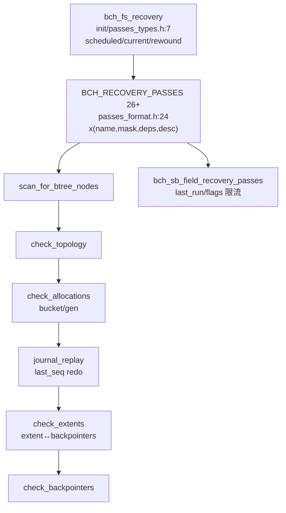
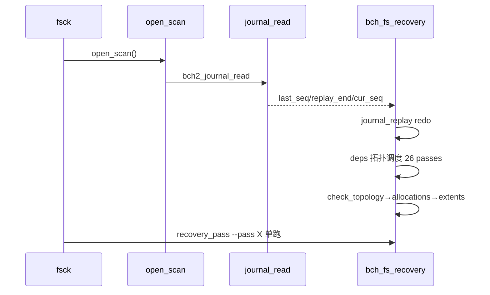
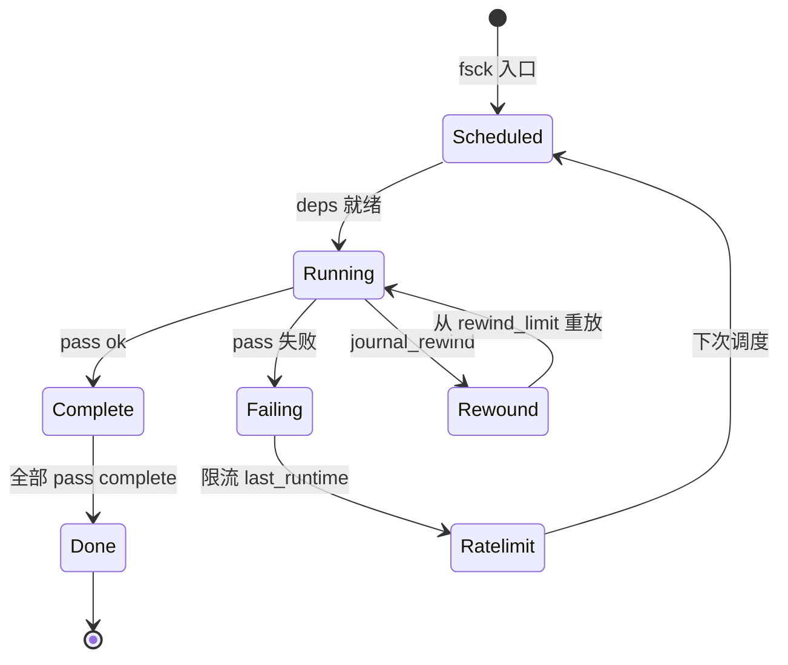
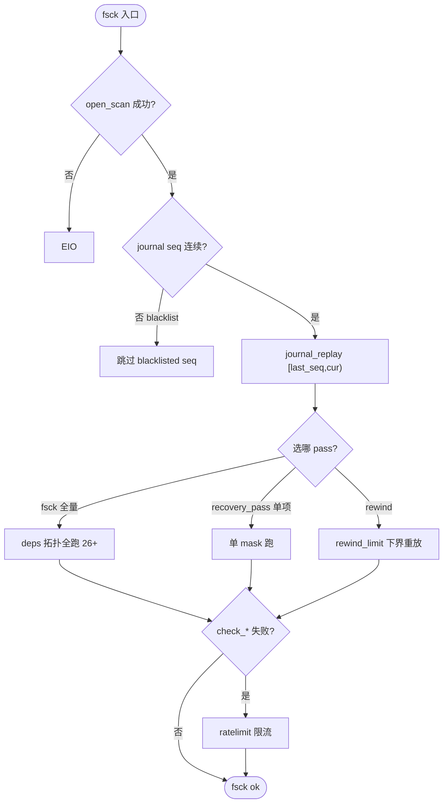

# Bcachefs Fsck（一致性检查）

`fsck`（`src/commands/fsck.rs`）以 `bch2_fs_recovery`（`fs/init/recovery.c`）驱动 `BCH_RECOVERY_PASSES`（`fs/init/passes_format.h:24` 26+ pass），经 `journal replay` 按 `last_seq` redo，再按依赖 `BIT_ULL` 调度 `scan_for_btree_nodes → check_topology → check_allocations → journal_replay → check_extents → check_snapshots → check_backpointers`，`recovery_pass` 可单跑指定 pass，`journal_rewind_info` 计算 `rewind_limit`。定位：`src/bcachefs.rs:263 → fsck.rs/recovery_pass.rs → fs/init/passes_format.h:24 → fs/journal/read.c`。

## C4 L3 Component — 26 passes 依赖图与三大 check

`passes_format.h:24` 定义 `BCH_RECOVERY_PASSES()` x-macro，每行 `x(name, mask, deps BIT_ULL, desc)`，持久 `bch_sb_field_recovery_passes`（`fs/sb/clean.h`）存 `recovery_pass_entry { last_run/last_runtime/flags }` 限流；`recovery_types.h:7` 的 `bch_fs_recovery { scheduled/current/rewound_from/to/pass_done[NR] + lock/work }` 调度；三大 check `check_topology/check_allocations/check_extents` 分刺 bdev/bucket/extent 层。C4 L3 图以 `recover(Scheduled) → deps(BIT_ULL) → check_topology → check_allocations → journal_replay → check_extents → backpointers` 六层呈现。



Source: `/home/black/Documents/bcachefs-tools/fs/init/passes_format.h:24`（26+ `x(...)`）+ `/home/black/Documents/bcachefs-tools/fs/init/passes_types.h:7`（`bch_fs_recovery`）+ `/home/black/Documents/bcachefs-tools/fs/sb/clean.h:1`（`bch_sb_field_recovery_passes`）

## 时序 — fsck → journal_read → passes 调度 → 单 pass 重放

1) `fsck /dev/sda` → `open_scan` 得 `journal_start_info { last_seq/replay_end/cur_seq }`（`journal/read.h:78`）；2) `bch2_fs_recovery` 按 `deps BIT_ULL` 拓扑排序 passes；3) `journal_replay` 按 seq redo `jset_entry` 至 `replay_end`；4) 依次 `check_topology`→`check_allocations`→`check_extents`，失败 pass 置 `failing` 并 `ratelimiting`；5) `recovery_pass --pass check_extents` 可单跑；6) `journal_rewind_info` 以 `JSET_NO_FLUSH` 枚举候选 `rewind` 点。时序图以 `open_scan → journal_read → recovery deps → journal_replay → check_*` 全链呈现。



Source: `/home/black/Documents/bcachefs-tools/src/commands/fsck.rs:1` + `/home/black/Documents/bcachefs-tools/src/commands/recovery_pass.rs:1` + `/home/black/Documents/bcachefs-tools/fs/init/passes_format.h:24` + `/home/black/Documents/bcachefs-tools/fs/journal/read.c:1`

## 状态机 — recovery 调度与 rewind

`recovery` 五态 `idle → scheduled → running → rewound → done`：`rewound` 时 `rewound_from/to` 记录区间，`journal_rewind` 以 `rewind_limit` 为下界。pass 四态 `pending → running → complete/failing → ratelimiting`：`failing` 入限流，下次调度跳过。`recovery_pass` 二态 `single → scheduled`：单 pass 仅跑指定 `mask`。状态机图覆盖 `rewound` 往返与 `ratelimiting` 分支。



Source: `/home/black/Documents/bcachefs-tools/fs/init/passes_format.h:24` + `/home/black/Documents/bcachefs-tools/fs/init/passes_types.h:7`

## 决策树



Source: `/home/black/Documents/bcachefs-tools/src/commands/fsck.rs:1` + `/home/black/Documents/bcachefs-tools/fs/init/passes_format.h:24` + `/home/black/Documents/bcachefs-tools/fs/journal/seq_blacklist.h:1`

## 正例

```c
// 正例：fsck 全量 + 单 pass 调试
bcachefs fsck /dev/sda
bcachefs recovery_pass --pass check_extents /dev/sda
bcachefs journal_rewind_info /dev/sda # 枚举 [floor,latest] 内 JSET_NO_FLUSH==false 的 flush 点
// 验证：journal_replay 幂等，pass 依赖拓扑正确，rewind_limit 下界安全
```

命中：`journal_replay` 与 `last_seq` 配对，`deps` 拓扑正确。

## 反例

```c
// 反例1：跳过 journal_replay 直接 check_extents
// 错：btree 未 redo，extents 与 backpointers 不一致，误报
// 正确：先 replay 至 cur_seq 再 check

// 反例2：无视 rewound_from/to 直接 rewind
// 错：回退到 discard 已无效化的 seq，数据踩踏
// 正确：以 rewind_limit 为下界（JSET 14 类型）
```

## 门禁

- **多图门禁**：`grep -c '```mermaid' ontology/entity/bcachefs-fsck.md` ≥3
- **溯源门禁**：`grep -c 'Source:' ontology/entity/bcachefs-fsck.md` ≥3 且每图含 `Source: /home/black/Documents/bcachefs-tools/... file:line`
- **正文门禁**：`wc -l ontology/entity/bcachefs-fsck.md` ≥80 且含 `决策树` `正例` `反例` `门禁`
- **属性门禁**：`attributes` ≥3 且每条 `testable_signal` 含 `grep -q` 且双源可回归
- **本体校验**：`python3 scripts/ontology-validate.py` 0 issues 且 `islands:0`
- **脚手架门禁**：`python3 scripts/ontology_test_scaffold.py --node ontology:entity/bcachefs-fsck --out /tmp/x.py` 可产
- **Gate 门禁**：`python3 scripts/production-ontology-gate.py --node ontology:entity/bcachefs-fsck` GATE OK

Source: `/home/black/Documents/bcachefs-tools/fs/init/passes_format.h:24` + `/home/black/Documents/bcachefs-tools/fs/init/passes_types.h:7` + `/home/black/Documents/bcachefs-tools/src/commands/fsck.rs:1`
