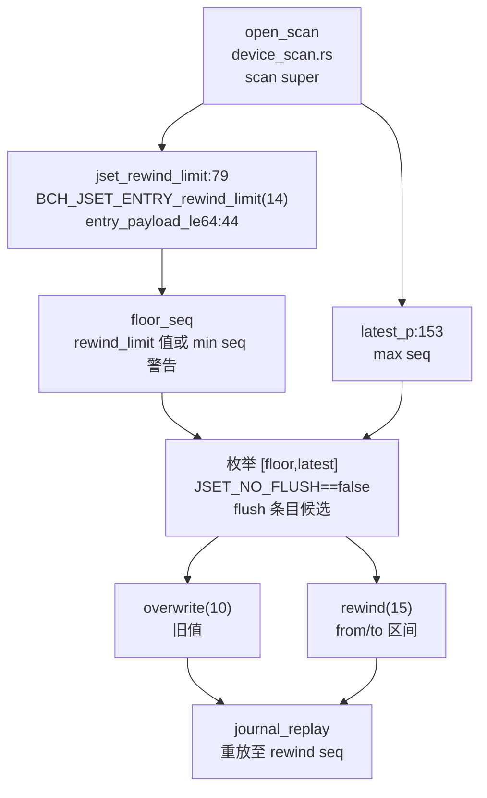
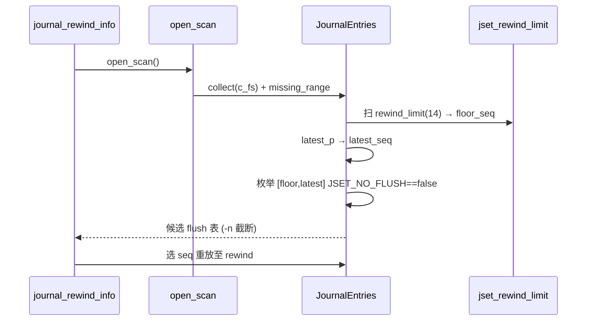
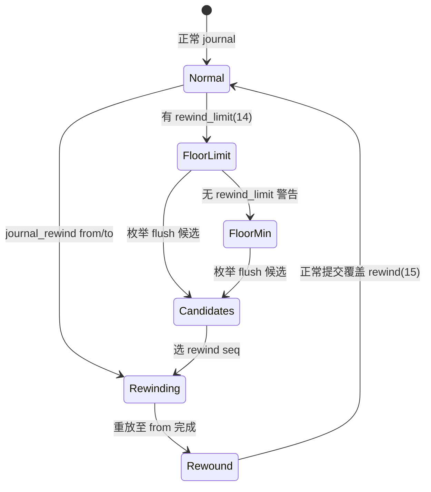
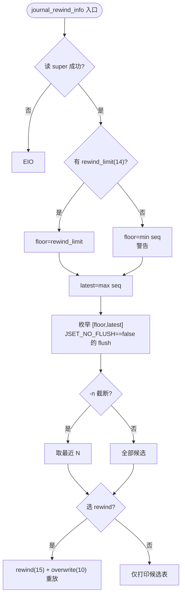

# Bcachefs Journal Rewind（日志回退）

`journal_rewind` 为 `bcachefs` 的时间回退：`journal_rewind_info`（`src/commands/journal_rewind_info.rs:119`）以 `open_scan` 扫 `super`，经 `jset_rewind_limit`（`79` 扫 `BCH_JSET_ENTRY_rewind_limit` payload `entry_payload_le64:44`）定 `floor_seq`（下界），`latest_p`（`153`）定 `latest_seq`（上界），枚举 `[floor,latest]` 内 `JSET_NO_FLUSH==false` 的 `flush` 条目为候选，回退区间 `rewind (15)` 内 `overwrite (10)` 存旧值供恢复。定位：`journal_rewind_info.rs:119 → device_scan::open_scan → journal/read.h:78 + journal/reclaim.c + bcachefs_format.h:1624 (14/15/10)`。

## C4 L3 Component — rewind_limit 下界 + flush 候选 + overwrite 旧值

`journal_rewind_info.rs:79` 的 `jset_rewind_limit` 扫描 `jset_entry type==rewind_limit (14)` 的 `payload le64` 得 `floor_seq`；无 `rewind_limit` 时回退到 `min seq on disk` 并警告；`latest_p:153` 取最大 `seq`；`JSET_NO_FLUSH`（`bch_sb field flags`）为 `false` 的 `flush` 条目即提交边界；`overwrite`（`10`）存被覆写前 `bkey` 旧值；`rewind`（`15`）存 `from/to` 区间标记回退中。C4 L3 图以 `open_scan → rewind_limit(14) → [floor,latest] → flush候选(JSET_NO_FLUSH) → overwrite(10)/rewind(15)` 五层呈现。



Source: `/home/black/Documents/bcachefs-tools/src/commands/journal_rewind_info.rs:79`（`jset_rewind_limit`）+ `/home/black/Documents/bcachefs-tools/src/commands/journal_rewind_info.rs:153`（`latest_p`）+ `/home/black/Documents/bcachefs-tools/fs/bcachefs_format.h:1624`（`14 rewind_limit /15 rewind /10 overwrite`）+ `/home/black/Documents/bcachefs-tools/fs/journal/read.h:78`（`bch2_journal_read`）

## 时序 — journal_rewind_info 选点与 rewind 重放

1) `journal_rewind_info /dev/sda` → `open_scan` 读 `super` 与 `journal buckets`；2) `JournalEntries::collect`（`list_journal.rs:772`）收集并 `bch2_journal_entry_missing_range` 补空洞；3) `jset_rewind_limit` 定 `floor_seq`，`latest_p` 定 `latest_seq`；4) 枚举 `[floor,latest]` 内 `JSET_NO_FLUSH==false` 的 `flush` 条目为候选，`-n` 截断取最近 N；5) 选定 `rewind_seq` 后 `bch2_journal_read` 重放至该 seq，`overwrite` 供反向恢复旧 `bkey`。时序图以 `open_scan → floor/latest → 枚举 flush → 选 rewind → replay` 全链呈现。



Source: `/home/black/Documents/bcachefs-tools/src/commands/journal_rewind_info.rs:119` + `/home/black/Documents/bcachefs-tools/src/commands/list_journal.rs:772` + `/home/black/Documents/bcachefs-tools/fs/bcachefs_format.h:1624`

## 状态机 — rewind 区间与 overwrite

`rewind` 三态 `normal → rewinding → rewound`：`rewinding` 时 `[from,to]` 区间内所有 key 均带 `overwrite (10)`，`rewound` 后 `rewound_from/to` 记录。`jset` 二态 `NO_FLUSH true/false`：仅 `false` 的 `flush` 条目可为回退点。`floor` 二态 `rewind_limit → min seq`：有 `14` 即 `rewind_limit`，无则警告回落 `min seq`。状态机图覆盖 `normal→rewinding→rewound` 与 `floor` 分支。



Source: `/home/black/Documents/bcachefs-tools/src/commands/journal_rewind_info.rs:79` + `/home/black/Documents/bcachefs-tools/fs/bcachefs_format.h:1624`

## 决策树



Source: `/home/black/Documents/bcachefs-tools/src/commands/journal_rewind_info.rs:119` + `/home/black/Documents/bcachefs-tools/fs/bcachefs_format.h:1624`

## 正例

```c
// 正例：枚举候选并回退
bcachefs journal_rewind_info /dev/sda -n 10
// → [floor=100,latest=500] 内 flush 候选 20 条，取最近 10 打印
bcachefs journal_rewind --seq 450 /dev/sda
// → rewind(15) from=450 to=500，overwrite(10) 恢复旧 bkey，replay 至 450
// 验证：floor 来自 rewind_limit(14)，非警告回落 min seq
```

命中：`rewind_limit` 与 `floor` 配对，`overwrite` 与 `rewind` 配对。

## 反例

```c
// 反例1：回退到低于 rewind_limit 的 seq
// 错：discard 已无效化早于 rewind_limit 的数据，回退后踩踏
// 正确：仅在 [floor,latest] 内选 JSET_NO_FLUSH==false 的 flush 点

// 反例2：忽视 overwrite 旧值
// 错：仅用 rewind(15) 不带 overwrite(10)，旧 bkey 丢失无法恢复
// 正确：rewinding 区间内每 key 均带 overwrite 旧值
```

## 门禁

- **多图门禁**：`grep -c '```mermaid' ontology/entity/bcachefs-journal-rewind.md` ≥3
- **溯源门禁**：`grep -c 'Source:' ontology/entity/bcachefs-journal-rewind.md` ≥3 且每图含 `Source: /home/black/Documents/bcachefs-tools/... file:line`
- **正文门禁**：`wc -l ontology/entity/bcachefs-journal-rewind.md` ≥80 且含 `决策树` `正例` `反例` `门禁`
- **属性门禁**：`attributes` ≥3 且每条 `testable_signal` 含 `grep -q` 且双源可回归
- **本体校验**：`python3 scripts/ontology-validate.py` 0 issues 且 `islands:0`
- **脚手架门禁**：`python3 scripts/ontology_test_scaffold.py --node ontology:entity/bcachefs-journal-rewind --out /tmp/x.py` 可产
- **Gate 门禁**：`python3 scripts/production-ontology-gate.py --node ontology:entity/bcachefs-journal-rewind` GATE OK

Source: `/home/black/Documents/bcachefs-tools/src/commands/journal_rewind_info.rs:79` + `/home/black/Documents/bcachefs-tools/fs/bcachefs_format.h:1624` + `/home/black/Documents/bcachefs-tools/fs/journal/read.h:78`
