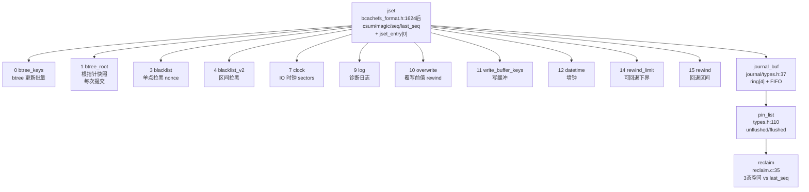
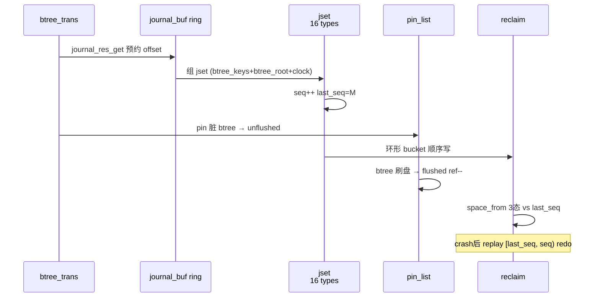
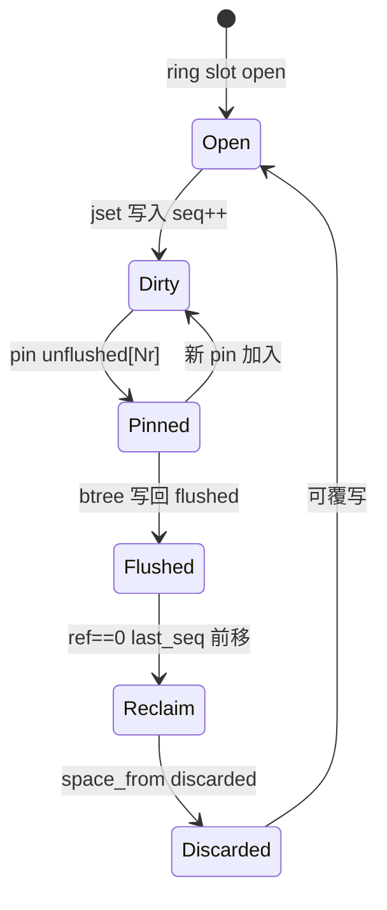
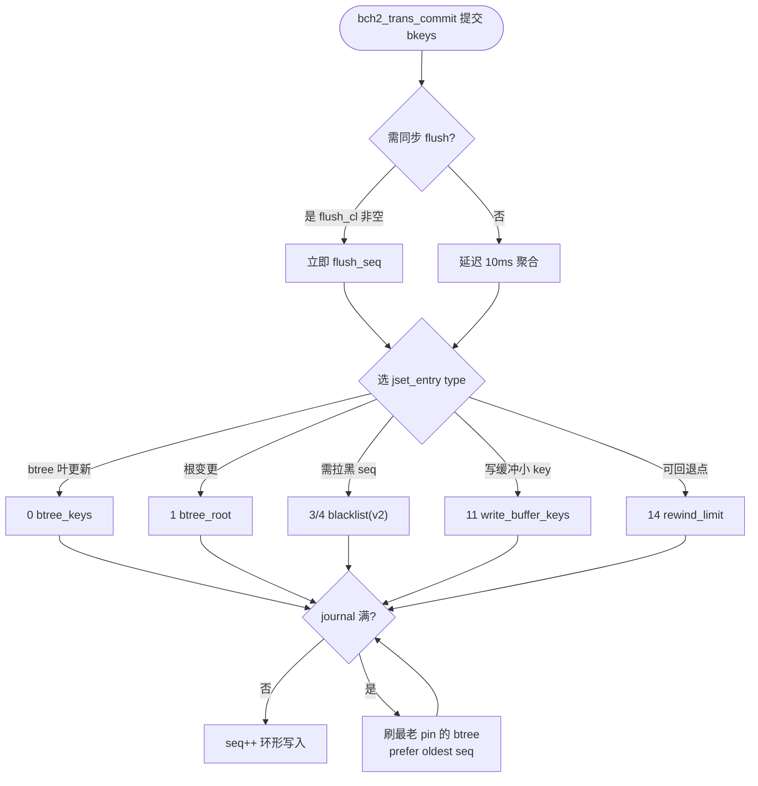

# Bcachefs Journal（日志）

日志为 `bcachefs` 的 WAL：`jset`（`fs/bcachefs_format.h:1624 BCH_JSET_ENTRY_TYPES` 定义 16 类型 + `fs/journal/types.h:37 journal_buf` 内存载体）经环形 `journal_device.buckets` 顺序写，`last_seq` 标记 oldest dirty 下界，`pin` 追踪 btree 脏页，`reclaim` 以三态空间防止覆写。定位：`src/bcachefs.rs:263 main()` → `COMMAND_GROUPS` `src/commands/mod.rs:234`（`journal_rewind_info/list_journal`）→ `wrappers/bdev/handle` → `fs/journal/`（`journal.c/read.c/write.c/reclaim.c/seq_blacklist.*`）→ `fs/bcachefs_format.h:1624` on-disk 契约。

## C4 L3 Component — jset 16 类型 + journal_buf 环 + pin + reclaim

`struct jset`（`bcachefs_format.h:1624` 后 `struct jset: csum/magic/seq/version/flags/u64s/_write_clock/last_seq/start[0]`）内含 `jset_entry` 数组（`u64s/btree_id/level/type/start[0]`），`type` 由 `BCH_JSET_ENTRY_TYPES()` 16 项决定；内存侧 `journal_buf`（`journal/types.h:37`）含 `jset *data + BKEY_PADDED key + bch_dev *cas[] + wait`，环 `ring[4]`（`JOURNAL_STATE_BUF_NR=4`）+ `FIFO in_flight` 装载；`journal_entry_pin_list`（`types.h:110` `spinlock + unflushed[NR]/flushed + journal_entry_pin { list/flush/seq }`）按 seq 引用计数；`journal_reclaim` 以 `journal_space_from(discarded/clean_ondisk/clean)` 三态对比 `last_seq` 判定可覆写桶。C4 L3 图以 `jset(16 types) → journal_buf ring → pin_list → reclaim` 四层呈现。



Source: `/home/black/Documents/bcachefs-tools/fs/bcachefs_format.h:1624`（`BCH_JSET_ENTRY_TYPES()` 16 项 `btree_keys/btree_root/blacklist/clock/log/overwrite/write_buffer/datetime/log_bkey/rewind_limit/rewind`）+ `/home/black/Documents/bcachefs-tools/fs/journal/types.h:37`（`journal_buf` 含 `jset *data + cas + wait`）+ `/home/black/Documents/bcachefs-tools/fs/journal/types.h:110`（`journal_entry_pin_list + journal_entry_pin { flush/seq }`）+ `/home/black/Documents/bcachefs-tools/fs/journal/reclaim.c:35`（`journal_space_from` 三态）

jset_entry 16 类型作用表（`BCH_JSET_ENTRY_TYPES()` `bcachefs_format.h:1624`）：

| type | 名称 | 作用场景 | 解决的 crash consistency 问题 |
|---|---|---|---|
| 0 | `btree_keys` | 常规 btree 叶更新批量（alloc/extent/inode 等） | 叶更新 WAL 化避免同步写 btree，crash 后 redo |
| 1 | `btree_root` | 每次 journal 提交必带的各 btree 根指针快照 | 新增 btree 类型无需改 super 格式；恢复时定位根 |
| 2 | `prio_ptrs` | legacy 已废弃 | 兼容旧盘不新写 |
| 3 | `blacklist` | 单点 seq 拉黑（加密 nonce 单值） | nonce 重用防护单点 |
| 4 | `blacklist_v2` | 区间 seq 拉黑 | 区间 nonce 防重放 |
| 5 | `usage` | 加密最大 key version（nonce 派生输入） | nonce 单调与版本推进 |
| 6/8 | `data_usage/dev_usage` | legacy 已迁至 `accounting` btree | 兼容 |
| 7 | `clock` | 自文件系统创建以来的总读写 sectors（IO 时钟） | 磨损/统计跨重启持久 |
| 9 | `log` | 自由文本诊断日志（fsck 动作记录） | 审计可追溯 |
| 10 | `overwrite` | 被覆写 key 的旧值，供 `journal_rewind` 回退 | 回退需旧值反向 |
| 11 | `write_buffer_keys` | 写缓冲 key，上盘前转 `btree_keys` | 小 key 合并降写放大 |
| 12 | `datetime` | 墙钟时间 | 跨节点时序 |
| 13 | `log_bkey` | 带 bkey 的结构化日志条目 | 可机读的带 key 日志 |
| 14 | `rewind_limit` | 可安全回退的最老 seq 下界（discard 可能已无效化更早 seq） | 回退下界防踩无效数据 |
| 15 | `rewind` | 回退进行中：该 seq 范围内 key 均带 `overwrite` | 标记回退区间 |

## 时序 — trans_commit → journal_buf 预约 → pin → reclaim → replay

1) `bch2_trans_commit`（`fs/btree/types.h:645` 的 `btree_trans`）经 `journal_res_get` 预约当前 `jset` 偏移；2) `bset` 插入 `bkey_packed` 并 `pin` 关联 btree 脏页（`journal_entry_pin` 入 `unflushed`）；3) `jset`（含 16 类型中命中者，如 `btree_keys + btree_root + clock`）经环形 `journal_device.buckets` 顺序写（`jset.seq` 单调）；4) btree node 增量 `bset` 刷盘后 `pin` 释放入 `flushed`，`refcount→0` 时 `last_seq` 可前移；5) `reclaim` 以 `journal_space_from` 三态对比 `last_seq` 判定可覆写桶（`discard_idx` 前进）；6) crash 后 `bch2_journal_read` 按 `seq` 顺序 redo `jset_entry`（`last_seq` 为 oldest dirty）。时序图以 `trans → journal_buf → jset(16 types) → pin → reclaim → replay` 全链呈现。



Source: `/home/black/Documents/bcachefs-tools/fs/journal/types.h:37`（`journal_buf`）+ `/home/black/Documents/bcachefs-tools/fs/bcachefs_format.h:1624`（16 types）+ `/home/black/Documents/bcachefs-tools/fs/journal/reclaim.c:35`（`journal_space_from`）+ `/home/black/Documents/bcachefs-tools/fs/journal/read.c:1`（`bch2_journal_read`）

## 状态机 — journal_buf + pin + reclaim 联动

`journal_buf` 三态 `empty → open → dirty → reclaimable`：`open` 预约可写，`dirty` 已写但 pin 非空，`reclaimable` pin 归零且 `seq < last_seq`。`pin` 二态 `unflushed → flushed`：`unflushed` 含 `JOURNAL_PIN_TYPE_btree{0-3}/key_cache/other`，刷盘后进 `flushed` 队列。`reclaim` 三态 `discarded → clean_ondisk → clean`：仅 `seq < last_seq` 的桶可进 `discarded`。状态机图覆盖 `open→dirty→flushed→discarded→open` 往返。



Source: `/home/black/Documents/bcachefs-tools/fs/journal/types.h:110`（`pin_list`）+ `/home/black/Documents/bcachefs-tools/fs/journal/reclaim.c:35` + `/home/black/Documents/bcachefs-tools/fs/bcachefs_format.h:1624`

## 决策树



Source: `/home/black/Documents/bcachefs-tools/fs/journal/journal.h:1`（`PERSISTENCE / JOURNAL FILLING UP`）+ `/home/black/Documents/bcachefs-tools/fs/bcachefs_format.h:1624`

## 正例

```c
// 正例：多类型聚合提交 — 一次 jset 内聚合 btree_keys + btree_root + clock/datetime
struct jset_entry *e = jset_entry_init(&jset->start[0], ...);
e->type = BCH_JSET_ENTRY_btree_keys;   // 0: btree 叶更新
e->btree_id = BTREE_ID_extents;
jset_entry_init(..., BCH_JSET_ENTRY_btree_root); // 1: 根快照
jset_entry_init(..., BCH_JSET_ENTRY_clock);      // 7: IO 时钟
// pin: btree dirty 页 pin 住 seq，刷盘后 flushed→ref--
// 验证：reclaim 仅释 seq < last_seq 的桶
```

命中：多类型聚合正确，`pin/unpin` 与 `last_seq` 配对，`reclaim` 不误覆写 dirty。

## 反例

```c
// 反例1：遗漏 btree_root
// 错：仅写 btree_keys 不带 btree_root，crash 后新 btree 类型根丢失
// 正确：每次提交必含 btree_root 快照

// 反例2：pin 泄漏
// 错：btree 脏页 pin 后未在 write_done 释放，last_seq 永不前移，journal 满死锁
// 正确：journal_entry_pin.flush 回调释放入 flushed

// 反例3：误用 legacy prio_ptrs (2)
// 错：新码仍写 prio_ptrs (2)，浪费空间且无消费方
// 正确：prio_ptrs 仅兼容读，写路径禁发
```

## 门禁

- **多图门禁**：`grep -c '```mermaid' ontology/entity/bcachefs-journal.md` ≥3
- **溯源门禁**：`grep -c 'Source:' ontology/entity/bcachefs-journal.md` ≥3 且每图含 `Source: /home/black/Documents/bcachefs-tools/... file:line`
- **正文门禁**：`wc -l ontology/entity/bcachefs-journal.md` ≥80 且含 `决策树` `正例` `反例` `门禁`
- **属性门禁**：`attributes` ≥3 且每条 `testable_signal` 含 `grep -q` 且双源 `records + /home/black/Documents/bcachefs-tools` 可回归
- **本体校验**：`python3 scripts/ontology-validate.py` 0 issues 且 `islands:0`
- **脚手架门禁**：`python3 scripts/ontology_test_scaffold.py --node ontology:entity/bcachefs-journal --out /tmp/x.py` 可产
- **Gate 门禁**：`python3 scripts/production-ontology-gate.py --node ontology:entity/bcachefs-journal` GATE OK

Source: `/home/black/Documents/bcachefs-tools/fs/bcachefs_format.h:1624` + `/home/black/Documents/bcachefs-tools/fs/journal/types.h:37` + `/home/black/Documents/bcachefs-tools/fs/journal/reclaim.c:35`
