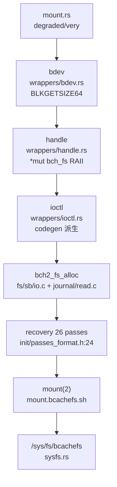
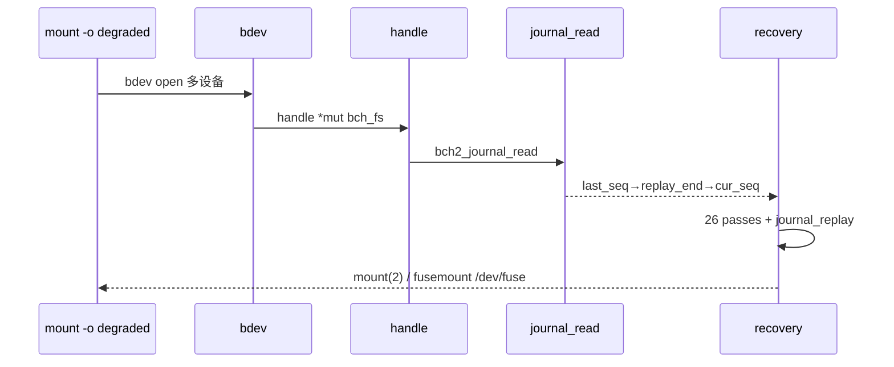
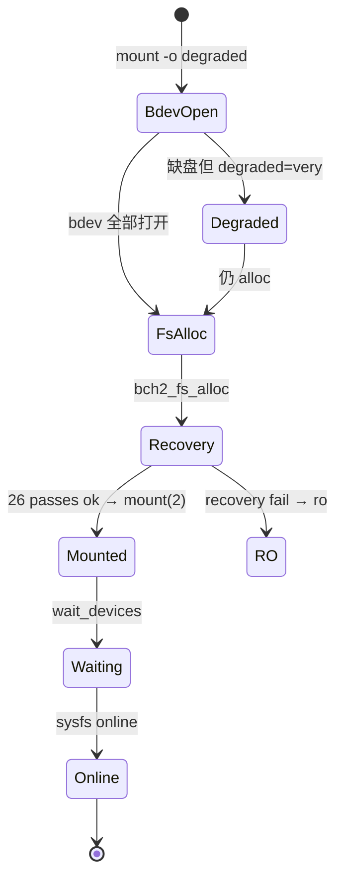
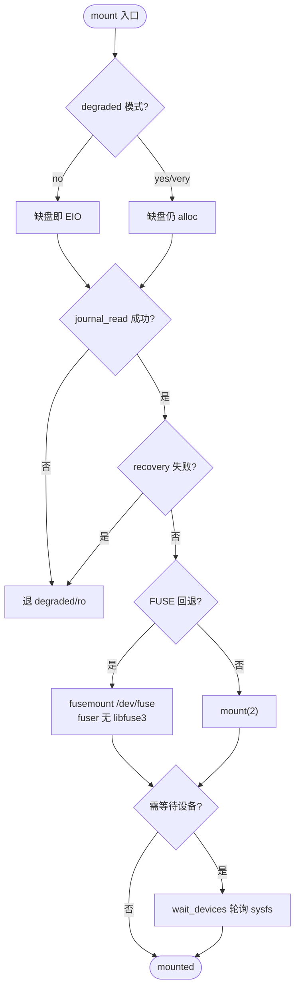

# Bcachefs Mount（挂载）

`mount` 经 `wrappers` 三层（`bdev` 打开块设备 → `handle` 封装 `*mut bch_fs` → `ioctl` 类型安全派生自 `fs/codegen.rs`）触发 `bch2_fs_alloc + journal_read + recovery`，最终 `mount(2)` 或 `mount.bcachefs.sh` 多设备拼装；`fusemount` 直写 `/dev/fuse` 无 `libfuse3`。定位：`src/bcachefs.rs:263 → mount.rs/wait_devices.rs → wrappers/{bdev,handle,ioctl} → fs/sb/io.c + fs/journal/read.c`。

## C4 L3 Component — wrappers 三层与 mount 路径

`wrappers/mod.rs:1` 声明 `accounting/bdev/handle/ioctl/online_iter/sb_display/super_io/sysfs` 7 模块：`bdev.rs` 封装 `openat`/`BLKGETSIZE64`，`handle.rs` 以 `*mut c::bch_fs` RAII 管理 `bch2_fs_open`/`close` 并 `SbLockGuard`，`ioctl.rs` 由 `fs/codegen.rs` 生成 `Ioctl` 派生类型安全号，`super_io.rs` 封装 `bch2_read_super`/`bch2_write_super`，`sysfs.rs` 读写 `/sys/fs/bcachefs/*/`. `mount.rs` 聚合 `degraded`→`BCH_DEGRADED_yes/very/no` 映射。C4 L3 图以 `mount cmd → bdev → handle → ioctl → fs_alloc/journal_read → mount(2)` 五层呈现。



Source: `/home/black/Documents/bcachefs-tools/src/wrappers/mod.rs:1`（7 模块）+ `/home/black/Documents/bcachefs-tools/src/wrappers/handle.rs:1`（`*mut bch_fs` RAII）+ `/home/black/Documents/bcachefs-tools/src/wrappers/ioctl.rs:1`（`Ioctl` 派生）+ `/home/black/Documents/bcachefs-tools/fs/sb/io.c:1` + `/home/black/Documents/bcachefs-tools/mount.bcachefs.sh:1`

## 时序 — mount 全链

1) `mount.bcachefs /dev/sda:/dev/sdb /mnt -o degraded` 解析为 `mount` cmd；2) `bdev::open` 逐设备 `openat`，`handle::open` 调 `bch2_fs_alloc` 分配 `bch_fs`；3) `ioctl` 触发 `bch2_journal_read`（`journal/read.c`）→ `journal_start_info` 取 `last_seq/replay_end/cur_seq`；4) `bch2_fs_recovery` 跑 26 passes（含 `journal_replay`）；5) `mount(2)` 或 `fusemount` 直写 `/dev/fuse`（`fuser` 无 `libfuse3`），`defers_shrinkers` 延迟初始化；6) `wait_devices` 轮询 `sysfs` 直至设备全部 `online`。时序图以 `bdev → handle → ioctl → fs_alloc → recovery → mount` 全链呈现。



Source: `/home/black/Documents/bcachefs-tools/src/commands/mount.rs:1` + `/home/black/Documents/bcachefs-tools/src/wrappers/handle.rs:1` + `/home/black/Documents/bcachefs-tools/fs/journal/read.c:1` + `/home/black/Documents/bcachefs-tools/fs/init/passes_format.h:24`

## 状态机 — mount degraded 与 wait

`degraded` 三态 `no → yes → very`：`no` 缺盘即拒，`yes` 允许单盘缺，`very` 允许多盘缺且 `errors continue`。`mount` 五态 `init → bdev_open → fs_alloc → recovery → mounted`：`recovery` 失败则 `ro`。`wait_devices` 二态 `waiting → online`：轮询 `sysfs` 直至 `online` 或超时。`fusemount` 二态 `fuse_init → fuse_serve`：直写 `/dev/fuse`。状态机图覆盖 `degraded` 与 `wait` 分支。



Source: `/home/black/Documents/bcachefs-tools/src/commands/mount.rs:1` + `/home/black/Documents/bcachefs-tools/src/commands/wait_devices.rs:1` + `/home/black/Documents/bcachefs-tools/fs/init/passes_format.h:24`

## 决策树



Source: `/home/black/Documents/bcachefs-tools/src/commands/mount.rs:1` + `/home/black/Documents/bcachefs-tools/src/wrappers/mod.rs:1` + `/home/black/Documents/bcachefs-tools/mount.bcachefs.sh:1`

## 正例

```c
// 正例：多设备 mount + degraded
mount.bcachefs /dev/sda:/dev/sdb /mnt -o degraded
// → bdev 逐开 → handle RAII → bch2_journal_read → recovery 26 passes → mount(2)
// 验证：handle Drop 自动 close，mount 后 /sys/fs/bcachefs/*/online 为 1
```

命中：`bdev→handle→ioctl` 配对，`degraded` 与 `recovery` 配对。

## 反例

```c
// 反例1：跳过 handle 直接 ioctl
// 错：无 bch_fs 即 ioctl，空指针
// 正确：先 handle::open 再 ioctl

// 反例2：FUSE 误用 libfuse3
// 错：依赖 libfuse3，与 Cargo fuse feature (fuser) 冲突
// 正确：fusemount 直写 /dev/fuse，经 fuser crate
```

## 门禁

- **多图门禁**：`grep -c '```mermaid' ontology/entity/bcachefs-mount.md` ≥3
- **溯源门禁**：`grep -c 'Source:' ontology/entity/bcachefs-mount.md` ≥3 且每图含 `Source: /home/black/Documents/bcachefs-tools/... file:line`
- **正文门禁**：`wc -l ontology/entity/bcachefs-mount.md` ≥80 且含 `决策树` `正例` `反例` `门禁`
- **属性门禁**：`attributes` ≥3 且每条 `testable_signal` 含 `grep -q` 且双源可回归
- **本体校验**：`python3 scripts/ontology-validate.py` 0 issues 且 `islands:0`
- **脚手架门禁**：`python3 scripts/ontology_test_scaffold.py --node ontology:entity/bcachefs-mount --out /tmp/x.py` 可产
- **Gate 门禁**：`python3 scripts/production-ontology-gate.py --node ontology:entity/bcachefs-mount` GATE OK

Source: `/home/black/Documents/bcachefs-tools/src/wrappers/mod.rs:1` + `/home/black/Documents/bcachefs-tools/src/wrappers/handle.rs:1` + `/home/black/Documents/bcachefs-tools/mount.bcachefs.sh:1`
