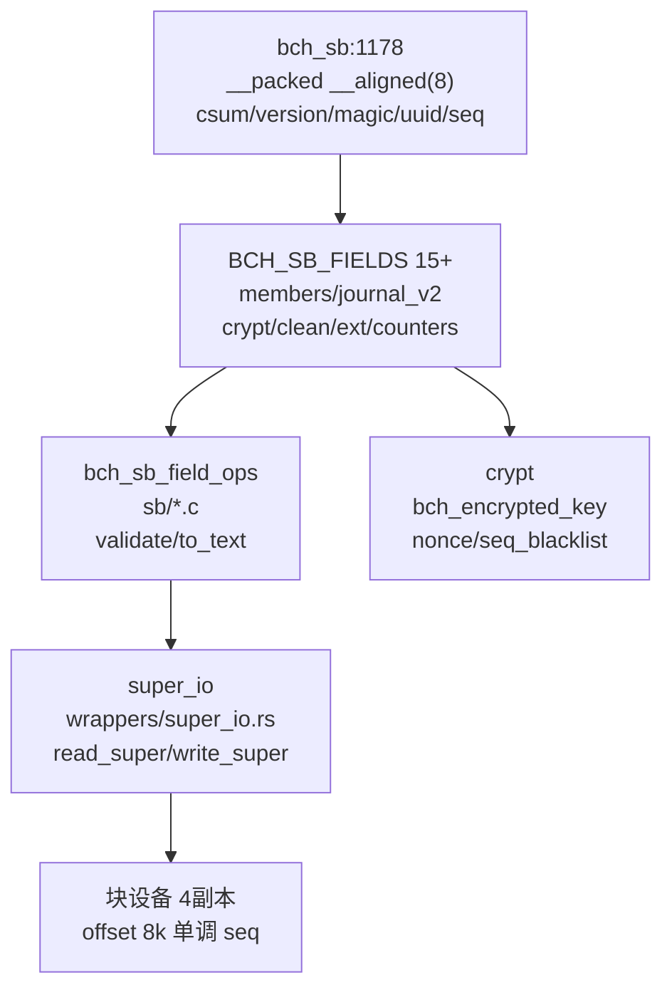
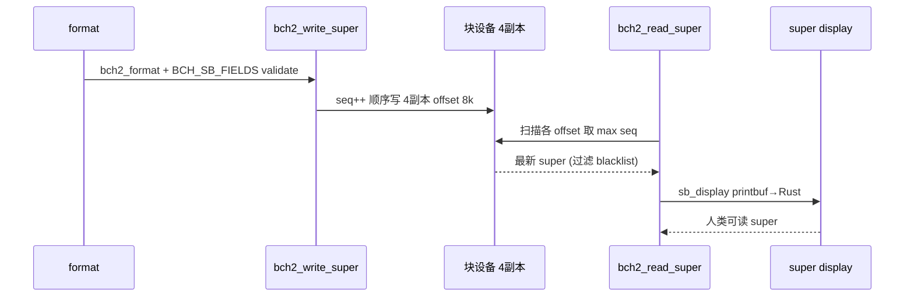
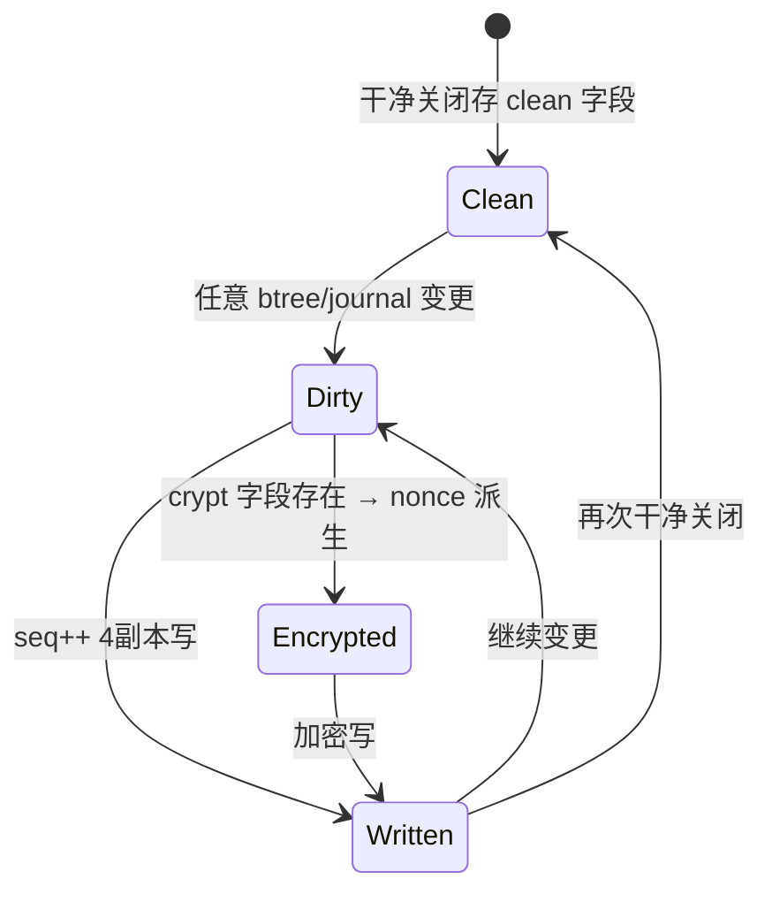
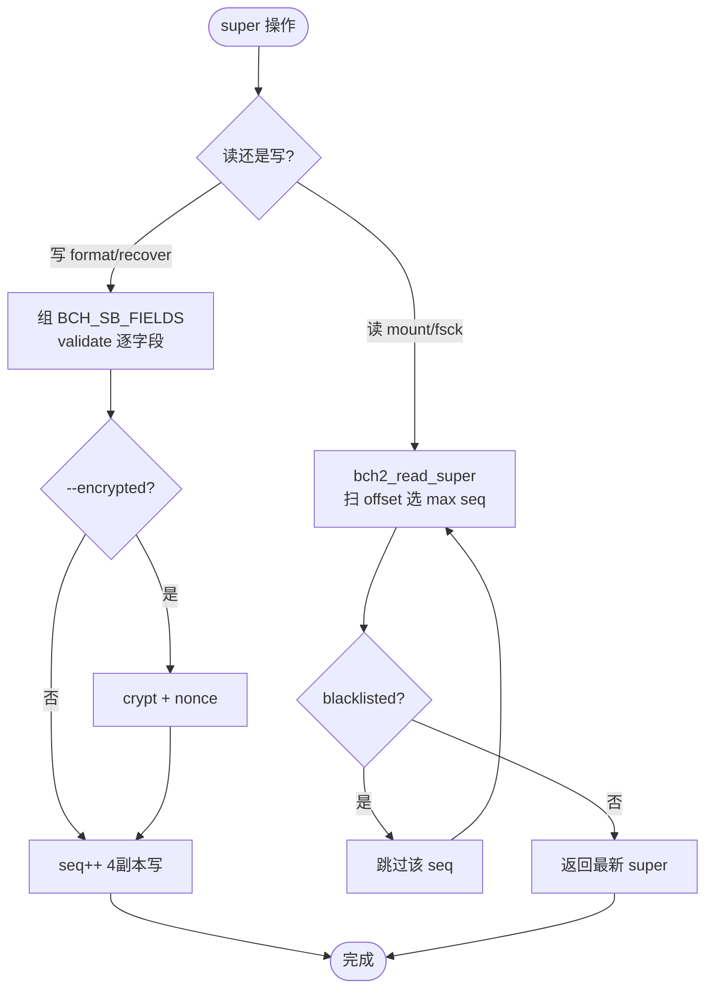

# Bcachefs Super（超块）

`bch_sb`（`fs/bcachefs_format.h:1178` `__packed __aligned(8)`）为 `bcachefs` 超块：固定头 `csum/version/magic/uuid/user_uuid/label/offset/seq/block_size/dev_idx/nr_devices/u64s/time_base` + `flags[7]/features[2]/compat` + 可扩展 `BCH_SB_FIELDS` 15+ 字段（`members/journal_v2/crypt/clean/ext/recovery_passes/counters/disk_groups/...`）。多副本 4 份存 `offset 8k` 起，按 `seq` 单调选最新。定位：`src/commands/super_cmd.rs + recover_super.rs → wrappers/super_io + sb_display → fs/sb/io.c + fs/bcachefs_format.h:1178`。

## C4 L3 Component — bch_sb 固定头 + 15 字段 + super_io

`bch_sb` 固定头：`csum/version/version_min/magic/uuid/user_uuid/label/offset/seq/block_size/dev_idx/nr_devices/u64s`；`BCH_SB_FIELDS()` x-macro 定义 15+ 可扩展字段：`members`（设备列表）、`journal/journal_v2`（环 buckets）、`crypt`（加密根密钥）、`clean`（干净关闭时 btree roots + journal_seq）、`ext`（`recovery_passes/errors/btrees_clean`）、`counters`（计数器）、`disk_groups`、`replicas` 等，每字段由 `bch_sb_field_ops`（`fs/sb/*.c: .validate/.to_text`）校验。`super_io`（`wrappers/super_io.rs` `SUPERBLOCK_SIZE_DEFAULT`）封装 `bch2_read_super` 扫描、`bch2_write_super` 4 副本顺序写。C4 L3 图以 `bch_sb(固定头) → BCH_SB_FIELDS(15+) → sb_field_ops → super_io(4副本)` 四层呈现。



Source: `/home/black/Documents/bcachefs-tools/fs/bcachefs_format.h:1178`（`struct bch_sb`）+ `/home/black/Documents/bcachefs-tools/src/wrappers/super_io.rs:1`（`SUPERBLOCK_SIZE_DEFAULT`）+ `/home/black/Documents/bcachefs-tools/src/wrappers/sb_display.rs:1`（`printbuf→Rust`）+ `/home/black/Documents/bcachefs-tools/fs/sb/io.c:1`（`bch2_read_super/write_super`）

## 时序 — super 读写与 format/recover 链

1) `format` 经 `bch2_format` 组 `bch_sb` 并 `BCH_SB_FIELDS` validate；2) `bch2_write_super` 按 `offset 8k` 顺序写 4 副本，每次 `seq++`；3) `mount/fsck` 时 `bch2_read_super` 扫描各 offset 取最大 `seq`（`seq_blacklist` 过滤）；4) `recover_super`（`recover_super.rs`）以 `open_scan` 扫描全盘选最新可用 `super` 并重写；5) `super` cmd（`super_cmd.rs`）经 `sb_display` 以 `printbuf` 打印人类可读。时序图以 `format → write 4副本 → read max seq → recover → display` 全链呈现。



Source: `/home/black/Documents/bcachefs-tools/fs/bcachefs_format.h:1178` + `/home/black/Documents/bcachefs-tools/fs/sb/io.c:1` + `/home/black/Documents/bcachefs-tools/src/wrappers/super_io.rs:1` + `/home/black/Documents/bcachefs-tools/src/wrappers/sb_display.rs:1`

## 状态机 — super 副本与加密

`super copy` 三态 `clean → dirty → written`：`clean` 时 `bch_sb_field_clean` 存 roots+seq，`dirty` 后 `seq++`，`written` 4 副本均最新。`crypt` 二态 `plain → encrypted`：`crypt` 字段存 `bch_encrypted_key`，`nonce` 由 `journal seq` 派生。`seq` 单调态 `old → current → next`：`read_super` 必选 `next`（max seq）。状态机图覆盖 `clean→dirty→written` 与 `seq` 单调分支。



Source: `/home/black/Documents/bcachefs-tools/fs/bcachefs_format.h:1178` + `/home/black/Documents/bcachefs-tools/fs/sb/io.c:1` + `/home/black/Documents/bcachefs-tools/src/wrappers/sb_display.rs:1`

## 决策树



Source: `/home/black/Documents/bcachefs-tools/fs/bcachefs_format.h:1178` + `/home/black/Documents/bcachefs-tools/fs/sb/io.c:1`

## 正例

```c
// 正例：mount 时选最新 super
struct bch_sb *sb = bch2_read_super(dev); // 扫 4 offset 取 max seq，跳 blacklist
bch2_fs_alloc(sb); // 以最新 super 初始化
// format 时 4副本原子
bch2_write_super(c, sb); // seq++ 后顺序写 4副本
// 验证：seq 单调，read 幂等
```

命中：`write seq++` 与 `read max seq` 配对，`BCH_SB_FIELDS` validate 闭环。

## 反例

```c
// 反例1：只写单副本
// 错：仅写 offset 8k，掉盘即丢 super
// 正确：4副本顺序写，任一存活即可读

// 反例2：忽视 seq 单调直接覆盖旧 seq 的副本
// 错：以旧 seq 覆盖新 seq，回退
// 正确：seq++ 后写，read 选 max seq
```

## 门禁

- **多图门禁**：`grep -c '```mermaid' ontology/entity/bcachefs-super.md` ≥3
- **溯源门禁**：`grep -c 'Source:' ontology/entity/bcachefs-super.md` ≥3 且每图含 `Source: /home/black/Documents/bcachefs-tools/... file:line`
- **正文门禁**：`wc -l ontology/entity/bcachefs-super.md` ≥80 且含 `决策树` `正例` `反例` `门禁`
- **属性门禁**：`attributes` ≥3 且每条 `testable_signal` 含 `grep -q` 且双源可回归
- **本体校验**：`python3 scripts/ontology-validate.py` 0 issues 且 `islands:0`
- **脚手架门禁**：`python3 scripts/ontology_test_scaffold.py --node ontology:entity/bcachefs-super --out /tmp/x.py` 可产
- **Gate 门禁**：`python3 scripts/production-ontology-gate.py --node ontology:entity/bcachefs-super` GATE OK

Source: `/home/black/Documents/bcachefs-tools/fs/bcachefs_format.h:1178` + `/home/black/Documents/bcachefs-tools/fs/sb/io.c:1` + `/home/black/Documents/bcachefs-tools/src/wrappers/super_io.rs:1`
