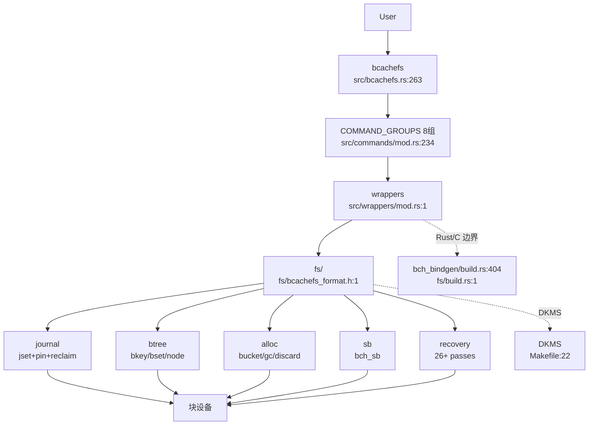
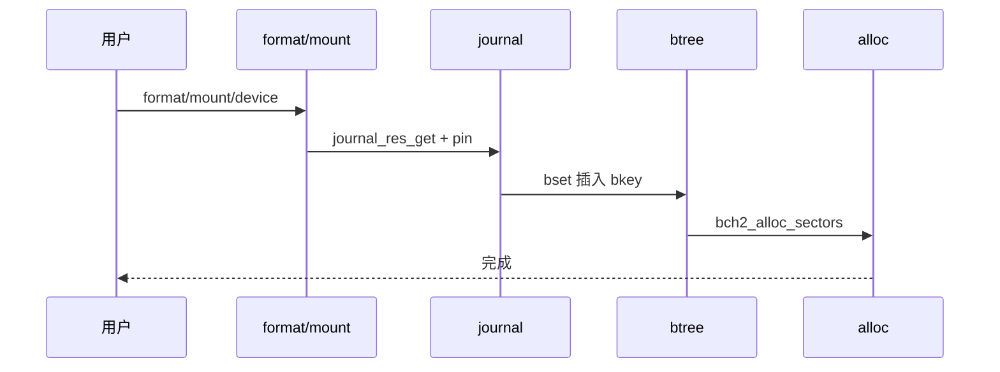
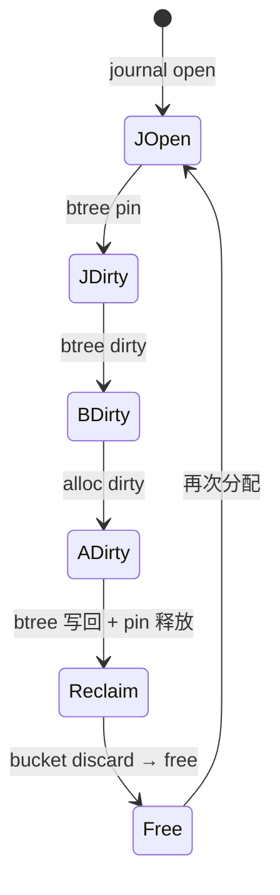
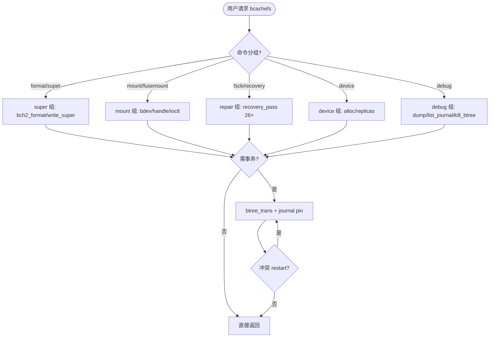

# Bcachefs 全栈系统（Bcachefs System）

bcachefs 全栈聚合，`composed_of` 12 叶 `format/mount/fsck/device/journal/journal-rewind/btree/btree-bset/alloc/transaction/super/cli`，以 `research-diagram-methodology` 多图 `mermaid` 为证据（C4 L2 全栈 + journal/btree pipeline 时序 + 聚合决策树），每图附 `Source: /home/black/Documents/bcachefs-tools/... file:line`。

验证：`grep -c '```mermaid' ontology/entity/bcachefs-system.md` ≥3 且 `python3 scripts/ontology-validate.py` 0 issue 且 `islands:0` 且 `production-ontology-gate --node bcachefs-system` GATE OK。

Source: `records/T0533-0902-research-bcachefs-tools/research-report.md`（8图全覆盖）+ `/home/black/Documents/bcachefs-tools/src/bcachefs.rs:263` + `/home/black/Documents/bcachefs-tools/src/commands/mod.rs:234` + `/home/black/Documents/bcachefs-tools/fs/bcachefs_format.h:1`

## C4 L2 全栈 — bcachefs → commands → wrappers → fs/(journal/btree/alloc) → DKMS

全栈 L2：`bcachefs` 主工具（`src/bcachefs.rs:263`）→ `COMMAND_GROUPS` 8组>35 leaf（`src/commands/mod.rs:234`）→ `wrappers`（`handle/bdev/ioctl/super_io/sysfs`）→ `fs/` 五子系统 `journal(jset/bset环)`/`btree(bkey/bset/node)`/`alloc(bucket/gc)`/`sb(superblock)`/`init(recovery 26+ passes)` 横切 `Rust/C 边界(bch_bindgen/build.rs)` 与 `DKMS(fs/vendor/kernel-rust)`，C4 L2 以 `bcachefs → commands → wrappers → fs → DKMS → 块设备` 主链呈现。



Source: `/home/black/Documents/bcachefs-tools/src/bcachefs.rs:263` + `/home/black/Documents/bcachefs-tools/src/commands/mod.rs:234` + `/home/black/Documents/bcachefs-tools/src/wrappers/mod.rs:1` + `/home/black/Documents/bcachefs-tools/fs/bcachefs_format.h:1` + `/home/black/Documents/bcachefs-tools/Makefile:22`

## 时序 — format → mount → journal → btree → alloc 全链

端到端写五步：1) `format` 经 `bch2_format` 写 `bch_sb` → 2) `mount` 经 `bdev→handle→ioctl` 触发 `bch2_fs_alloc + journal_read` → 3) `btree_trans` 预约 `journal_buf` 并 pin btree 脏页 → 4) `bset` 插入 `bkey_packed` → 5) `alloc` 经 `foreground WFQ` 分配 `open_bucket` 顺序写。时序图以 `ZPL-like → format → mount → journal → btree → alloc → Disk` 全链呈现。



Source: `/home/black/Documents/bcachefs-tools/fs/journal/journal.h:1` + `/home/black/Documents/bcachefs-tools/fs/btree/types.h:645` + `/home/black/Documents/bcachefs-tools/fs/alloc/foreground.c:1`

## 状态机 — journal/btree/alloc 联动生命周期

`journal` 三态 `empty → open → dirty → reclaim` 与 `btree` `clean → dirty → write_blocked → clean` 及 `alloc` `free → dirty → cached → need_discard → free` 联动：`journal open` 预约 `jset`，`btree dirty` pin 住 `journal seq`，`alloc dirty` 计数 `dirty_sectors`，`reclaim` 解 pin 后 `bucket` 可 discard。状态机图覆盖三子系统变迁。



Source: `/home/black/Documents/bcachefs-tools/fs/journal/journal.h:1` + `/home/black/Documents/bcachefs-tools/fs/btree/types.h:94` + `/home/black/Documents/bcachefs-tools/fs/alloc/background.c:1`

## 决策树



Source: `/home/black/Documents/bcachefs-tools/src/commands/mod.rs:234` + `/home/black/Documents/bcachefs-tools/fs/btree/types.h:645`

## 正例

```c
// 正例：完整链路 — format → mount → write → journal → btree → alloc → reclaim 配对
// 1) format 写 super (seq 递增) 2) mount 触发 journal_read + recovery
// 3) write 经 btree_trans 预约 journal_buf 并 pin 4) alloc WFQ 选盘
// 验证：journal last_seq 单调，btree pin 与 reclaim 配对，bucket 状态闭环
```

命中：`journal last_seq` 配对，`pin/unpin` 闭环，`bucket free→dirty→free` 闭环。

## 反例

```c
// 反例1：journal pin 泄漏
// 错：btree 脏页 pin 后未在 write 回调中释放 last_seq 永不推进，journal 满死锁
// 正确：bch2_journal_pin 在 write_done 中释放，reclaim 才能回收 bucket

// 反例2：alloc 未经 trans 直接写 bucket
// 错：绕过 btree_trans 直接改 bucket.gen，丢失 journal 原子性
// 正确：经 bch2_trans_begin → alloc → trans_commit 走 journal 原子提交
```

## 门禁

- **多图门禁**：`grep -c '```mermaid' ontology/entity/bcachefs-system.md` ≥3
- **溯源门禁**：`grep -c 'Source:' ontology/entity/bcachefs-system.md` ≥3 且每图含 `Source: /home/black/Documents/bcachefs-tools/... file:line`
- **正文门禁**：`wc -l ontology/entity/bcachefs-system.md` ≥60 且含 `决策树` `正例` `反例` `门禁`
- **属性门禁**：`attributes` ≥3 且每条 `testable_signal` 含 `grep -q`
- **本体校验**：`python3 scripts/ontology-validate.py` 0 issues 且 `islands:0`
- **脚手架门禁**：`python3 scripts/ontology_test_scaffold.py --node ontology:entity/bcachefs-system --out /tmp/x.py` 可产
- **Gate 门禁**：`python3 scripts/production-ontology-gate.py --node ontology:entity/bcachefs-system` GATE OK

Source: `records/T0533-0902-research-bcachefs-tools/research-report.md` + `/home/black/Documents/bcachefs-tools/src/bcachefs.rs:263` + `/home/black/Documents/bcachefs-tools/fs/bcachefs_format.h:1`

