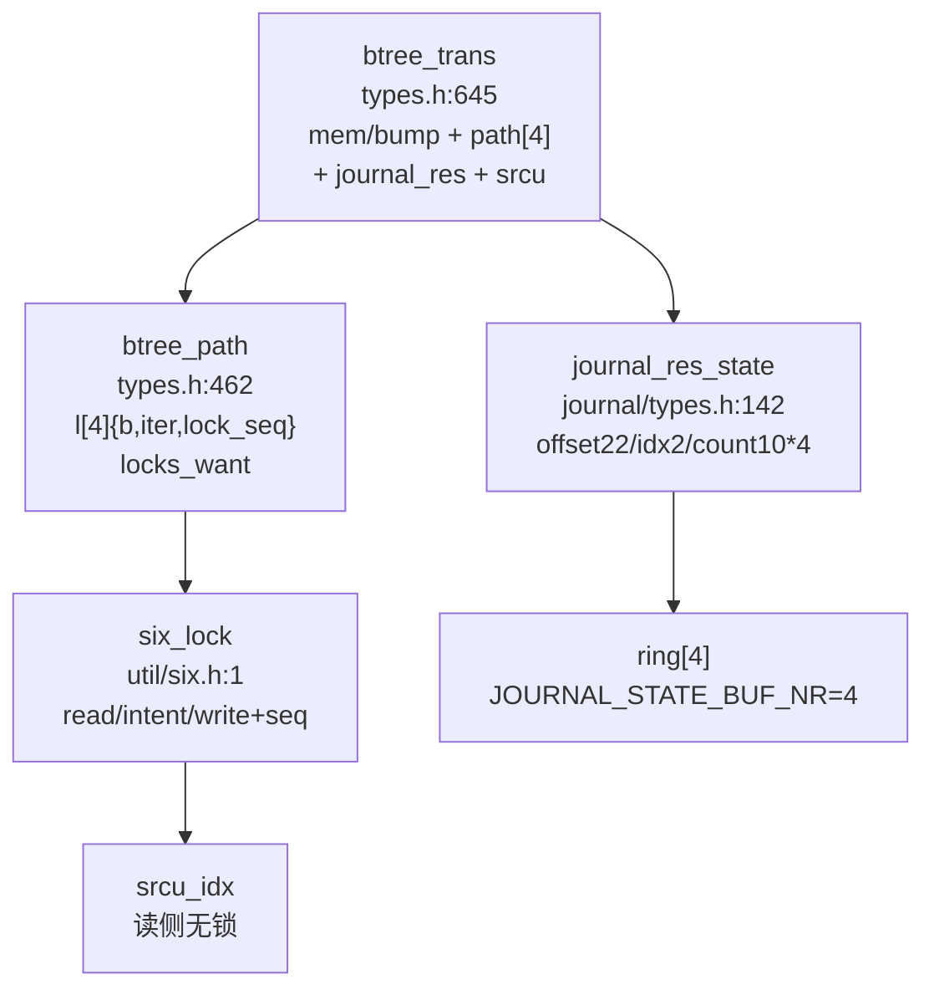
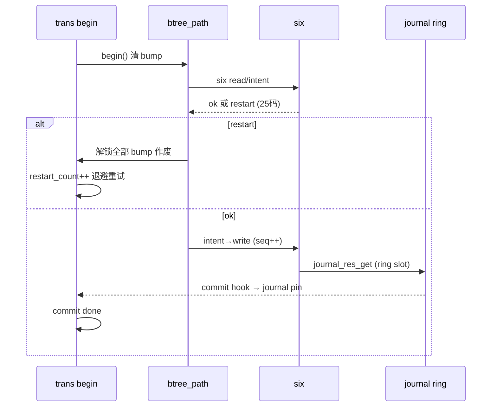
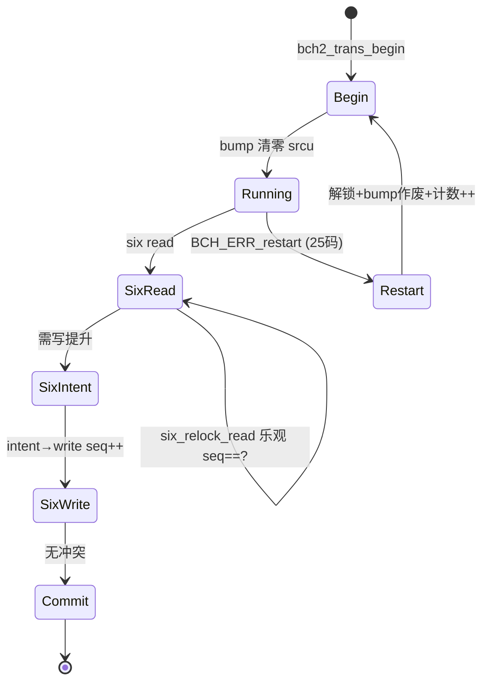
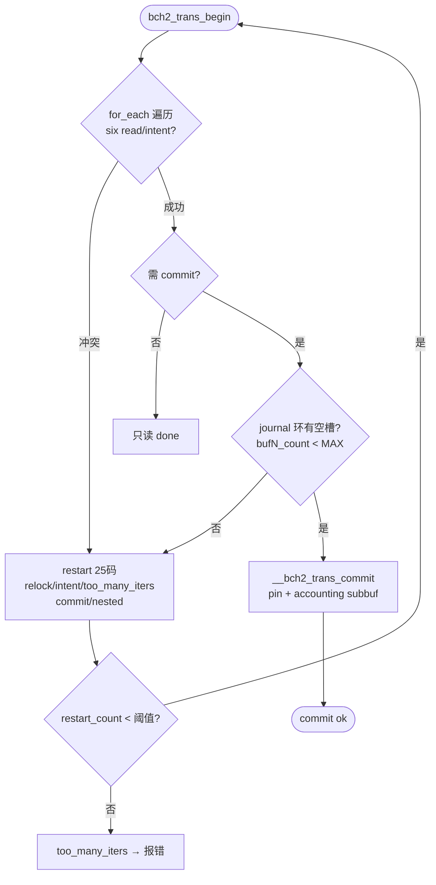

# Bcachefs Transaction（事务/并发）

事务以 `btree_trans`（`fs/btree/types.h:645`）为载体：`mem/mem_top/mem_bytes` 为 `bump allocator`（restart 即作废），`srcu_idx` 读侧无锁，`six_lock` 三态 + `seq` 乐观并发，`for_each_btree_key/commit_do` 宏以 25 种 `BCH_ERR_transaction_restart` 子码驱动重试，`journal_res_state` 4 槽环并发预约。定位：`src/bcachefs.rs:263` → `wrappers` → `fs/btree/`（`types.h/iter.h/update.h/errcode.h`）→ `fs/util/six.h` → `fs/journal/types.h:18`。

## C4 L3 Component — btree_trans + six + journal 环

`btree_trans`（`types.h:645`）含 `mem/mem_top`（bump 区，`restarted:16` 标记时作废）、`sorted/nr_sorted/nr_paths`（`btree_path` 数组，每 path 含 `l[4]{b,iter,lock_seq} + locks_want`）、`journal_res/disk_res`（预约）、`srcu_idx`；`six_lock`（`util/six.h:1`）含 `read/intent/write + seq`；`journal_res_state`（`journal/types.h:142`）含 `cur_entry_offset:22/idx:2/buf0-3_count:10*4`。C4 L3 图以 `trans(bump+path[]) → six(read/intent/write) → journal ring(4) → SRCU` 四层呈现。



Source: `/home/black/Documents/bcachefs-tools/fs/btree/types.h:645`（`btree_trans { mem/mem_top/restarted/srcu_idx/journal_res }`）+ `/home/black/Documents/bcachefs-tools/fs/util/six.h:1`（`read/intent/write + seq`）+ `/home/black/Documents/bcachefs-tools/fs/journal/types.h:142`（`journal_res_state`）+ `/home/black/Documents/bcachefs-tools/fs/journal/types.h:18`（`JOURNAL_STATE_BUF_NR=4`）

## 时序 — for_each_btree_key 重试环与 six 升降级

`for_each_btree_key`（`iter.h:962`）展开为 `do { restart_count=begin(); _ret=do; } while(err_matches(restart))`：1) `bch2_trans_begin` 清 bump mem；2) `btree_path` 遍历持 `six read/intent`；3) 若并发冲突 `six` 抛 `BCH_ERR_transaction_restart_*`（25 子码），则解锁全部 + bump 作废 + `restart_count++`；4) 指数退避后重入；5) 成功则 `bch2_trans_commit` 经 `__bch2_trans_commit`（`update.h:273`）先触发器再 btree 写。`six` 升级路径 `read → intent → write` 防死锁，`six_relock_read` 以 `seq` 乐观验证。时序图以 `begin → six read/intent → conflict?restart → write → commit` 全链呈现。



Source: `/home/black/Documents/bcachefs-tools/fs/btree/iter.h:962`（`for_each_btree_key`）+ `/home/black/Documents/bcachefs-tools/fs/btree/types.h:645` + `/home/black/Documents/bcachefs-tools/fs/util/six.h:1` + `/home/black/Documents/bcachefs-tools/fs/journal/types.h:142`

## 状态机 — trans 重试与 six 三态

`trans` 三态 `begin → running → commit_or_restart`：`running` 中任 `six` 冲突即 `restart` 回 `begin`（bump 作废）。`six` 三态 `unlocked → read ↔ intent → write`：`read` 可重入共享，`intent` 互斥防升级死锁，`write` 独占且 `seq++`，`relock` 乐观 `seq` 验证。状态机图覆盖 `restart` 往返与 `intent` 栅栏。



Source: `/home/black/Documents/bcachefs-tools/fs/btree/types.h:645` + `/home/black/Documents/bcachefs-tools/fs/util/six.h:1`（`DOC` 含 `intent→write` 防死锁）+ `/home/black/Documents/bcachefs-tools/fs/errcode.h:209`（25 restart 子码）

## 决策树



Source: `/home/black/Documents/bcachefs-tools/fs/btree/iter.h:962` + `/home/black/Documents/bcachefs-tools/fs/errcode.h:209` + `/home/black/Documents/bcachefs-tools/fs/journal/types.h:142`

## 正例

```c
// 正例：for_each + commit 闭环，six 升降有序
for_each_btree_key(trans, iter, BTREE_ID_extents, pos, BTREE_ITER_slots, k, ret) {
    // 持有 six read/intent 遍历
    bch2_trans_update(trans, iter, &new_key);
}
ret = bch2_trans_commit(trans, NULL, NULL, BCH_TRANS_COMMIT_no_enospc);
// 验证：restart 时 bump 作废不泄漏，commit 时 journal ring 不溢出
```

命中：`restart` 与 `bump` 配对，`six intent→write` 有序，`journal_res_state` 不超 `COUNT_MAX`。

## 反例

```c
// 反例1：trans 间复用 bump 内存
// 错：restart 后仍用旧 mem 指针，UAF
// 正确：restart 即作废 mem/mem_top，begin 重新分配

// 反例2：跳过 intent 直接 write
// 错：read→write 升级与并发 read 死锁
// 正确：read→intent(互斥栅栏)→write
```

## 门禁

- **多图门禁**：`grep -c '```mermaid' ontology/entity/bcachefs-transaction.md` ≥3
- **溯源门禁**：`grep -c 'Source:' ontology/entity/bcachefs-transaction.md` ≥3 且每图含 `Source: /home/black/Documents/bcachefs-tools/... file:line`
- **正文门禁**：`wc -l ontology/entity/bcachefs-transaction.md` ≥80 且含 `决策树` `正例` `反例` `门禁`
- **属性门禁**：`attributes` ≥3 且每条 `testable_signal` 含 `grep -q` 且双源可回归
- **本体校验**：`python3 scripts/ontology-validate.py` 0 issues 且 `islands:0`
- **脚手架门禁**：`python3 scripts/ontology_test_scaffold.py --node ontology:entity/bcachefs-transaction --out /tmp/x.py` 可产
- **Gate 门禁**：`python3 scripts/production-ontology-gate.py --node ontology:entity/bcachefs-transaction` GATE OK

Source: `/home/black/Documents/bcachefs-tools/fs/btree/types.h:645` + `/home/black/Documents/bcachefs-tools/fs/util/six.h:1` + `/home/black/Documents/bcachefs-tools/fs/errcode.h:209`
