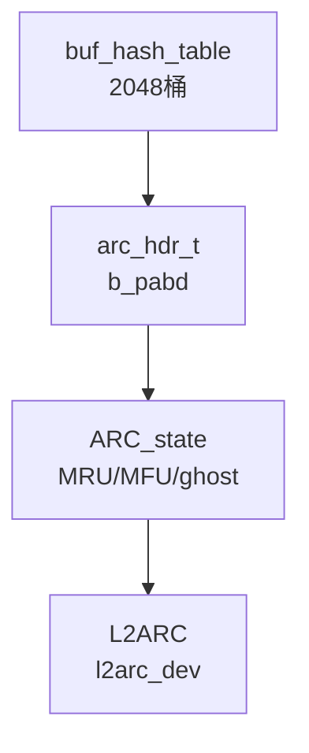

# ZFS ARC（Adaptive Replacement Cache）

自适应缓存：L1 以 `MRU`/`MFU` 双队列 + `ghost` 幽灵队列四态 `T1/T2/B1/B2` 组织，`ARC_p` 在 `0..c` 间自适应均衡 recency vs frequency，`ghost 命中`驱动 `p` 按 `|B|` 增量调整；`buf_hash_table[2048]` 每桶独立 `hash lock` + `ARC_state lock` 分层，`buf_hash_find` 以 `spa+dataset+object+blknum` 为 key 返回持锁 hash 头；`zfs_compressed_arc_enabled` 控制 `arc_buf_hdr_t.b_pabd` 是否以压缩物理块常驻，`L2ARC` 经 `l2arc_feed_thread` 周期扫描 `ARC_mfu/mru` 以 `l2arc_write_max`/`l2arc_headroom`/`l2arc_write_boost` 限速异步回写至 cache vdev，`zfetch` 预取协同 `dbuf_read → arc_read` 命中路径。

## C4 L3 Component — ARC 四态自适应与 buf_hash/L2ARC 协作

`arc_hdr_t` 为缓存单元头：`b_spa/b_dva/b_birth` 标识块，`b_flags` 含 `ARC_FLAG_COMPRESSED`，`b_pabd` 为 `abd_t` 物理数据（`zfs_compressed_arc_enabled=1` 时存压缩块），`b_l1hdr` 链入 `T1/T2/B1/B2` 四链表之一。`arc_state_t` 四态：`arc_anon`（未入队）、`arc_mru`（T1）、`arc_mfu`（T2）、`arc_mru_ghost`（B1）、`arc_mfu_ghost`（B2）、`arc_l2c_only`（仅 L2）。`buf_hash_table` 为 2048 桶 hash 表，每桶 `ht_lock + ht_table`，`buf_hash_find` 以 `spa_guid + dsobj + object + offset` 计算 hash 并 `mutex_enter(ht_lock)` 后在桶链中查找 `arc_hdr_t`，返回持锁头由调用方负责 `mutex_exit`。`ARC_p` 为自适应目标：`T1` 目标大小 `p`，`T2` 目标大小 `c-p`，`B1 命中→p+=max(|B2|/|B1|,1)`，`B2 命中→p-=max(|B1|/|B2|,1)`，`c = arc_c_min..arc_c_max` 受 `zfs_arc_max` 与内存压力动态伸缩。`L2ARC` 侧 `l2arc_dev_t` 每 cache vdev 一实例，`l2arc_feed_thread` 每 `l2arc_feed_secs` 扫描 `ARC` 链表，以 `l2arc_write_max` 限速批量 `l2arc_write_buffers`。C4 L3 图以 `buf_hash_table → arc_hdr → ARC_state(T1/T2/B1/B2/p/c) → L2ARC(l2arc_dev/l2arc_feed)` 三层呈现该分层与自适应循环。

Source: `openzfs/zfs/module/zfs/arc.c:1-200`（ARC operation 头注释 "Adaptive Replacement Cache" 与 T1/T2/B1/B2/p 定义）+ `openzfs/zfs/module/zfs/arc.c:800-950`（`buf_hash_table` 定义 2048 桶与 `buf_hash_find` 持锁查找）+ `openzfs/zfs/include/sys/arc_impl.h:40-180`（`arc_hdr_t` 含 `b_pabd/b_flags/b_l1hdr` 与 `arc_state_t` 四态）

## 时序 — arc_read → buf_hash_find → ghost 命中 → ARC_p 自适应 → L2ARC 回填

读命中四分支：1) `dbuf_read → arc_read(hdr, spa, dsobj, blkid)` → `buf_hash_find(spa, dsobj, blkid, &hash_lock)` 持 `ht_lock` 查 `arc_hdr_t`；2a) `T1/T2 命中（L1 hit）`：在 `ARC_state lock` 下将 `hdr` 移至 `T2(MFU)` 队首，`adjust p` 不变，直接 `abd_copy(b_pabd)` 返回；2b) `B1/B2 ghost 命中`：`hash 命中但 state 为 ghost`，`p += delta(|B2|/|B1|)` 或 `p -= delta`，从 ghost 摘除并重新分配 `b_pabd` 后入 `T2`，计为 `ghost hit → ARC_p 调整`；2c) `L2ARC 命中（L2 hit）`：`arc_hdr` 在 `arc_l2c_only`，`l2arc_read_done` 从 cache vdev 异步读后 `b_pabd` 回填 L1 并入 `T1/T2`；2d) `完全 miss`：`arc_hdr_alloc → ZIO read pipeline → arc_write` 新建 `ANON → T1`。写/预取侧：`zfetch` 以 `dbuf stream` 预取 `arc_read` 多块，`l2arc_feed_thread` 周期 `l2arc_feed_cksum` 校验并 `l2arc_write_buffers` 以 `l2arc_write_max` 限速写 cache vdev，`l2arc_write_done` 更新 `l2arc_dev` 统计与 `headroom`。时序图以 `dbuf_read → buf_hash_find(ht_lock) → ARC_state lock → ghost/p 调整 → b_pabd/ABD → L2ARC feed/write` 全链呈现该命中-自适应-回填衔接。

Source: `openzfs/zfs/module/zfs/arc.c:320-500`（`arc_read` 命中四分支与 ghost/ARC_p 调整）+ `openzfs/zfs/module/zfs/arc.c:800-950`（`buf_hash_find` hash 锁分层与返回持锁语义）+ `openzfs/zfs/module/zfs/l2arc.c:80-250`（`l2arc_feed_thread` 与 `l2arc_write_buffers`/`l2arc_write_max` 限速）+ `openzfs/zfs/module/zfs/dbuf.c:320-420`（`dbuf_read → arc_read` 协同与 `zfetch` 预取）

## 状态机 — arc_hdr_t MRU/MFU/ghost/ANON/L2CACHE 五态与压缩分支

`arc_hdr_t` 生命周期七态：`ANON`（`arc_anon` 新分配，未入 L1，`b_pabd` 已分配）→ `MRU`（`T1` recency 队，新块首次入 MRU 队首）→ `MFU`（`T2` frequency 队，MRU 命中一次后提升至 MFU）→ `MRU_GHOST`（`B1` 幽灵，仅存 `hdr` 元数据无 `b_pabd`，LRU 淘汰自 T1）→ `MFU_GHOST`（`B2` 幽灵，LRU 淘汰自 T2）→ `L2CACHE`（`arc_l2c_only` 仅 L2 有数据，L1 已驱逐但 L2 仍存）、`EVICTED`（完全驱逐，无 L1/L2）。`ghost 命中`边：`MRU_GHOST → MRU/MFU` 且 `p+=delta`，`MFU_GHOST → MFU` 且 `p-=delta`；`MRU→MFU` 边由 `T1 命中`触发；`MFU→MFU` 自环为 `T2 命中`保持队首；`MRU/MFU → GHOST` 边由 `arc_evict` 在 `c` 超限时按 `p` 比例选 victim 淘汰至 ghost，`b_pabd` 释放但 `hdr` 留 ghost 队；`MFU→L2CACHE` 边由 `l2arc_write_buffers` 成功后 `hdr` 同步入 L2 索引；`L2CACHE→MRU` 边由 `L2 hit` 回填。压缩分支：`zfs_compressed_arc_enabled=1` 时 `b_pabd` 存压缩后 `psize`，`hdr` 在 `MRU/MFU` 时 `b_pabd` 为压缩态，`arc_read` 解压至 `abd` 返回；`=0` 时 `b_pabd` 存解压后 `lsize`。状态机图覆盖七态及 `ghost/p 调整`、`evict→ghost`、`L2 回填` 三条关键变迁与 `compressed` 分支。

Source: `openzfs/zfs/module/zfs/arc.c:1-200`（ARC operation 四态与 ARC_p 定义及 compressed arc 注释）+ `openzfs/zfs/module/zfs/arc.c:1200-1500`（`arc_evict` 按 p 比例选 T1/T2 victim 与 ghost 迁移）+ `openzfs/zfs/include/sys/arc_impl.h:40-180`（`arc_hdr_t` 定义 `b_pabd/b_flags` 与 `arc_state_t`）+ `openzfs/zfs/module/zfs/l2arc.c:250-400`（`l2arc_write_done` 与 `arc_l2c_only` 衔接）

## 决策树

```mermaid
flowchart TD
    START([dbuf_read 发起 arc_read]) --> Q1{buf_hash_find<br/>hash 命中?}
    Q1 -- 未命中<br/>hash miss --> A1[arc_hdr_alloc ANON<br/>ZIO read pipeline<br/>ANON → T1 MRU]
    Q1 -- 命中 --> Q2{hdr state?}
    Q2 -- T1/T2<br/>L1 hit --> A2[ARC_state lock 下<br/>移至 T2 MFU 队首<br/>abd_copy b_pabd 返回]
    Q2 -- B1 ghost --> A3[B1 ghost hit<br/>p += max(|B2|/|B1|,1)<br/>重分配 b_pabd → T2]
    Q2 -- B2 ghost --> A4[B2 ghost hit<br/>p -= max(|B1|/|B2|,1)<br/>重分配 b_pabd → T2]
    Q2 -- arc_l2c_only<br/>L2 only --> Q3{L2ARC 可读?}
    Q3 -- 是 l2arc_dev 命中 --> A5[l2arc_read_done<br/>b_pabd 回填 L1<br/>L2CACHE → T1/T2]
    Q3 -- 否 --> A1
    A1 --> Q4{zfs_compressed_arc_enabled?}
    A2 --> Q4
    A3 --> Q4
    A4 --> Q4
    A5 --> Q4
    Q4 -- 1 压缩 ARC --> A6[b_pabd 存压缩 psize<br/>arc_read 解压至 abd]
    Q4 -- 0 非压缩 --> A7[b_pabd 存明文 lsize<br/>直接 abd_copy]
    A6 --> Q5{需 L2ARC 回写?}
    A7 --> Q5
    Q5 -- 命中频高<br/>MFU 且 l2arc_feed 选中 --> A8[l2arc_feed_thread 扫描<br/>l2arc_write_buffers<br/>限速 l2arc_write_max]
    Q5 -- 否 --> END([返回 abd<br/>dbuf db_data 就绪])
    A8 --> END
    A1 --> END2([ZIO 完成入 T1<br/>ghost 队列已更新 p/c])
    A6 --> END
    A7 --> END
```

Source: `openzfs/zfs/module/zfs/arc.c:320-500`（arc_read 四分支与 ghost/ARC_p 调整）+ `openzfs/zfs/module/zfs/arc.c:800-950`（buf_hash_find 分支）+ `openzfs/zfs/module/zfs/arc.c:1-200`（ARC_p 自适应公式）+ `openzfs/zfs/module/zfs/l2arc.c:80-250`（L2ARC 写入分支与 l2arc_write_max 限速）


## 补充 C4 — buf_hash 与 L2ARC 协同（补图至 3 mermaid）



Source: `openzfs/zfs/module/zfs/arc.c:800-950` + `openzfs/zfs/include/sys/arc_impl.h:40-180`


## 正例

```c
// 正例1：正确的 buf_hash_find 持锁查找与 ARC_state 配对及 ghost/p 调整
arc_buf_hdr_t *hdr; kmutex_t *hash_lock;
hdr = buf_hash_find(spa_guid, dsobj, object, blknum, &hash_lock);
// buf_hash_find 内部 mutex_enter(ht_lock) 并返回持锁头，调用方需在 ARC_state 操作后释放
if (hdr != NULL) {
    mutex_enter(&hdr->b_l1hdr.b_arc_lock); // 先 hash 锁已持，再 ARC_state 锁，分层顺序正确
    if (HDR_IN_GHOST(hdr)) {
        // ghost 命中：按 |B| 调整 p 并重分配 b_pabd
        int64_t delta = MAX(arc_mfu_ghost->arcs_size / MAX(arc_mru_ghost->arcs_size, 1), 1);
        if (hdr->b_state == arc_mru_ghost)
            arc_p = MIN(arc_c, arc_p + delta);
        else
            arc_p = MAX(0, arc_p - delta);
        arc_hdr_realloc(hdr); // 重分配 b_pabd
        arc_change_state(arc_mfu, hdr); // ghost → MFU
    } else {
        arc_change_state(arc_mfu, hdr); // MRU→MFU 或 MFU 自环至队首
    }
    mutex_exit(&hdr->b_l1hdr.b_arc_lock);
    mutex_exit(hash_lock); // 释放 hash 锁
    abd_copy(hdr->b_pabd, abd); // 压缩 ARC 需先 decompress
}

// 正例2：L2ARC 限速回写与压缩 ARC 协同
if (zfs_compressed_arc_enabled && HDR_HAS_L2HDR(hdr)) {
    // b_pabd 存压缩块，L2ARC 直接写压缩 psize，节省带宽
    l2arc_write_buffers(l2dev, hdr->b_pabd, hdr->b_psize); // l2arc_write_max 限速
}
// 验证：ghost 命中 p 调整符合 FAST'03 公式，hash 锁先于 ARC_state 锁，L2 写压缩 psize
```

命中：`buf_hash_find` 返回持锁头后先 `ARC_state lock` 再操作 `ARC_p`，ghost 命中按 `|B2|/|B1|` 调整 `p`，`zfs_compressed_arc_enabled` 时 `b_pabd` 压缩块直通 L2ARC 且 `l2arc_write_max` 限速。

## 反例

```c
// 反例1：hash 锁与 ARC_state 锁序反转死锁
mutex_enter(&hdr->b_l1hdr.b_arc_lock);
kmutex_t *hl; buf_hash_find(spa, dsobj, obj, blk, &hl); // 错：已持 ARC_state 锁再取 hash 锁
// 与 arc_evict 侧（先 hash 锁再 ARC_state 锁）形成 ABBA 死锁，同 dbuf 的 dn_struct_rwlock→db_mtx 范式

// 反例2：漏 ghost/p 调整导致 ARC 退化为固定 LRU
hdr = buf_hash_find(..., &hash_lock);
if (HDR_IN_GHOST(hdr)) {
    arc_change_state(arc_mfu, hdr); // 错：漏 arc_p 调整，MRU/MFU 比例永不自适应，scan 与 loop 混合负载性能退化为 LRU
    // 正确：ghost 命中必须按 |B| 调整 p
}

// 反例3：压缩 ARC 误解压后写 L2 导致写放大
abd_t *plain = arc_decompress(hdr->b_pabd);
l2arc_write_buffers(l2dev, plain, hdr->b_lsize); // 错：解压后写 L2，放大 psize→lsize，浪费 cache vdev 带宽与 l2arc_write_max 头室
// 正确：zfs_compressed_arc_enabled 时直接写 hdr->b_pabd (psize)

// 反例4：L2ARC 绕过 ARC 直接回填 dbuf 导致一致性撕裂
l2arc_read(l2dev, dva, abd); // 异步读完成
memcpy(dbuf->db_data, abd, len); // 错：绕过 arc_read 的 buf_hash 与 ARC_state，直接写 dbuf，hdr 仍为 arc_l2c_only，后续 arc_evict 重复释放
// 正确：经 arc_read → buf_hash_find → arc_l2c_only→T1/T2 状态机回填
```

## 门禁

- **多图门禁**：`grep -c '```mermaid' records/T0518-0903-research-zfs-arc/research-arc.md` ≥3
- **溯源门禁**：`grep -c 'Source:' records/T0518-0903-research-zfs-arc/research-arc.md` ≥3 且每图附 `openzfs/zfs file:line`
- **正文门禁**：`wc -l ontology/entity/zfs-arc.md` ≥60 且 `grep -q '决策树' ontology/entity/zfs-arc.md && grep -q '正例' ontology/entity/zfs-arc.md && grep -q '反例' ontology/entity/zfs-arc.md && grep -q '门禁' ontology/entity/zfs-arc.md`
- **属性门禁**：`attributes` 数量 ≥3 且每条 `testable_signal` 含 `grep -q` 动词+判定
- **本体校验**：`python3 scripts/ontology-validate.py --ontology-dir ontology` 0 issues 且 `python3 scripts/ontology_graph.py --format summary` `islands:0`
- **脚手架门禁**：`python3 scripts/ontology_test_scaffold.py --node ontology:entity/zfs-arc --out /tmp/test_zfs_arc_scaffold.py` 可产且 `pytest` 可收集
- **收敛门禁**：`python3 scripts/validate-convergence.py --task-dir pdca/tasks/0903-research-zfs-arc` `valid:true`

Source: `openzfs/zfs/module/zfs/arc.c:1-200`（ARC operation 与 ARC_p 自适应）+ `openzfs/zfs/module/zfs/arc.c:320-500`（arc_read 四分支）+ `openzfs/zfs/module/zfs/arc.c:800-950`（buf_hash_table 2048 与 buf_hash_find）+ `openzfs/zfs/module/zfs/arc.c:1200-1500`（arc_evict 与 ghost 迁移）+ `openzfs/zfs/module/zfs/l2arc.c:80-250`（l2arc_feed 与 l2arc_write_max）+ `openzfs/zfs/include/sys/arc_impl.h:40-180`（arc_hdr_t/b_pabd/arc_state_t）
