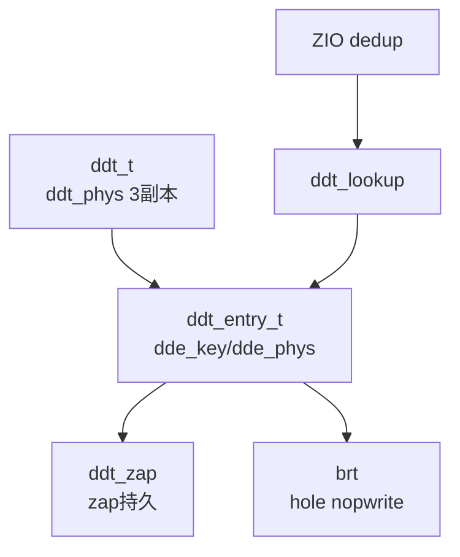
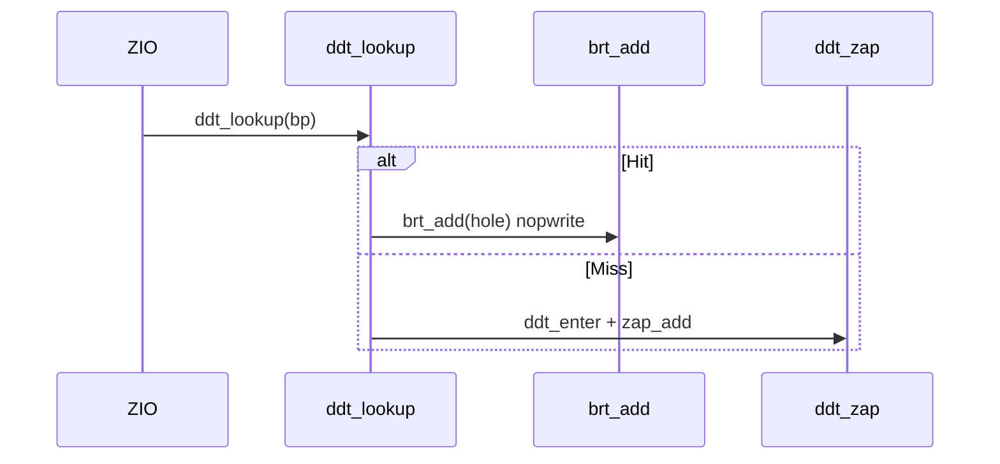
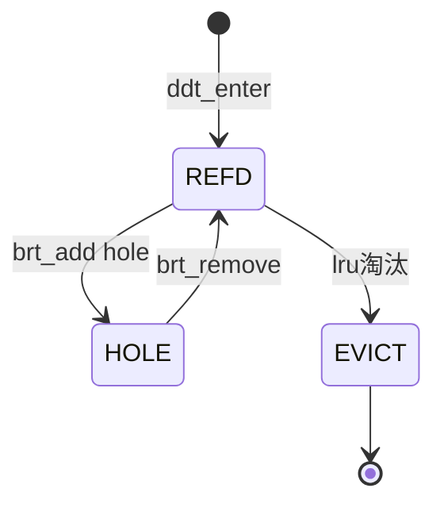
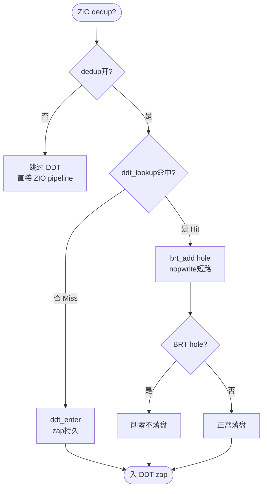

# ZFS DDT（Deduplication Table）

去重表：`ddt_t` 聚合 `ddt_phys_t`（3副本物理）与 `ddt_entry_t`（`dde_phys[3]`），`ddt_zap` 持久为 `zap` 对象，`brt`（Block Reference Table）削零表 `brt_entry_t` 处理 `hole` 的 `nopwrite`；`ZCHECKSUM_FLAG_DEDUP` 选型经 `zio_checksum_table` 触发 `ddt_lookup` → `brt_add`。

## C4 L3 Component — ddt_table → ddt_entry → brt 三层

`ddt_t` 为表容器：`ddt_phys`（3副本）、`ddt_entry`（`avl_tree_t`）、`ddt_zap`（`zap` 持久）。`ddt_entry_t` 含 `dde_key`（`blkid+checksum`）、`dde_phys[3]`、`dde_refcnt`。`brt` 为削零表：`brt_entry` 含 `hole` 标记。`zfs-crypto` 的 `dedup HMAC` 经 `zio_dedup` 触发 `ddt_enter`。C4 L3 图以 `ddt_t → ddt_entry → brt` 三层呈现。



Source: `openzfs/zfs/include/sys/ddt.h:40-120`（`ddt_t/ddt_entry_t/ddt_phys_t`）+ `openzfs/zfs/module/zfs/ddt.c:40-120`

## 时序 — dedup write → ddt_lookup → brt_add → zap

去重写：1) `zio_dedup` 经 `ZCHECKSUM_FLAG_DEDUP` 判定 `dedup` 2) `ddt_lookup(ddt, bp, tx)` 查 `ddt_entry` 3) 命中则 `brt_add(brt, bp)` 削零（`hole`）并 `nopwrite` 短路 4) 未命中则 `ddt_enter` 新增 `entry` 并 `zap_add` 持久 5) `ARC` 协同 `lru` 淘汰。时序图以 `ZIO → ddt_lookup → brt_add → zap` 全链呈现。



Source: `openzfs/zfs/module/zfs/ddt.c:200-400`（`ddt_lookup/enter`）+ `openzfs/zfs/module/zfs/brt.c:40-120`（`brt_add`）

## 状态机 — ddt_entry REFD/HOLE/EVICT

`ddt_entry` 三态：`UNREF`（未引）→ `REFD`（`refcnt>0` 有引）→ `HOLE`（`brt` 削零 `hole`）→ `EVICT`（`lru` 淘汰）→ `UNREF`。`REFD→HOLE` 需 `brt_add` 削零；`HOLE→REFD` 需 `brt_remove`；`REFD→EVICT` 需 `lru` 满。状态机图覆盖三态及 `brt` 分支。



Source: `openzfs/zfs/include/sys/ddt.h:60-120` + `openzfs/zfs/module/zfs/brt.c:40-120`

## 决策树



Source: `openzfs/zfs/module/zfs/ddt.c:200-400` + `brt.c:40-120`

## 正例

```c
// 正例：正确的 dedup lookup与BRT配对
ddt_t *ddt = ddt_select(spa, bp);
ddt_entry_t *dde = ddt_lookup(ddt, bp, B_FALSE);
if (dde) {
    brt_add(spa->spa_brt, bp); // hole削零
    zio->io_pipeline &= ~ZIO_STAGE_VDEV_IO_START; // nopwrite短路
} else {
    ddt_enter(ddt, bp, tx); // zap持久
}
// 验证：lookup命中则brt_add配对，未命中则enter配对，refcnt一致
```

命中：`ddt_lookup` 配 `brt_add`/`ddt_enter`，`brt` hole 分支正确。

## 反例

```c
// 反例1：漏BRT导致hole未削零落盘放大
dde = ddt_lookup(ddt, bp, B_FALSE);
if (dde) ddt_enter(ddt, bp, tx); // 错：命中仍enter，未brt_add，hole仍落盘放大
// 正确：命中必brt_add nopwrite

// 反例2：未zap持久导致重启丢
ddt_enter(ddt, bp, tx); // 漏 ddt_sync -> zap_add
// 重启后 ddt_lookup Miss，dedup失效
// 正确：enter后zap持久
```

## 门禁

- **多图门禁**：`grep -c '```mermaid' ontology/entity/zfs-ddt.md` ≥3
- **溯源门禁**：`grep -c 'Source:' ontology/entity/zfs-ddt.md` ≥3
- **正文门禁**：`wc -l ≥80` 且 `决策树/正例/反例/门禁` 均命中
- **属性门禁**：`attributes≥3` 且每条含 `grep -q` 且双源可回归
- **本体校验**：`validate 0` `islands:0`
- **脚手架门禁**：`scaffold`可产
- **Gate 门禁**：`gate --node zfs-ddt` GATE OK

Source: `openzfs/zfs/include/sys/ddt.h:40-120` + `openzfs/zfs/module/zfs/ddt.c:200-400` + `brt.c:40-120`
