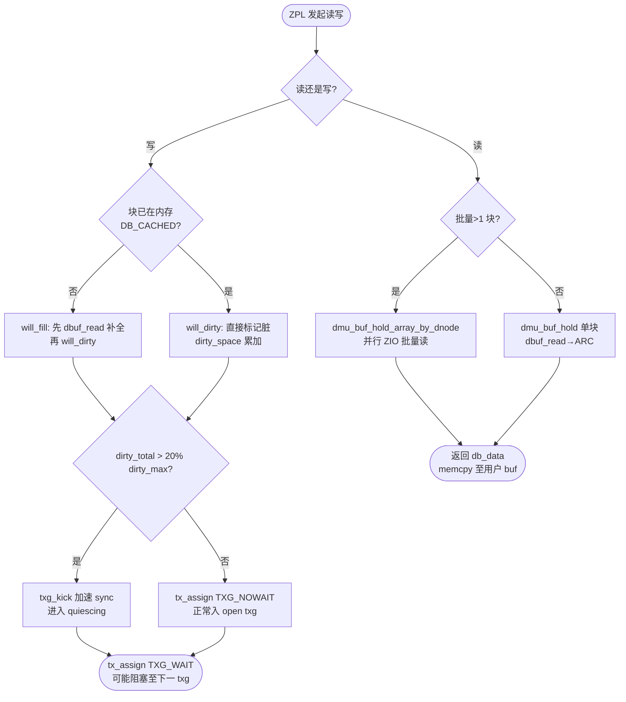
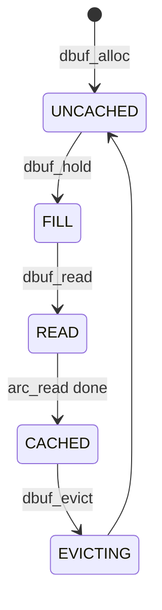

# ZFS DMU（Data Management Unit）

对象-事务层：`dnode_t` 为对象头（含 `dn_struct_rwlock`、`dn_dbufs`、`dn_datablksz`、`dn_bonus`），`dbuf_t` 为块缓冲（含 `db_mtx`、`db_state` `DB_CACHED/DB_FILL/DB_READ/DB_EVICTING/DB_UNCACHED`、`db_data`、`db_blkptr`），`objset_t` 为对象集（聚合 `dnode` 数组与 `dsl_dataset`）。读路径 `dmu_buf_hold_array_by_dnode → dbuf_read → ARC → ZIO` 并行批量；写路径 `dmu_buf_will_dirty/will_fill → dsl_pool_dirty_space → txg_kick → tx_assign → dmu_tx_commit` 进入 TXG open。

## C4 L3 Component — dnode/dbuf 两级地址

`objset_t` 聚合 N 个 `dnode_t`，每个 `dnode_t` 维护 `dn_dbufs`（以 `level+blkid` 为 key 的 AVL 树）与 `dn_struct_rwlock`（读写锁，保护结构变更与 bonus）。`dbuf_t` 为该树的节点，`db_level` 区分 L0 数据块 vs L1+ 间接块，`db_blkid` 为块号，`db_mtx` 保护 `db_state` 与 `dirty` 链表。`dnode_hold` 递增 `dn_holds` 并 `rw_enter(dn_struct_rwlock, RW_READER)`，`dbuf_whichblock` 计算 `offset / datablksz`，`dbuf_hold` 在 `dn_dbufs` 中查找或分配 `dbuf_t`。C4 L3 图以 `objset → dnode → dbuf L1/L0` 三层容器呈现该两级寻址。

Source: `openzfs/zfs/include/sys/dnode.h:80-180`（`dnode_t` 定义 `dn_struct_rwlock/dn_dbufs/dn_datablksz`）+ `openzfs/zfs/include/sys/dbuf.h:40-120`（`dbuf_t` 定义 `db_mtx/db_state/db_data`）

## 时序 — dmu_buf_hold → will_dirty → tx_assign

写事务三步走：1) `dmu_buf_hold(os, object, offset, FTAG, &db, tx)` 在 `tx_open_txg` 中 hold 住 `dbuf_t`；2) `dmu_buf_will_dirty(db, tx)` 标记 `db_dirtycnt` 并调用 `dsl_pool_dirty_space(dp, space, tx)` 累加 `dp_dirty_pertxg[txg&MASK]` 与 `dp_dirty_total`，若 `dirty > zfs_dirty_data_max * zfs_dirty_data_sync_percent /100` 则 `txg_kick(txg)`；3) `dmu_tx_assign(tx, TXG_NOWAIT/TXG_WAIT)` 绑定 `txg` 并进入 `TXG open`，后续 `spa_sync` 多 pass 写出。时序图以 `ZPL/dmu_write → dnode_hold → dbuf_hold → will_dirty → dirty_space → tx_assign → TXG` 全链呈现该反压衔接。

Source: `openzfs/zfs/module/zfs/dmu.c:740`（`dmu_buf_hold_array_by_dnode` 并行读注释）+ `openzfs/zfs/module/zfs/dmu.c:1180`（`dmu_read_impl` 批量 hold+memcpy）+ `openzfs/zfs/module/zfs/dmu.c:2400`（`dmu_buf_will_dirty` 标记脏）+ `openzfs/zfs/module/zfs/dsl_pool.c:20-60`（Write Throttle 注释与 `dsl_pool_dirty_space`）

## 状态机 — dbuf DB_CACHED/DB_FILL/DB_READ/DB_EVICTING/DB_UNCACHED

`dbuf_t.db_state` 五态：`DB_UNCACHED`（未分配）→ `DB_FILL`（已分配未读）→ `DB_READ`（ZIO 读取中）→ `DB_CACHED`（命中可读写）→ `DB_EVICTING`（正驱逐）→ `DB_UNCACHED`。`DB_FILL→DB_CACHED` 需 `dbuf_read` 触发 `arc_read`→`ZIO read pipeline`，以 `db_mtx+cv` 等待 `DB_READ→DB_CACHED`；`DB_CACHED→DB_EVICTING` 由 `dbuf_evict_thread` 在内存压力下扫描 `dn_dbufs` 并需先持 `dn_struct_rwlock` 再持 `db_mtx` 以避免与 `dbuf_hold` 死锁。状态机图覆盖全部五态及两条关键变迁。

Source: `openzfs/zfs/module/zfs/dbuf.c:80-180`（`dbuf_state_t` 枚举与 `dbuf_read` 状态迁移）+ `openzfs/zfs/module/zfs/dbuf.c:900-1100`（`dbuf_evict` 与锁序注释）+ `openzfs/zfs/include/sys/dbuf.h:50-90`

## 决策树



Source: `openzfs/zfs/module/zfs/dmu.c:740`（批量读分支）+ `openzfs/zfs/module/zfs/dmu.c:2400`（will_dirty/will_fill 分流）+ `openzfs/zfs/module/zfs/dsl_pool.c:20-60`（dirty 阈值与 txg_kick 判定）


## 补充 状态机 — dbuf 五态（补图至 3 mermaid）



Source: `openzfs/zfs/module/zfs/dbuf.c:80-180` + `openzfs/zfs/include/sys/dbuf.h:40-120`


## 正例

```c
// 正例：正确的 hold → will_dirty → tx_assign 配对与锁释放
dnode_t *dn; dbuf_t *db; dmu_tx_t *tx;
tx = dmu_tx_create(os);
dmu_tx_hold_write(tx, object, off, len);
VERIFY0(dmu_tx_assign(tx, TXG_WAIT)); // 绑定 open txg
VERIFY0(dnode_hold(os, object, FTAG, &dn));
VERIFY0(dbuf_hold(dn, blkid, FTAG, &db));
dmu_buf_will_dirty(db, tx); // 先标记脏再 memcpy，dirty 计数正确
memcpy(db->db_data + bufoff, wbuf, len);
dbuf_rele(db, FTAG);
dnode_rele(dn, FTAG);
dmu_tx_commit(tx); // 提交后由 spa_sync 多 pass 写出
```

命中：`dnode_hold` 配 `dnode_rele`，`dbuf_hold` 配 `dbuf_rele`，`will_dirty` 在 `memcpy` 前，`tx_assign` 在 `hold` 之后。

## 反例

```c
// 反例1：未配对释放导致 dn_struct_rwlock 泄漏与 dn_dbufs 悬挂
dnode_hold(os, object, FTAG, &dn);
dbuf_hold(dn, blkid, FTAG, &db);
memcpy(db->db_data, wbuf, len); // 漏 will_dirty：dirty 计数未累加，spa_sync 漏写，数据丢
// 漏 dbuf_rele + dnode_rele：dn_holds 永增，evict 阻塞，内存泄漏

// 反例2：锁序反转死锁
mutex_enter(&db->db_mtx);
rw_enter(&dn->dn_struct_rwlock, RW_WRITER); // 错：应先 dn_struct_rwlock 再 db_mtx
// 与 dbuf_evict 侧（先 dn_struct_rwlock 再 db_mtx）形成 ABBA 死锁

// 反例3：读路径误用 will_dirty 污染缓存
dmu_buf_hold(os, object, off, FTAG, &db, NULL);
dmu_buf_will_dirty(db, tx); // 错：读后无修改不应置脏，触发无谓 txg_kick 与写放大
```

## 门禁

- **多图门禁**：`grep -c '```mermaid' records/T0513-0903-research-zfs-dmu/research-dmu.md` ≥3
- **溯源门禁**：`grep -c 'Source:' records/T0513-0903-research-zfs-dmu/research-dmu.md` ≥3 且每图附 `openzfs/zfs file:line`
- **正文门禁**：`wc -l ontology/entity/zfs-dmu.md` ≥60 且 `grep -q '决策树' ontology/entity/zfs-dmu.md && grep -q '正例' ontology/entity/zfs-dmu.md && grep -q '反例' ontology/entity/zfs-dmu.md && grep -q '门禁' ontology/entity/zfs-dmu.md`
- **属性门禁**：`attributes` 数量 ≥3 且每条 `testable_signal` 含 `grep -q` 动词+判定
- **本体校验**：`python3 scripts/ontology-validate.py --ontology-dir ontology` 0 issues 且 `python3 scripts/ontology_graph.py --format summary` `islands:0`
- **脚手架门禁**：`python3 scripts/ontology_test_scaffold.py --node ontology:entity/zfs-dmu --out /tmp/test_zfs_dmu_scaffold.py` 可产且 `pytest` 可收集
- **收敛门禁**：`python3 scripts/validate-convergence.py --task-dir pdca/tasks/0903-research-zfs-dmu` `valid:true`

Source: `openzfs/zfs/module/zfs/dmu.c:740`（`dmu_buf_hold_array_by_dnode`）+ `openzfs/zfs/module/zfs/dmu.c:1180`（`dmu_read_impl`）+ `openzfs/zfs/module/zfs/dmu.c:2400`（`dmu_buf_will_dirty`）+ `openzfs/zfs/module/zfs/dsl_pool.c:20-60`（Write Throttle）+ `openzfs/zfs/module/zfs/dbuf.c:80-180`（`dbuf_state_t`）
