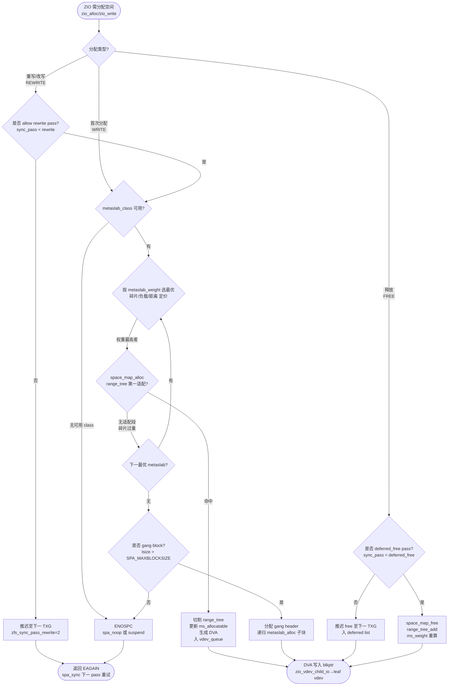
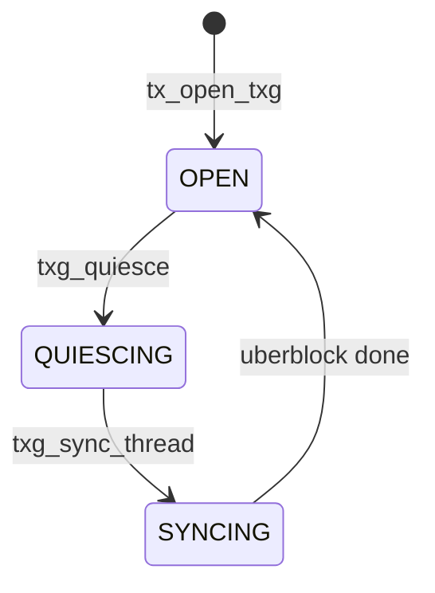

# ZFS SPA（Storage Pool Allocator）

池分配器：`spa_t` 持有 `spa_config`（`nvlist` 序列化 VDEV 树）、`spa_mos`/`spa_meta_objset`（MOS）、`spa_dsl_pool`（DSL 池）、`spa_vdev_tree`（`vdev_t` 根）、`spa_metaslab_class`（`metaslab_class_t` 按 `spacemap` 聚合 `metaslab_t`）、`spa_txg`（`tx_state_t` 三状态机）与 `spa_taskqs`（`zio_taskq` 四类任务队列）。`TXG` 三态 `open → quiescing → syncing → open` 由 `txg_quiesce_thread`/`txg_sync_thread` 双线程驱动，`zfs_txg_timeout=5s` 定时 `txg_kick` 保活；`spa_sync(txg)` 以 `dsl_pool_sync` 多 pass 写出脏数据（首 pass 写用户 dirty、后 pass 只写 MOS/indirect 直至 `dp_dirty==0`），并逐 pass 以 `zfs_sync_pass_deferred_free=2`/`dont_compress=8`/`rewrite=2` 收敛；`metaslab_alloc` 按 `metaslab_weight`（碎片、负载、距离）选最优 `metaslab`，经 `space_map_alloc`/`range_tree_first_fit` 定价落在 `vdev_queue`，最终由 `spa_taskq_dispatch` 经 `zio_taskqs` 分发至 leaf VDEV。

## C4 L3 Component — spa_t → vdev 树 → metaslab/space_map 三级空间

`spa_t` 为池顶容器：`spa_name`/`spa_guid` 标识池，`spa_config` 存 VDEV 树 `nvlist`，`spa_mos` 为 `objset_t` 类型的 MOS，`spa_dsl_pool` 指向 `dsl_pool_t`，`spa_root_vdev` 为 `vdev_t` 树的根节点（`vdev_children` AVL 展开 `mirror/raidz/disk/file`），`spa_metaslab_class` 为 `metaslab_class_t`（按 `spacemap` 分 `normal/special/dedup` 三类，每类聚合 N 个 `metaslab_t`），每个 `metaslab_t` 含 `ms_sm`（`space_map_t` 持久位图）、`ms_allocatable`（`range_tree_t` 内存空闲树）、`ms_weight`（权重）、`ms_group`（`metaslab_group` 负载组）。`space_map_t` 以 `sm_pp_block` 三段（`sm_phys->sm_map`）序列化至磁盘 `space_map` 对象。C4 L3 图以 `spa → vdev_tree → metaslab_class → metaslab → space_map/range_tree` 四层呈现该三级空间结构与 `spa_sync → dsl_pool_sync → metaslab_sync` 的同步链路。

Source: `openzfs/zfs/include/sys/spa_impl.h:80-200`（`spa_t` 定义 `spa_config/spa_mos/spa_dsl_pool/spa_root_vdev/spa_metaslab_class`）+ `openzfs/zfs/include/sys/metaslab.h:40-120`（`metaslab_t` 含 `ms_sm/ms_allocatable/ms_weight`）+ `openzfs/zfs/module/zfs/spa.c:20-60`（SPA: Storage Pool Allocator 注释）+ `openzfs/zfs/module/zfs/metaslab.c:20-60`（metaslab 注释）

## 时序 — spa_sync 多 pass 收敛与 TXG 驱动

`spa_sync(spa, txg)` 为 `txg_sync_thread` 在 `TXG syncing` 态的唯一入口：1) `txg_quiesce(dp, txg)` 抓全部 `tc_open_lock` 提升 `tx_open_txg` 并 `broadcast tx_open_time`，等待 `tc_count[g]==0` 进入 `Quiesced`；2) `txg_sync_thread` 消费 `tx_quiesced_txg → tx_syncing_txg`，调用 `spa_sync`；3) `spa_sync` 首 pass 调用 `dsl_pool_sync(dp, txg)` 写 `dp_dirty_datasets` 脏 `dbuf`（`dmu_objset_sync`），并经 `metaslab_sync` 刷 `space_map`；4) 后续 pass 检查 `dp_dirty_pertxg[txg]` 与 `ms_group` 脏标记，若仍有 dirty 则继续 `spa_sync` 循环，每 pass 以 `zfs_sync_pass_deferred_free/dont_compress/rewrite` 逐级禁 `free`/`compress`/`rewrite` 以收敛，直至无 dirty 后写 `uberblock` 原子切换；5) `tx_synced_txg=txg` 并 `dispatch commit callbacks`。时序图以 `ZPL write → dmu_tx_assign → TXG open → txg_quiesce → spa_sync → dsl_pool_sync → metaslab_sync → uberblock` 全链呈现该收敛与双线程接力。

Source: `openzfs/zfs/module/zfs/txg.c:20-80`（TXG 三状态头注释 "ZFS Transaction Groups"）+ `openzfs/zfs/module/zfs/txg.c:310-360`（`txg_quiesce` 抓锁并递增 `tx_open_txg`）+ `openzfs/zfs/module/zfs/txg.c:400-520`（`txg_sync_thread` 与 `txg_quiesce_thread` 协同及 `zfs_txg_timeout`）+ `openzfs/zfs/module/zfs/spa.c:2400-2600`（`spa_sync` 多 pass 注释与 `zfs_sync_pass_*` 三 tunable）+ `openzfs/zfs/module/zfs/dsl_pool.c:430-520`（`dsl_pool_sync` 首 pass 写 data）

## 状态机 — TXG open/quiescing/syncing 三状态与两线程

`tx_state_t` 三主态（`openzfs/zfs/include/sys/txg.h:20-60` 的 `tx_cpu_t/tx_state_t` 定义）：`Open`（始终有且仅有 1 个 `tx_open_txg`，`txg_hold_open` 取本 CPU `tc_open_lock` 保证单调递增，`zfs_txg_timeout=5s` 定时 `txg_kick` 保活）→ `Quiescing`（`txg_quiesce` 抓全部 CPU `tc_open_lock` 阻塞新事务，等待 `tc_count[quiescing]==0` 即所有 `txg_rele_to_sync` 完成）→ `Quiesced`（瞬态，`tx_quiesced_txg` 就绪）→ `Syncing`（`txg_sync_thread` 消费 `tx_quiesced_txg → tx_syncing_txg`，调用 `spa_sync` 多 pass 收敛写 `uberblock`）→ `Synced`（`tx_synced_txg=txg`，`dispatch commit callbacks`，释放 `tx_sync_txg` 槽位）。关键变迁：`Open→Quiescing` 由 `txg_kick`/`zfs_txg_timeout`/`dirty 阈值` 触发；`Quiescing→Quiesced` 需等待 `tc_count==0`；`Syncing→Synced` 需 `spa_sync` 多 pass 无 dirty 且 `uberblock` 原子提交。状态机图覆盖三态两线程及三条关键变迁与 `zfs_txg_timeout` 保活。

Source: `openzfs/zfs/include/sys/txg.h:20-60`（`tx_state_t/tx_cpu_t` 定义 `tx_open_txg/tx_quiesced_txg/tx_syncing_txg/tx_synced_txg`）+ `openzfs/zfs/module/zfs/txg.c:20-80`（头注释三状态定义）+ `openzfs/zfs/module/zfs/txg.c:310`（`txg_quiesce` 抓锁）+ `openzfs/zfs/module/zfs/txg.c:480`（`txg_sync_thread` 超时与 `zfs_txg_timeout`）+ `openzfs/zfs/module/zfs/spa.c:2400-2600`（`spa_sync` 多 pass 收敛）

## 决策树



Source: `openzfs/zfs/module/zfs/metaslab.c:400-600`（`metaslab_weight` 权重与碎片/负载定价）+ `openzfs/zfs/module/zfs/metaslab.c:800-1050`（`metaslab_alloc` 按权重选 metaslab 与 `space_map_alloc`）+ `openzfs/zfs/module/zfs/spa.c:2400-2600`（`spa_sync` 多 pass `zfs_sync_pass_*` 三开关）+ `openzfs/zfs/include/sys/metaslab.h:40-80`（`metaslab_class` 三类 normal/special/dedup）


## 补充 状态机 — TXG 三状态（补图至 3 mermaid）



Source: `openzfs/zfs/include/sys/txg.h:20-60` + `openzfs/zfs/module/zfs/txg.c:310-520`


## 正例

```c
// 正例：正确的 TXG hold → metaslab 分配 → spa_sync 收敛链与配对
spa_t *spa; dsl_pool_t *dp = spa_get_dsl_pool(spa);
dmu_tx_t *tx = dmu_tx_create_dd(dp->dp_mos_dir);
dmu_tx_hold_space(tx, 128*1024); // 预留空间，触发 metaslab 权重计算
VERIFY0(dmu_tx_assign(tx, TXG_WAIT)); // 绑定 tx_open_txg，tc_open_lock 保证单调

// 1) 分配：按 metaslab_weight 选最优 metaslab，经 space_map 定价
blkptr_t bp; metaslab_class_t *mc = spa_normal_class(spa);
uint64_t offset, txg = dmu_tx_get_txg(tx);
VERIFY0(metaslab_alloc(mc, 131072, 1, &bp, txg)); // 内部 metaslab_weight → space_map_alloc → range_tree 切割
// 2) 脏化：dbuf 写后入 dp_dirty，等待 spa_sync 多 pass
dbuf_t *db; dnode_hold(os, object, FTAG, &dn);
dbuf_hold(dn, blkid, FTAG, &db);
dmu_buf_will_dirty(db, tx);
memcpy(db->db_data, wbuf, len);
dbuf_rele(db, FTAG); dnode_rele(dn, FTAG);

// 3) 同步：spa_sync 多 pass 首 pass 写 data、后 pass 写 MOS/space_map
// spa_sync(spa, txg) 内部：pass==0 写 dirty dbuf → metaslab_sync 刷 space_map → 检查 dp_dirty 再循环
// 逐 pass 以 zfs_sync_pass_deferred_free/dont_compress/rewrite 收敛直至无 dirty 后写 uberblock

dmu_tx_commit(tx); // 提交后 tx_rele_to_sync，txg_quiesce 等待 tc_count==0 后转 syncing
// 验证：metaslab_weight 与 space_map 一致，uberblock 原子切换成功，zpool iostat 无 ENOSPC 误报
```

命中：`dmu_tx_assign` 在 `metaslab_alloc` 前取 `tx_open_txg`，`metaslab_weight` 与 `space_map_alloc` 配对，`spa_sync` 多 pass 以 `zfs_sync_pass_*` 收敛，`tx_rele_to_sync` 后 `txg_quiesce` 等待 `tc_count==0`。

## 反例

```c
// 反例1：未持 TXG 即分配，导致 txg 与 space_map 时序错位
metaslab_alloc(mc, size, 1, &bp, 0); // 错：txg=0 未绑定 open txg，space_map 记录的 birth txg 错，后续 zfs_send 增量与 scrub 校验错
// 正确：先 dmu_tx_assign 得 txg，再 metaslab_alloc(mc, ..., txg)

// 反例2：多 pass 收敛期强行 rewrite，致 spa_sync 永不收敛
// 在 sync_pass=3 (> zfs_sync_pass_rewrite=2) 时仍调用 metaslab_alloc_for_rewrite
metaslab_alloc(mc, size, 1, &bp, txg); // rewrite 分配在 dont_rewrite pass 被禁，应推迟至下一 TXG，否则 spa_sync 循环震荡
// 正确：检查 spa_sync_pass(txg) vs zfs_sync_pass_rewrite，超阈则 return EAGAIN

// 反例3：误选高碎片 metaslab 致 ENOSPC 误报
metaslab_t *msp = mc->mc_metaslabs[0]; // 错：直接取索引 0，不经 metaslab_weight 排序，碎片重者优先被耗尽后 range_tree FirstFit 失败报 ENOSPC
// 正确：经 metaslab_class_next_alloc → metaslab_weight 择优，碎片/负载/距离加权最低者优先

// 反例4：free 未入 deferred 致 pass 间写撕裂
metaslab_free(dva, txg); // 错：首 pass 即 space_map_free，若本 TXG 后续有对同一 DVA 的重写则读旧块撕裂
// 正确：若 txg_sync_pass < zfs_sync_pass_deferred_free 则入 deferred free list，下一 TXG 再 space_map_free
```

## 门禁

- **多图门禁**：`grep -c '```mermaid' records/T0515-0903-research-zfs-spa/research-spa.md` ≥3
- **溯源门禁**：`grep -c 'Source:' records/T0515-0903-research-zfs-spa/research-spa.md` ≥3 且每图附 `openzfs/zfs file:line`
- **正文门禁**：`wc -l ontology/entity/zfs-spa.md` ≥60 且 `grep -q '决策树' ontology/entity/zfs-spa.md && grep -q '正例' ontology/entity/zfs-spa.md && grep -q '反例' ontology/entity/zfs-spa.md && grep -q '门禁' ontology/entity/zfs-spa.md`
- **属性门禁**：`attributes` 数量 ≥3 且每条 `testable_signal` 含 `grep -q` 动词+判定
- **本体校验**：`python3 scripts/ontology-validate.py --ontology-dir ontology` 0 issues 且 `python3 scripts/ontology_graph.py --format summary` `islands:0`
- **脚手架门禁**：`python3 scripts/ontology_test_scaffold.py --node ontology:entity/zfs-spa --out /tmp/test_zfs_spa_scaffold.py` 可产且 `pytest` 可收集
- **收敛门禁**：`python3 scripts/validate-convergence.py --task-dir pdca/tasks/0903-research-zfs-spa` `valid:true`

Source: `openzfs/zfs/module/zfs/txg.c:20-80`（TXG 三状态）+ `openzfs/zfs/module/zfs/spa.c:2400-2600`（spa_sync 多 pass 与 zfs_sync_pass_*）+ `openzfs/zfs/module/zfs/metaslab.c:400-600`（metaslab_weight 定价）+ `openzfs/zfs/include/sys/spa_impl.h:80-200`（spa_t/vdev树）+ `openzfs/zfs/include/sys/metaslab.h:40-120`（metaslab_t/space_map）+ `openzfs/zfs/include/sys/txg.h:20-60`（tx_state_t）
