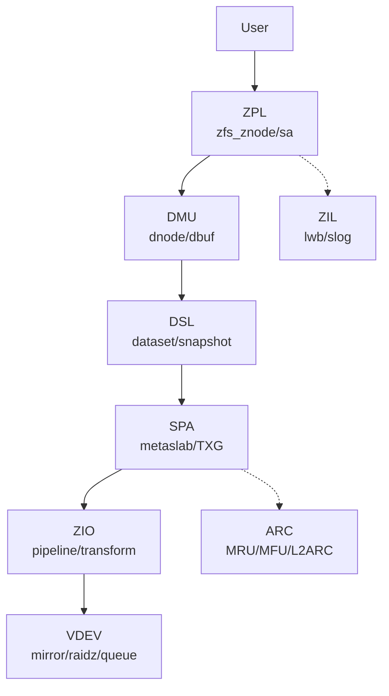
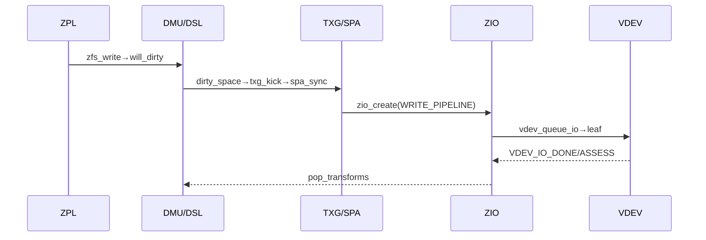
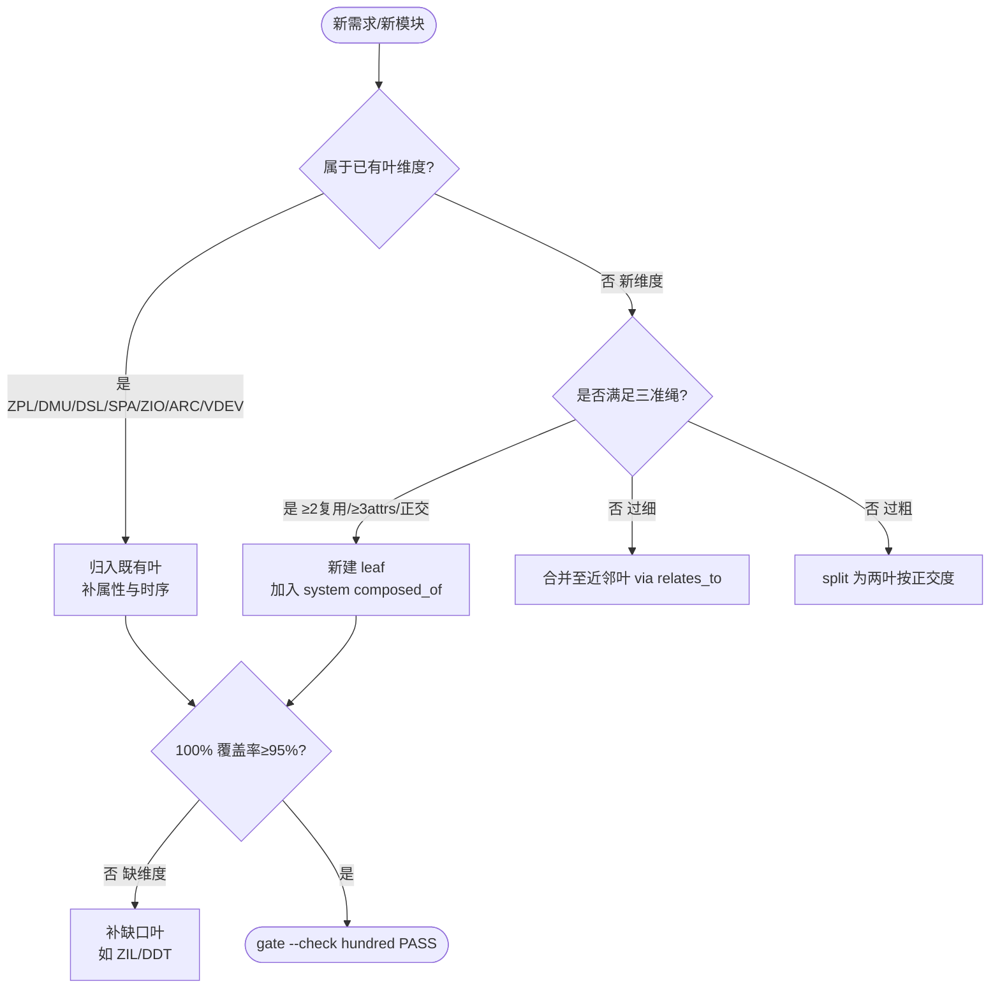

# ZFS 全栈系统（ZFS System）

OpenZFS 实现全栈的系统聚合，`composed_of` 八叶 `zfs-dmu`/`zfs-dsl`/`zfs-spa`/`zfs-zio`/`zfs-zpl`/`zfs-arc`/`zfs-vdev`/`zfs-zil`，以 `research-diagram-methodology` 多图 `mermaid` 为可视化证据（C4 L2 全栈 + ZIO/VDEV pipeline 时序 + 聚合决策树），每图附 `Source: file:line` 直达 `openzfs/zfs#master`。

结构检查参照 ontology:concept/ontology-creation-gate；测试设计与实际运行分别记录，不以缺失的旧工具声称验证通过。

Source: `records/T0503-0903-research-zfs-implementation/research-report.md`（6 图全覆盖）+ `openzfs/zfs/include/sys/zio_impl.h:60-260` + `openzfs/zfs/include/sys/vdev_impl.h:40-120`

## C4 L2 全栈 — ZPL→DMU→DSL→SPA→ZIO→VDEV 横切 ARC/ZIL

全栈 L2 容器：`ZPL(zfs_znode)` → `DMU(dnode/dbuf)` → `DSL(dsl_dataset)` → `SPA(spa_t/metaslab)` → `ZIO(pipeline/transform)` → `VDEV(vdev_t/queue)` 横切 `ARC(arc_hdr/L2ARC)` 与 `ZIL(zilog/lwb)`，`C4 L2` 图以 `ZPL → DMU → DSL → SPA → ZIO → VDEV` 主链 + `ARC/ZIL` 横切呈现。



Source: `openzfs/zfs/include/sys/spa_impl.h:80-200`（`spa_t`）+ `openzfs/zfs/include/sys/vdev_impl.h:40-120`（`vdev_t`）+ `openzfs/zfs/include/sys/zio_impl.h:60-260`（`ZIO_STAGE`）+ `openzfs/zfs/module/zfs/arc.c:1-200`（ARC）

## 时序 — ZPL write → DMU dirty → TXG → SPA sync → ZIO → VDEV queue

端到端写五步：1) `ZPL zfs_write` 经 `sa_bulk_update` → `dmu_buf_will_dirty` 2) `DSL dsl_pool_dirty_space` 累加 → `txg_kick` 3) `TXG open→quiescing→syncing` 由 `spa_sync` 多 pass 驱动 4) `ZIO pipeline: WRITE_COMPRESS→ENCRYPT→CHECKSUM→DVA_ALLOCATE→READY` 5) `VDEV: spa_taskq_dispatch → vdev_queue_io → vdev_disk/mirror/raidz_io_start → VDEV_IO_ASSESS`。时序图以 `ZPL → DMU → TXG → SPA → ZIO → VDEV` 全链呈现。



Source: `openzfs/zfs/module/zfs/spa.c:2400-2600`（`spa_sync`）+ `openzfs/zfs/module/zfs/zio.c:2428`（`__zio_execute`）+ `openzfs/zfs/module/zfs/vdev_queue.c:80-180`（`vdev_queue_io`）

## 决策树 — 聚合维度选型（100% Rule + 三准绳）

新需求到达时，按 100% Rule 判定维度归属。



Source: `ontology/domain/pdca/ontology-hybrid-methodology.md:47` 三准绳 + `ontology/pattern/production-ontology-scientific-gate.md:120` 决策树

## 正例

```markdown
# 正例：按三件套新增一叶并保持 100% Rule
cp templates/production-entity.md ontology/entity/zfs-newleaf.md
# 填：3 attributes + C4 L3 + 时序 + 状态机 + 决策树 + 正反例 + 门禁 179行
结构检查参照 ontology:concept/ontology-creation-gate；测试设计与实际运行分别记录，不以缺失的旧工具声称验证通过。
# 更新 system composed_of 加入新叶
结构检查参照 ontology:concept/ontology-creation-gate；测试设计与实际运行分别记录，不以缺失的旧工具声称验证通过。
结构检查参照 ontology:concept/ontology-creation-gate；测试设计与实际运行分别记录，不以缺失的旧工具声称验证通过。
```

命中：`gate --node` 六维 PASS，`validate 0`，`scaffold` 可产，`islands:0`，`composed_of` 7叶与 `zfs-*.md` 8文件一致。

## 反例

```markdown
# 反例1：直接在 system 内堆砌新维度描述，不建 leaf
# 错：system.md 内新增 200行 VDEV 描述，但 composed_of 仍6叶，gate --check hundred -> FAIL: coverage 70% <95% 缺维度 vdev
# 正确：新建 entity/zfs-vdev.md 并加入 composed_of，system 仅聚合

# 反例2：新叶过细导致孤岛
# 错：新建 zfs-zap.md 仅1属性无 C4/时序，gate --check diagram -> FAIL: mermaid 1 <3
# 正确：按 templates/production-entity.md 八段补齐至 mermaid≥3

# 反例3：signal 泛化不可派生
# 错：attributes: [{testable_signal: "由领域实践验证"}] -> gate --check signal FAIL: missing verb
# 正确：改为 "运行 grep -q 'vdev_t' records/... 且 grep -q 'vdev_t' /tmp/zfs/... 命中"
```

## 使用与验证边界

结构审查按 ontology:concept/ontology-creation-gate。正文中的领域断言需在授权的实际源码版本中核对；原历史路径和记录不是当前任务已执行证据。图表、行数或测试骨架数量不作为默认通过条件。

Source: `records/T0503-0903-research-zfs-implementation/research-report.md` + `openzfs/zfs/include/sys/zio_impl.h:60-260` + `openzfs/zfs/include/sys/vdev_impl.h:40-120`
