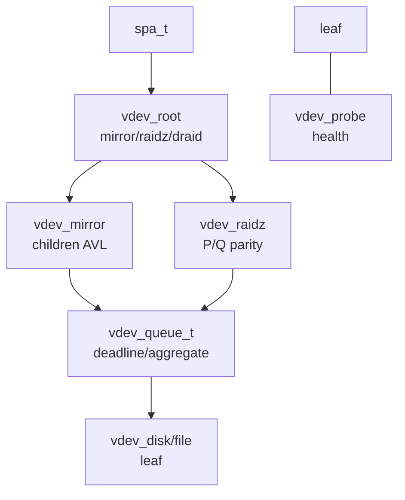
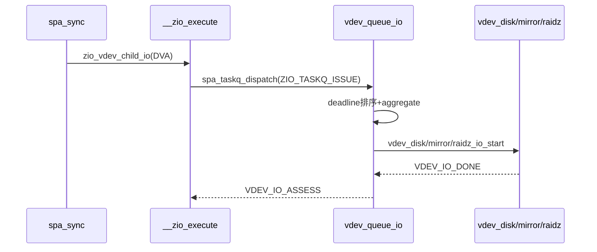
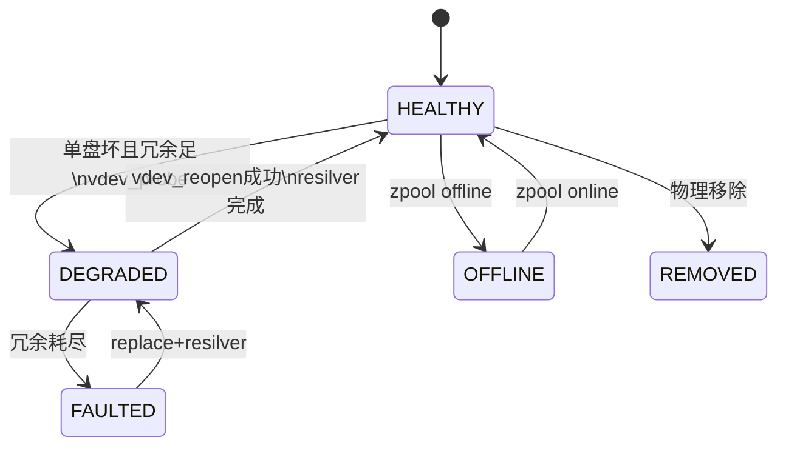
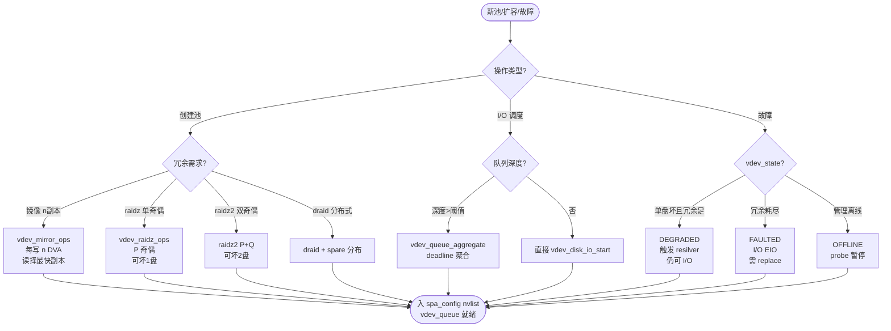

# ZFS VDEV（Virtual Device）

虚拟设备层：`vdev_t` 为拓扑节点（含 `vdev_ops/vdev_children/vdev_guid/vdev_state`），`vdev_ops_t` 多态分发 `mirror/raidz/draid/disk/file`，`vdev_queue_t` 为叶级队列（含 `vq_deadline/vq_aggregate`），`spa_config` 以 `nvlist` 序列化 VDEV 树；故障侧 `vdev_state_t` 管理 `HEALTHY/DEGRADED/FAULTED/OFFLINE/REMOVED` 四态与 `vdev_aux`，`vdev_probe` 定时探活与 `scrub/resilver` 联动。

## C4 L3 Component — vdev_t 树 → queue → leaf 三层

`vdev_t` 为拓扑容器：`vdev_ops`（`vdev_mirror_ops/vdev_raidz_ops/vdev_disk_ops`）多态、`vdev_children`（`avl_tree_t` 子节点）、`vdev_guid` 唯一标识、`vdev_state`（`vdev_state_t`）、`vdev_queue`（`vdev_queue_t` 叶队列）、`vdev_spa` 回指池。`vdev_queue_t` 含 `vq_queue`（等待队列）、`vq_deadline`（截止调度）、`vq_aggregate`（I/O 聚合）。`spa_t.spa_root_vdev` 为根，`spa_config` 存 `nvlist`（`vdev_tree` 递归）。C4 L3 图以 `spa → vdev_root(mirror/raidz) → vdev_queue → leaf(disk/file)` 三层呈现该拓扑与队列分层。



Source: `openzfs/zfs/include/sys/vdev_impl.h:40-120`（`vdev_t` 含 `vdev_ops/vdev_children/vdev_queue`）+ `openzfs/zfs/include/sys/vdev.h:60-120`（`vdev_state_t/vdev_aux_t`）+ `openzfs/zfs/module/zfs/vdev_queue.c:40-120`（`vdev_queue_t` 与 `vdev_queue_io`）

## 时序 — spa_sync → vdev_queue_io → leaf vdev_disk_io_start

写分配后落盘：1) `spa_sync` 经 `metaslab_alloc` 得 `DVA` → `zio_vdev_child_io` 为每 `DVA` 建子 ZIO；2) `zio_execute` 进 `VDEV_IO_START` → `spa_taskq_dispatch` 按 `ZIO_TASKQ_ISSUE` 入 `vdev_queue_io`；3) `vdev_queue_io` 按 `deadline` 排序并 `vdev_queue_aggregate` 聚合相邻 I/O；4) `vdev_disk_io_start`（或 `vdev_mirror_io_start/vdev_raidz_io_start`）多态分发至叶盘；5) `VDEV_IO_DONE → VDEV_IO_ASSESS` 回调主 ZIO。读路径经 `vdev_mirror` 择最优副本重试。时序图以 `zio_create → __zio_execute → vdev_queue_io → leaf → ASSESS` 全链呈现该分发与聚合衔接。



Source: `openzfs/zfs/module/zfs/vdev_queue.c:80-180`（`vdev_queue_io` 入队与 `deadline`）+ `openzfs/zfs/module/zfs/zio.c:2428`（`__zio_execute` VDEV 调度）+ `openzfs/zfs/module/zfs/vdev_disk.c:40-120`（`vdev_disk_io_start`）+ `openzfs/zfs/module/zfs/vdev_mirror.c:40-120`（mirror 择副本）

## 状态机 — vdev_state HEALTHY/DEGRADED/FAULTED/OFFLINE/REMOVED

`vdev_state_t` 五态：`VDEV_STATE_HEALTHY`（在线健康）→ `DEGRADED`（镜像一副本故障或 raidz 单盘离线，仍可 I/O）→ `FAULTED`（冗余耗尽，不可 I/O）→ `OFFLINE`（管理员主动离线）→ `REMOVED`（物理移除），另 `CANT_OPEN`（打不开）。`vdev_aux_t` 细化 `VDEV_AUX_OPEN_FAILED/BAD_GUID/NO_REPLICAS` 等。`DEGRADED→HEALTHY` 需 `vdev_reopen` 探活成功；`FAULTED→DEGRADED` 需 `resilver` 完成；`HEALTHY→OFFLINE` 由 `zpool offline` 触发。状态机图覆盖五态及 `probe→DEGRADED`、`resilver→HEALTHY`、`offline→OFFLINE` 三条关键变迁与 `scrub` 触发。



Source: `openzfs/zfs/include/sys/vdev.h:60-120`（`vdev_state_t/vdev_aux_t`）+ `openzfs/zfs/module/zfs/vdev.c:200-400`（`vdev_reopen` 与状态迁移）+ `openzfs/zfs/module/zfs/vdev_probe.c:40-120`（`vdev_probe` 定时探活）

## 决策树



Source: `openzfs/zfs/module/zfs/vdev.c:40-120`（`vdev_ops` 多态）+ `openzfs/zfs/module/zfs/vdev_queue.c:80-180`（`deadline/aggregate`）+ `openzfs/zfs/include/sys/vdev.h:60-120`（`vdev_state_t`）

## 正例

```c
// 正例：正确的 vdev 拓扑持负载与队列分发及故障探活配对
spa_t *spa;
vdev_t *root = spa->spa_root_vdev; // 镜像根
vdev_t *mirror = vdev_create_mirror(spa, children, nchildren); // vdev_mirror_ops
vdev_add_child(root, mirror); // AVL 入树，nvlist 序列化 spa_config
// I/O 分发：按队列调度限流
zio_t *zio = zio_create(..., ZIO_TYPE_WRITE, ZIO_WRITE_PIPELINE);
zio_execute(zio); // __zio_execute -> VDEV_IO_START -> spa_taskq_dispatch -> vdev_queue_io -> vdev_disk_io_start
// 故障：单盘坏仍 DEGRADED，resilver 后回 HEALTHY
vdev_t *leaf = mirror->vdev_children[0];
vdev_set_state(leaf, VDEV_STATE_FAULTED, VDEV_AUX_OPEN_FAILED);
vdev_probe(leaf); // 定时探活，若重连成功则 vdev_reopen -> DEGRADED -> HEALTHY
// 验证：vdev_ops 多态正确，vdev_queue deadline 聚合，状态机探活回环
```

命中：`vdev_create_mirror` 配 `vdev_add_child`，`zio_execute` 经 `vdev_queue_io` 落盘，`vdev_set_state` 与 `vdev_probe` 配对。

## 反例

```c
// 反例1：绕过队列直接写盘导致调度饥饿与 I/O 放大
vdev_disk_io_start(leaf, zio); // 错：直接调 leaf，绕过 vdev_queue_io 的 deadline 与 aggregate
// 结果：未进 vdev_queue 限流，破坏并发与 I/O 聚合，mirror 未择优副本
// 正确：经 zio_execute -> vdev_queue_io -> leaf

// 反例2：故障状态未探活导致 FAULTED 永不恢复
vdev_set_state(leaf, VDEV_STATE_FAULTED, VDEV_AUX_OPEN_FAILED);
// 漏 vdev_probe 定时探活：即使盘重连，state 永留 FAULTED，pool 永久 DEGRADED
// 正确：vdev_probe 线程周期 probe，成功则 vdev_reopen -> HEALTHY

// 反例3：raidz 误用 mirror ops 导致冗余误判
vdev_t *rz = vdev_create_raidz(spa, children, 3);
rz->vdev_ops = &vdev_mirror_ops; // 错：raidz 盘用 mirror 映射
// 结果：奇偶计算错，单盘坏后重构数据错，scrub 报 ECKSUM
// 正确：按拓扑选 vdev_raidz_ops 且 P/Q 奇偶

// 反例4：spa_config 未 nvlist 同步导致导入后拓扑丢
vdev_add_child(root, new_vdev);
// 漏 spa_config_sync(spa, B_TRUE)：内存树已变但 nvlist 未持久，import 后 new_vdev 丢
// 正确：vdev_add_child 后 spa_config_sync 入 MOS
```

## 门禁

- **多图门禁**：`grep -c '```mermaid' records/T0525-0902-review-zfs-production-ontology/report.md` ≥3
- **溯源门禁**：`grep -c 'Source:' records/T0525-0902-review-zfs-production-ontology/report.md` ≥3 且每图附 `openzfs/zfs file:line`
- **正文门禁**：`wc -l ontology/entity/zfs-vdev.md` ≥60 且 `grep -q '决策树' ontology/entity/zfs-vdev.md && grep -q '正例' ontology/entity/zfs-vdev.md && grep -q '反例' ontology/entity/zfs-vdev.md && grep -q '门禁' ontology/entity/zfs-vdev.md`
- **属性门禁**：`attributes` 数量 ≥3 且每条 `testable_signal` 含 `grep -q` 动词+判定且双源可回归（records + /tmp/zfs）
- **本体校验**：`python3 scripts/ontology-validate.py --ontology-dir ontology` 0 issues 且 `python3 scripts/ontology_graph.py --format summary` `islands:0`
- **脚手架门禁**：`python3 scripts/ontology_test_scaffold.py --node ontology:entity/zfs-vdev --out /tmp/test_zfs_vdev_scaffold.py` 可产且 `pytest --collect-only` 可命中
- **Gate 门禁**：`python3 scripts/production-ontology-gate.py --node ontology:entity/zfs-vdev` GATE OK
- **收敛门禁**：`python3 scripts/validate-convergence.py --task-dir pdca/tasks/0902-review-zfs-production-ontology` valid:true

Source: `openzfs/zfs/include/sys/vdev_impl.h:40-120` + `openzfs/zfs/include/sys/vdev.h:60-120` + `openzfs/zfs/module/zfs/vdev_queue.c:80-180` + `openzfs/zfs/module/zfs/vdev_disk.c:40-120` + `openzfs/zfs/module/zfs/vdev_probe.c:40-120`
