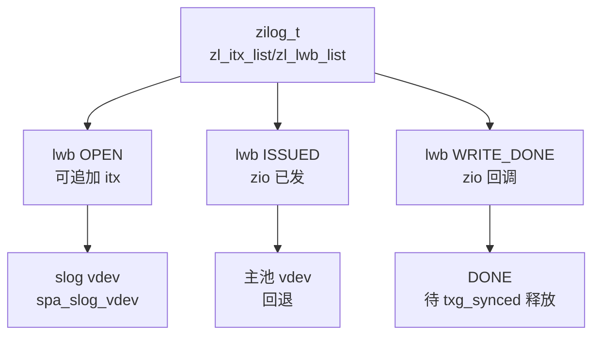
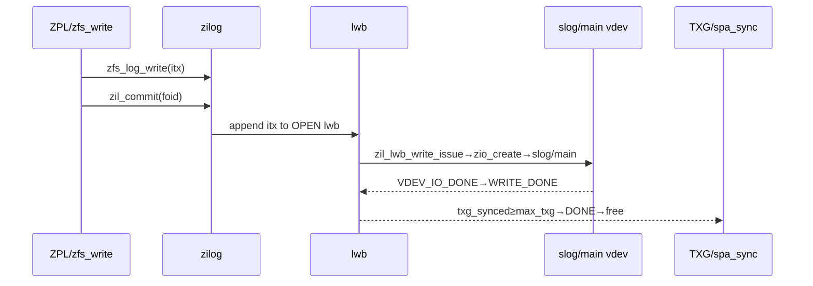
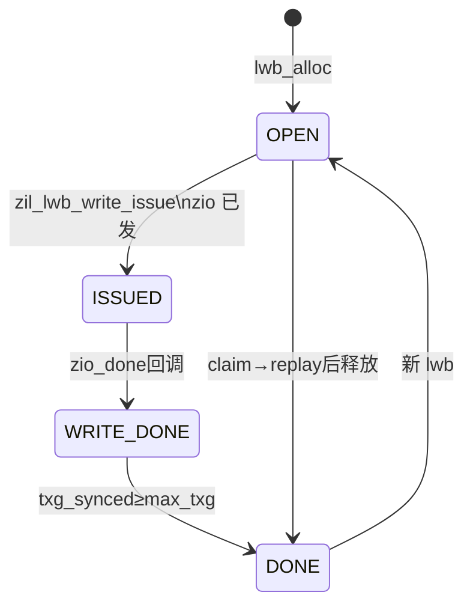
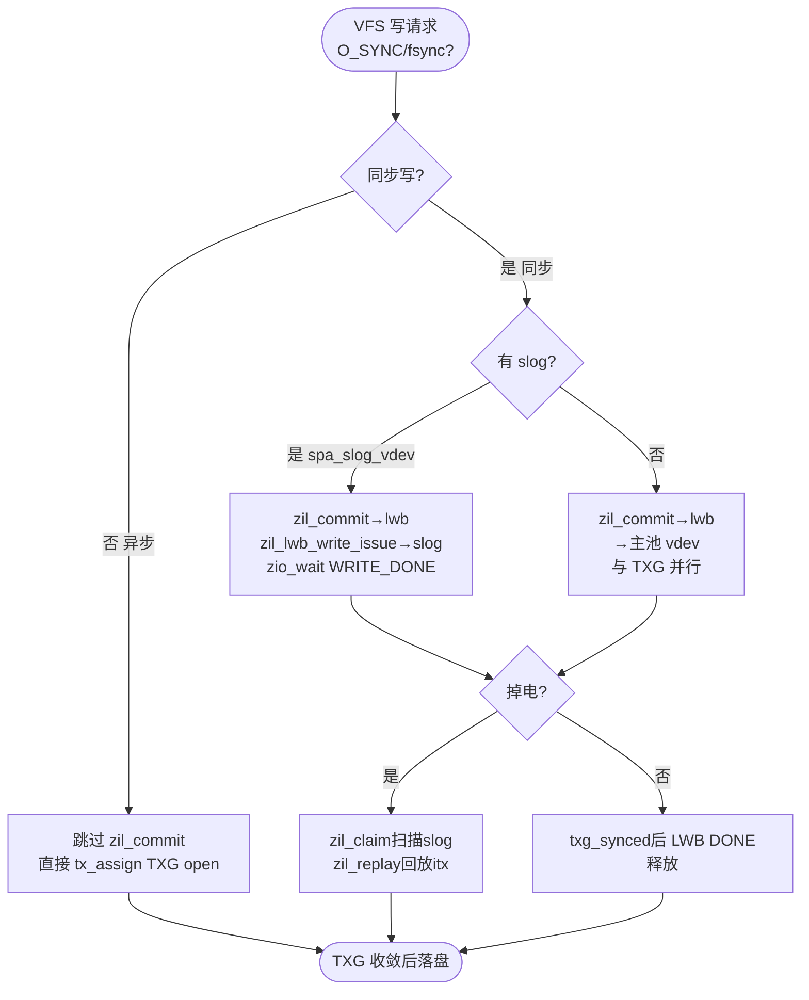

# ZFS ZIL（ZFS Intent Log）

意图日志：`zilog_t` 聚合 `zl_itx_list`（intent tx 链表）与 `zl_lwb_list`（LWB 链），`zil_lwb_t` 为日志写块（含 `lwb_state/lwb_itxs/lwb_max_txg/lwb_lock`），`slog` 为分离日志 vdev（`spa_slog_vdev`）。同步写 `zil_commit(zilog,foid)` 将 `TX_WRITE/TX_CREATE` 等 `itx` 追加至当前 `LWB_OPEN`，`zil_lwb_write_issue` 经 `zio_create(ZIO_TYPE_WRITE)` 分发至 `slog`（若有）或主池，`LWB_ISSUED→WRITE_DONE→DONE` 由 `txg_synced` 驱动；掉电后 `zil_claim` 重建 `zilog` 并 `zil_replay` 回放 `itx`。

## C4 L3 Component — zilog → lwb 链 → slog 三层

`zilog_t` 为日志容器：`z_os`（`objset_t`）、`zl_itx_list`（待提交 `itx`）、`zl_lwb_list`（LWB 链）、`zl_lock`（护列表）。`zil_lwb_t` 为写块：`lwb_state`（四态）、`lwb_itxs`（本块 `itx` 链表）、`lwb_max_txg`、`lwb_lock`、`lwb_zilog` 回指。`slog` 侧 `vdev_t` 为分离设备（`spa_slog_vdev` 判定）。C4 L3 图以 `zilog → lwb_chain(OPEN/ISSUED/WRITE_DONE/DONE) → slog vdev` 三层呈现该链与分离。



Source: `openzfs/zfs/include/sys/zil.h:80-180`（`zilog_t/zil_lwb_t` 定义 `lwb_state/lwb_itxs/lwb_max_txg`）+ `openzfs/zfs/module/zfs/zil.c:200-400`（`zil_lwb` 四态与 `zl_lock/lwb_lock`）

## 时序 — zfs_log_write → zil_commit → lwb_write_issue → slog/zio → TXG

同步写五步：1) `zfs_log_write(zilog,tx,txtype,zp,off,len)` 在 `dmu_tx_commit` 前登记 `itx` 至 `zl_itx_list` 2) `zil_commit(zilog,foid)` 将 `itx` 追加至当前 `LWB_OPEN` 的 `lwb_itxs` 3) `zil_lwb_write_issue(lwb,zilog)` 经 `zio_create(ZIO_TYPE_WRITE)` 分发至 `slog`（若有 `spa_slog_vdev`）或主池 `vdev`，`zio_wait` 至 `WRITE_DONE` 4) 异步写跳过 `zil_commit` 直接 `tx_assign` 入 `TXG open` 5) `spa_sync` 多 pass 后 `txg_synced` 达 `lwb_max_txg` 时 `LWB_WRITE_DONE→DONE` 并 `zio_free`。时序图以 `VFS → zpl → sa → zil_commit → lwb→slog/zio → TXG` 全链呈现同步/异步分流。



Source: `openzfs/zfs/module/zfs/zil.c:800-1050`（`zil_commit` 与 `zil_lwb_write_issue`）+ `openzfs/zfs/module/zfs/zfs_vnops.c:600-900`（`zfs_write` 同步/异步分流）+ `openzfs/zfs/include/sys/zil.h:80-180`

## 状态机 — LWB OPEN/ISSUED/WRITE_DONE/DONE 与 claim/replay

`zil_lwb_t.lwb_state` 四态：`LWB_OPEN`（可追加 `itx`，`lwb_max_txg` 跟踪）→ `LWB_ISSUED`（`zil_lwb_write_issue` 已发 `zio_write`）→ `LWB_WRITE_DONE`（`zio_done` 回调，等待 `txg_synced`）→ `LWB_DONE`（`spa_sync` 已落盘对应 `txg`，释放 `lwb`）→ 回 `OPEN` 开新块。`OPEN→ISSUED` 需 `lwb` 满 `zil_slog_bulk` 或 `zil_commit` 显式 `lwb_close`；`WRITE_DONE→DONE` 需 `txg_synced ≥ lwb_max_txg`。掉电重放：`zil_claim` 扫描 `slog`/`uberblock` 重建 `zilog`，`zil_replay` 逐 `itx` 回放 `TX_WRITE`。状态机图覆盖四态及两条关键变迁与 `claim→replay` 分支。



Source: `openzfs/zfs/include/sys/zil.h:80-180`（`zil_lwb_t`）+ `openzfs/zfs/module/zfs/zil.c:200-400`（四态与 `zil_commit_waiter`）+ `openzfs/zfs/module/zfs/zil.c:800-1050`（`claim/replay`）

## 决策树



Source: `openzfs/zfs/module/zfs/zil.c:800-1050`（`zil_commit` slog分流与 claim）+ `openzfs/zfs/module/zfs/zfs_vnops.c:600-900`（同步/异步分流）

## 正例

```c
// 正例：正确的 zfs_log_write → zil_commit → lwb_write_issue → slog 分发与重放配对
zilog_t *zilog = zfsvfs->z_log;
dmu_tx_t *tx = dmu_tx_create(zfsvfs->z_os);
dmu_tx_hold_write(tx, zp->z_id, off, len);
VERIFY0(dmu_tx_assign(tx, TXG_WAIT));
zfs_log_write(zilog, tx, TX_WRITE, zp, off, len, 0); // 登记 itx 至 zl_itx_list
dmu_tx_commit(tx);
if (io_sync)
    zil_commit(zilog, zp->z_id); // 追加至 LWB_OPEN → ISSUED → slog/main
// 掉电重放
zilog_t *claimed = zil_claim(spa, uberblock); // 扫描 slog
zil_replay(claimed, spa); // 逐 itx 回放
// 验证：itx 登记后 commit，LWB 四态收敛，slog 有则走 slog 否则主池，claim 后 replay 不丢
```

命中：`zfs_log_write` 在 `commit` 前，`zil_commit` 在 `commit` 后，`LWB_OPEN→ISSUED→WRITE_DONE→DONE` 需 `txg_synced`，`slog` 分流正确，`claim→replay` 配对。

## 反例

```c
// 反例1：漏 ZIL 登记掉电丢数据
dmu_tx_assign(tx, TXG_WAIT);
dmu_write(os, object, off, len, buf, tx);
// 漏 zfs_log_write：itx 未入 zl_itx_list，zil_commit 空刷，掉电重放无该 TX_WRITE
// 正确：同步写必先 zfs_log_write 再 zil_commit

// 反例2：漏 LWB 关闭导致日志撕裂
zil_lwb_t *lwb = zilog->zl_cur_lwb; // OPEN
lwb->lwb_state = LWB_ISSUED; // 错：手动改状态未持 zl_lock，且仍追加 itx 至已 ISSUED 的 lwb
// 正确：由 zil_lwb_write_issue 持 zl_lock 原子置 ISSUED 并开新 OPEN

// 反例3：slog 误判导致性能回退
if (spa->spa_slog_vdev == NULL)
    zil_lwb_write_issue(lwb, zilog); // 错：无 slog 时仍等 slog 响应，同步写放大至主池随机 I/O
// 正确：按 spa_slog_vdev 分流，有 slog 走 slog 顺序写，无则主池并行

// 反例4：claim 后未 replay 导致已提交同步写丢
zil_claim(spa, ub); // 仅 claim 未 replay，itx 仍在 lwb 链未回放至 DMU
// 正确：claim 后必 zil_replay 逐 itx 回放
```

## 门禁

- **多图门禁**：`grep -c '```mermaid' records/T0527-0902-zfs-zil-entity/report.md 2>/dev/null || grep -c '```mermaid' ontology/entity/zfs-zil.md | awk '{exit !($1>=3)}'`
- **溯源门禁**：`grep -c 'Source:' ontology/entity/zfs-zil.md` ≥3 且每图附 `openzfs/zfs file:line`
- **正文门禁**：`wc -l ontology/entity/zfs-zil.md` ≥80 且 `grep -q '决策树' && grep -q '正例' && grep -q '反例' && grep -q '门禁'`
- **属性门禁**：`attributes` ≥3 且每条 `testable_signal` 含 `grep -q` 动词+判定且双源可回归
- **本体校验**：`python3 scripts/ontology-validate.py --ontology-dir ontology` 0 issues 且 `islands:0`
- **脚手架门禁**：`python3 scripts/ontology_test_scaffold.py --node ontology:entity/zfs-zil --out /tmp/x.py` 可产
- **Gate 门禁**：`python3 scripts/production-ontology-gate.py --node ontology:entity/zfs-zil` GATE OK

Source: `openzfs/zfs/include/sys/zil.h:80-180` + `openzfs/zfs/module/zfs/zil.c:200-1050` + `openzfs/zfs/module/zfs/zfs_vnops.c:600-900`
