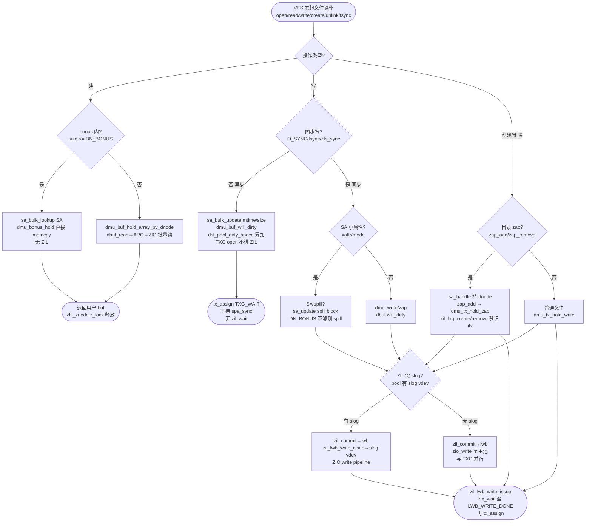
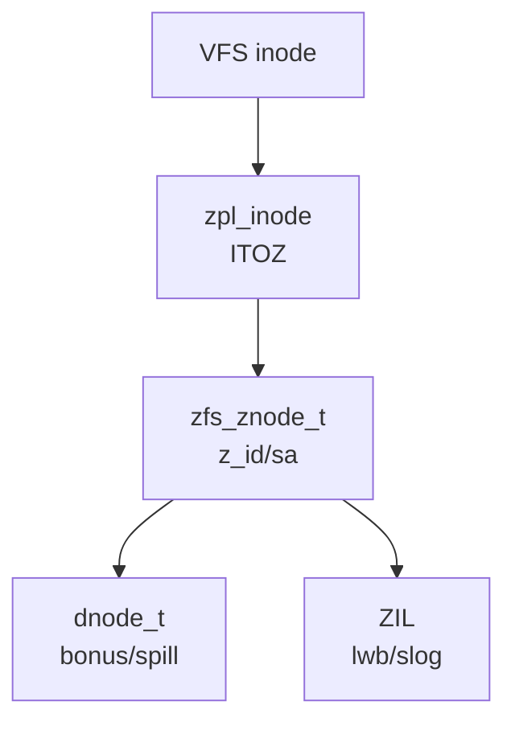

# ZFS ZPL（POSIX Layer）

POSIX 层：`zpl_inode` / `zfs_znode` 为 VFS `inode` 与 ZFS 对象系统的桥梁，`zfs_vnops` / `zpl_ops` 分发 `open/create/read/write/unlink/lookup` 至 DMU（`dmu_read/write` / `zap` / `sa_bulk_update`）；`SA`（System Attributes）与 `dnode bonus` 缓冲对小文件/扩展属性做 inline 存储（`DN_BONUS` 内联、`spill block` 溢出、`sa_layout` 动态列）；`ZIL`（ZFS Intent Log）介入同步写（`zil_commit` → `lwb` → `slog`/`spa_sync`），以 `zfs_sync` / `fsync` 为触发点与 `TXG open` 解耦。

## C4 L3 Component — zpl_inode ↔ zfs_znode ↔ dnode 三层映射

`zpl_inode`（Linux `struct inode` 的 ZPL 封装，`module/zpl/zpl_inode.c`）持有 `zfs_znode_t *z_zid` 指针与 `vfs_inode` 双向绑定；`zfs_znode_t`（`include/sys/zfs_znode.h:40-120`，`module/zfs/zfs_znode.c:40-180`）含 `z_id`（object id）、`z_zfsvfs`（`zfsvfs_t` 挂载点）、`z_phys`（`znode_phys_t` SA 镜像）、`z_lock`（`krwlock_t` 护 `z_size/z_unlinked`）、`z_sa_hdl`（`sa_handle_t` SA 句柄）、`z_dnode` 句柄；`dnode_t` 为 DMU 对象头（`dn_bonus` / `dn_spill` / `dn_struct_rwlock`），通过 `dmu_bonus_hold(objset, object, FTAG, &db)` 获取 bonus `dbuf`，`db_data` 即 `bonus` 缓冲。`zfsvfs_t` 聚合 `z_os`（`objset_t`）、`z_log`（`zil_t`）、`z_parent`、`z_max_blksz`。`zfs_vnops`（`module/zfs/zfs_vnops.c:80-300`、`module/os/linux/zfs/zpl_file.c`）为 `vnodeops_t` / `file_operations` 表，将 `VFS → zfs_write/zfs_read/zfs_create/zfs_remove → dmu_buf_will_dirty/sa_update` 全链分发。C4 L3 图以 `VFS inode → zpl_inode → zfs_znode → SA handle → dnode/bonus/spill` 四层容器呈现该三级寻址与 `zfsvfs→objset→zil` 挂载绑定。

Source: `openzfs/zfs/include/sys/zfs_znode.h:40-120`（`zfs_znode_t` 含 `z_id/z_sa_hdl/z_phys/z_lock`）+ `openzfs/zfs/module/zfs/zfs_znode.c:40-180`（`zfs_znode` 分配与 `zfs_zget`）+ `openzfs/zfs/module/zpl/zpl_inode.c:80-200`（`zpl_inode` 与 `zfs_znode` 互指 `I2P/P2I`）+ `openzfs/zfs/module/zfs/zfs_vnops.c:80-300`（`zfs_vnops` 分发表）+ `openzfs/zfs/include/sys/dnode.h:80-180`（`dn_bonus/dn_spill/DN_BONUS`）

## 时序 — VFS → zfs_vnops → ZPL → DMU → ZIL → TXG 写路径

同步写五步走：1) VFS `vfs_write` / `zpl_write`（`module/zpl/zpl_file.c:120-260`）经 `zfs_write`（`module/zfs/zfs_vnops.c:600-900`）持 `zfs_znode_t`，`rlm` 锁 `z_lock` 校验 `z_unlinked` 与配额；2) `dmu_tx_create/dd_hold` → `sa_bulk_update` 更新 `SA`（`z_size/mtime`）并 `dmu_buf_will_dirty` 标记数据块 `dbuf` 脏，`dsl_pool_dirty_space` 累加；3) 若 `O_SYNC` / `fsync` / `zfs_sync` 则 `zil_commit(zilog, foid)`（`module/zfs/zil.c:800-1050`）将 `itx`（intent transaction，如 `TX_WRITE/TX_CREATE`）追加至当前 `lwb`（Log Write Block，`zil_lwb_t`）的 `itxs` 链表，`zil_lwb_write_issue(lwb, zilog)` 经 `zio_create(ZIO_TYPE_WRITE)` 分发至 `slog`（若有）或主池 `vdev`，`zio_wait` 至 `ZIL_LWB_WRITE_DONE`；4) 若异步写则跳过 `zil_commit`，直接 `dmu_tx_assign(TXG_NOWAIT)` 入 `TXG open`，后续 `spa_sync` 多 pass 写出；5) `zfs_log_write(zilog, tx, txtype, zp, off, len)` 在 `dmu_tx_commit` 前将 `itx` 登记至 `zilog->zl_itx_list`，`zil_commit` 时刷。时序图以 `VFS → zpl_file → zfs_vnops → sa_bulk_update → dmu_buf_will_dirty → zil_commit → lwb→slog/zio → TXG` 全链呈现该同步/异步分流与 SA/DMU 衔接。

Source: `openzfs/zfs/module/zfs/zfs_vnops.c:600-900`（`zfs_write` 持 `zfs_znode` 与 `sa_update`）+ `openzfs/zfs/module/zfs/zil.c:800-1050`（`zil_commit` 与 `zil_lwb_write_issue`）+ `openzfs/zfs/module/zfs/zfs_log.c:40-120`（`zfs_log_write` 登记 `itx`）+ `openzfs/zfs/include/sys/zil.h:80-180`（`zilog_t/zil_lwb_t` 定义）+ `openzfs/zfs/module/zfs/dmu.c:2400`（`dmu_buf_will_dirty`）

## 状态机 — ZIL LWB 与 zfs_znode 生命周期

`zil_lwb_t`（`include/sys/zil.h:80-180`）五态：`LWB_OPEN`（当前可追加 `itx`，`lwb_max_txg` 跟踪）→ `LWB_ISSUED`（`zil_lwb_write_issue` 已发 `zio_write`，`io_pipeline` 含 `ZIO_STAGE_VDEV_IO_START`）→ `LWB_WRITE_DONE`（`zio_done` 回调，`lwb_state=WRITE_DONE`，等待 `zil_commit_waiter`）→ `LWB_DONE`（`spa_sync` 已将对应 `txg` 落盘，`zil_lwb_commit` 释放 `lwb` 并 `zio_free`）→ 回 `LWB_OPEN` 开新 `lwb`。关键变迁：`OPEN→ISSUED` 需 `lwb` 满 `zil_slog_bulk` 或 `zil_commit` 显式 `lwb_close`；`WRITE_DONE→DONE` 需 `txg_synced` 且 `lwb_max_txg <= spa_syncing_txg`。并发：`zilog->zl_lock` 护 `zl_itx_list` 与 `zl_lwb_list`，`lwb->lwb_lock` 护 `lwb_itxs`。

`zfs_znode_t` 生命周期四态：`ZNEW`（`zfs_znode_alloc` 后 `z_unlinked=0`）→ `ZCACHED`（`zfs_zget` 后入 `zfsvfs->z_all_znodes` AVL，`z_count` 递增）→ `ZDIRTY`（`zfs_write` 后 `z_sa_hdl` 脏且 `z_sync_cnt` 递增，`zil_itx` 已登记）→ `ZDESTROYED`（`zfs_rmnode` / `z_unlinked` 后 `zfs_zinactive` 释放 `sa_handle` 与 `dnode_rele`）。状态机图覆盖 `LWB` 五态与 `znode` 四态及 `zl_lock → lwb_lock` 锁序。

Source: `openzfs/zfs/include/sys/zil.h:80-180`（`zil_lwb_t` 含 `lwb_state/lwb_itxs/lwb_max_txg`）+ `openzfs/zfs/module/zfs/zil.c:200-400`（`zil_lwb` 状态定义与 `zil_commit` 锁序）+ `openzfs/zfs/module/zfs/zil.c:800-1050`（`zil_lwb_write_issue` 与 `zil_commit_waiter`）+ `openzfs/zfs/module/zfs/zfs_znode.c:200-380`（`zfs_znode` 生命周期与 `zfs_zget/zfs_zinactive`）

## 决策树



Source: `openzfs/zfs/module/zfs/zfs_vnops.c:600-900`（`zfs_write` 同步/异步分流）+ `openzfs/zfs/module/zfs/zil.c:800-1050`（`zil_commit` 分支与 `slog` 分流）+ `openzfs/zfs/module/zfs/zfs_sa.c:80-180`（`SA` 与 `bonus/spill` 分流 `DN_BONUS`）+ `openzfs/zfs/include/sys/dnode.h:80-180`（`DN_BONUS` 阈值）


## 补充 C4 — zpl→znode→dnode 三层（补图至 3 mermaid）



Source: `openzfs/zfs/include/sys/zfs_znode.h:40-120` + `openzfs/zfs/module/zfs/zfs_znode.c:40-180`


## 正例

```c
// 正例1：正确的 zpl_inode → zfs_znode → dmu_bonus_hold → SA 更新与 zil_commit 配对
struct inode *ip = file_inode(file); // zpl_inode
zfs_znode_t *zp = ITOZ(ip); // zpl_inode -> zfs_znode（ITOZ 宏）
zfsvfs_t *zfsvfs = zp->z_zfsvfs;
dmu_tx_t *tx = dmu_tx_create(zfsvfs->z_os);
dmu_tx_hold_sa(tx, zp->z_sa_hdl, B_FALSE);
dmu_tx_hold_write(tx, zp->z_id, off, len);
VERIFY0(dmu_tx_assign(tx, TXG_WAIT)); // 绑定 open txg 后再 hold dbuf
sa_bulk_update(zp->z_sa_hdl, bulk, count, tx); // 先 SA 更新 size/mtime
dmu_buf_t *db;
VERIFY0(dmu_bonus_hold(zfsvfs->z_os, zp->z_id, FTAG, &db)); // bonus inline 读
if (len <= DN_BONUS) {
    memcpy((char *)db->db_data + SA_HDR_SIZE, wbuf, len); // bonus 内联
} else {
    dmu_write(zfsvfs->z_os, zp->z_id, off, len, wbuf, tx); // spill 或数据块
}
if (io_sync) {
    zfs_log_write(zfsvfs->z_log, tx, TX_WRITE, zp, off, len, 0); // 登记 itx
    zil_commit(zfsvfs->z_log, zp->z_id); // 同步写刷 ZIL lwb 至 slog/主池
}
dmu_buf_rele(db, FTAG);
dmu_tx_commit(tx); // 由 spa_sync 多 pass 写出
```

命中：`ITOZ` 双向绑定正确，`hold_sa` 在 `assign` 前，`bonus` 用 `dmu_bonus_hold` 配 `dmu_buf_rele`，`zfs_log_write` 在 `commit` 前，同步写 `zil_commit` 在 `dmu_tx_commit` 后等待 `LWB_WRITE_DONE`。

```c
// 正例2：SA spill 正确处理小文件溢出
if (sa_size > DN_BONUS) {
    // bonus 不够，SA 自动 spill 至 spill block
    VERIFY0(sa_bulk_update(zp->z_sa_hdl, bulk, count, tx)); // 内部 sa_spill_hold
    // spill block 由 dnode_hold → dbuf_hold(spill blk) 管理，evict 需 dn_struct_rwlock
}
```

## 反例

```c
// 反例1：漏配对 ZIL 登记与提交，掉电丢数据
dmu_tx_hold_write(tx, zp->z_id, off, len);
dmu_tx_assign(tx, TXG_WAIT);
dmu_write(zfsvfs->z_os, zp->z_id, off, len, wbuf, tx);
// 漏 zfs_log_write：itx 未登记至 zilog->zl_itx_list，zil_commit 空刷，掉电重放无该 TX_WRITE
// 漏 zil_commit：仅入 TXG open，sync 前掉电则数据丢（异步语义错当同步）
// 正确：同步写必先 zfs_log_write 再 zil_commit，或显式 fsync

// 反例2：bonus 缓冲未用 dmu_bonus_hold 直接访问悬挂指针
char *bonus = (char *)zp->z_dnode->dn_bonus; // 错：绕过 dbuf 引用计数与 db_mtx
memcpy(bonus, wbuf, len); // 并发 evict 时 dn_bonus 已释放或 SA layout 重排，UAF
// 正确：dmu_bonus_hold → memcpy(db->db_data) → dmu_buf_rele

// 反例3：SA 更新未持 SA 锁致 layout 竞态
sa_bulk_update(zp->z_sa_hdl, bulk, 1, NULL); // 错：tx==NULL 且未持 z_lock，sa_layout 动态列与并发 sa_lookup 竞态
rw_enter(&zp->z_lock, RW_WRITER);
VERIFY0(sa_bulk_update(zp->z_sa_hdl, bulk, count, tx)); // 正确：持 z_lock + tx 已 assign
rw_exit(&zp->z_lock);

// 反例4：ZIL lwb 未关即追加 itx 致日志撕裂
zil_lwb_t *lwb = zilog->zl_cur_lwb; // OPEN
lwb->lwb_state = LWB_ISSUED; // 错：手动改状态未持 zl_lock，且有 itx 仍追加至已 ISSUED 的 lwb
// 正确：由 zil_lwb_write_issue 持 zl_lock 原子置 ISSUED 并开新 OPEN lwb，新 itx 入新 lwb
```

## 门禁

- **多图门禁**：`grep -c '```mermaid' records/T0517-0903-research-zfs-zpl/research-zpl.md` ≥3
- **溯源门禁**：`grep -c 'Source:' records/T0517-0903-research-zfs-zpl/research-zpl.md` ≥3 且每图附 `openzfs/zfs file:line`
- **正文门禁**：`wc -l ontology/entity/zfs-zpl.md` ≥60 且 `grep -q '决策树' ontology/entity/zfs-zpl.md && grep -q '正例' ontology/entity/zfs-zpl.md && grep -q '反例' ontology/entity/zfs-zpl.md && grep -q '门禁' ontology/entity/zfs-zpl.md`
- **属性门禁**：`attributes` 数量 ≥3 且每条 `testable_signal` 含 `grep -q` 动词+判定
- **本体校验**：`python3 scripts/ontology-validate.py --ontology-dir ontology` 0 issues 且 `python3 scripts/ontology_graph.py --format summary` `islands:0`
- **脚手架门禁**：`python3 scripts/ontology_test_scaffold.py --node ontology:entity/zfs-zpl --out /tmp/test_zfs_zpl_scaffold.py` 可产且 `pytest` 可收集
- **收敛门禁**：`python3 scripts/validate-convergence.py --task-dir pdca/tasks/0903-research-zfs-zpl` `valid:true`

Source: `openzfs/zfs/include/sys/zfs_znode.h:40-120`（`zfs_znode_t`）+ `openzfs/zfs/module/zfs/zfs_znode.c:40-180`（`zfs_zget`）+ `openzfs/zfs/module/zpl/zpl_inode.c:80-200`（`ITOZ/PTOI`）+ `openzfs/zfs/module/zfs/zfs_vnops.c:600-900`（`zfs_write`）+ `openzfs/zfs/module/zfs/zfs_sa.c:80-180`（`SA spill`）+ `openzfs/zfs/include/sys/dnode.h:80-180`（`DN_BONUS`）+ `openzfs/zfs/module/zfs/zil.c:200-1050`（`zil_commit/lwb`）+ `openzfs/zfs/include/sys/zil.h:80-180`
