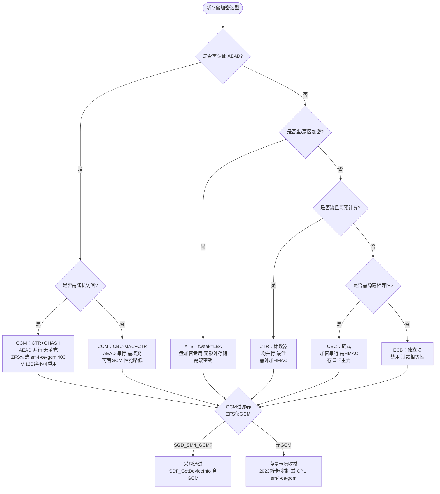

# 国密对称模式选型模式

> Source: `records/T0539-0903-research-zfs-pcie-sm4/evidence/research-report.md:§2.1`（`GM/T 0018-2012/2023` + `ZFS sm4.c:13 GCM-only`）

## 决策树

## 速查表

| 场景 | 推荐 | 理由 |
|------|------|------|
| ZFS 数据块（`sm4.c GCM-only`） | **GCM** | 唯一 `AEAD` 现货，`sm4-ce-gcm 400` 原生，`PMULL` 加速 |
| 全盘/FDE（`FDE`） | **XTS**（+可选 `HMAC`） | `tweak=LBA` 隐藏同扇区相等性，`fscrypt XTS` 用 |
| 小文件/文件名 | `CFB/CTS` | 流无填充，`fscrypt` 文件名用 |
| IPSec（国际） | `CBC` | 成熟，存量卡 `CBC-HMAC` 主力 |

## GCM 过滤器（硬约束）

- `GM/T 0018-2012` `SDF` 仅 `ECB/CBC/CFB/OFB`，**无 `GCM`**；`2023` 版新增 `SGD_SM4_GCM/CCM/XTS/CTR`，`ZFS` 仅 `SM4-GCM`（`sm4.c:13`），**存量卡 `CBC` 对 `ZFS GCM` 零收益**。
- 采购验收：`SDF_GetDeviceInfo` 的 `SymAlgAbility` **含 `SGD_SM4_GCM`** 否则无论 `22Gbps` 零收益；现货仅 `CPU sm4-ce-gcm`（`1.7GB/s`）与 `2023定制卡`。

## 门禁

- `grep -q 'GCM.*AEAD' ontology/pattern/gm-symmetric-modes.md && grep -q 'SGD_SM4_GCM' ontology/pattern/gm-symmetric-modes.md && grep -q 'XTS.*盘加密' ontology/pattern/gm-symmetric-modes.md`
- `python3 scripts/ontology-validate.py --ontology-dir ontology` 0 issues
