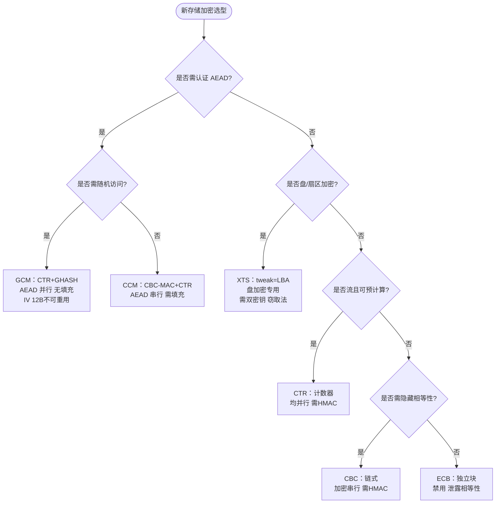

# 对称模式选型模式

## 上下文

存储或传输场景需为 `SM4/AES` 等分组密码选择工作模式，面临 `认证 / 并行 / 随机访问 / 填充 / IV` 五力权衡；`GM/T 0018` 的 `SDF` 版本差异（`2012` 仅 `ECB/CBC`，`2023` 增 `GCM`）进一步约束可选集。

## 问题

如何在 `ECB/CBC/CFB/OFB/CTR/XTS/GCM/CCM` 中选择满足 `认证 / 随机访问 / 盘加密` 的模式，避免 `ECB` 泄露、`CBC` 串行、`OFB` 预计算失效及 `GCM/CCM` 的 `IV` 重用灾难。

## 解

按三力逐级分流，`认证` 为首要分水岭：

`GCM`（`CTR+GHASH` 并行）与 `CCM`（`CBC-MAC+CTR` 认证串行）为唯二 `AEAD` 一体方案；`XTS`（`tweak=LBA` 窃取法）为盘加密专用无需额外存储；`CTR` 为并行最佳但需外加 `HMAC`；`CBC/CFB/OFB` 为流/链式，无认证且分别串行。

## 后果

- `ECB` 任何存储场景禁用（同明文同密文）；`CBC/CFB/OFB` 无认证，需 `HMAC` 补且 `OFB` 完全串行、`CBC` 加密串行。
- `GCM/CCM` 的 `IV/nonce` 绝不可重用（`GCM` 重用泄露 `GHASH` 密钥，`ZFS` 为 `12B` 约束）；`CCM` 认证串行略低于 `GCM`。
- `2012` 版 `SDF` 仅 `ECB/CBC`，若目标仅 `GCM`（如 `ZFS SM4 GCM-only`）则存量卡零收益，需 `2023` 版 `SGD_SM4_GCM` 或 `CPU sm4-ce-gcm`。

## 实例

| 场景 | 推荐 | 理由 |
|------|------|------|
| 块存储 `AEAD` 随机访问 | **GCM** | 唯一 `AEAD` 并行一体，现货 `sm4-ce-gcm` |
| 全盘 `FDE` | **XTS**（+可选 `HMAC`） | `tweak=LBA` 隐藏同扇区相等性 |
| 文件名/小流 | `CFB/CTS` | 流无填充 |
| 存量卡 `CBC` | `CBC+HMAC` | 成熟但串行 |

## 门禁

- `grep -q '是否需认证' ontology/pattern/gm-symmetric-modes.md && grep -q 'GCM' ontology/pattern/gm-symmetric-modes.md && grep -q 'AEAD' ontology/pattern/gm-symmetric-modes.md`
- `python3 scripts/ontology-validate.py --ontology-dir ontology` 0 issues
