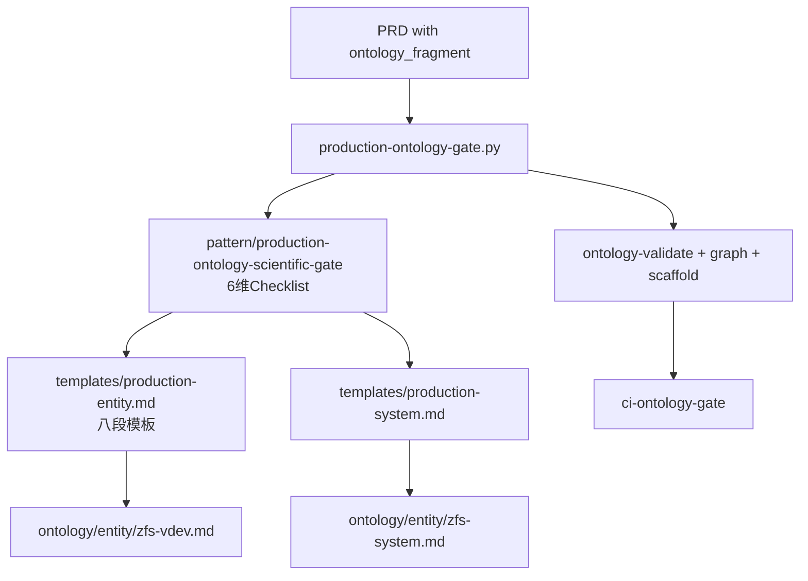
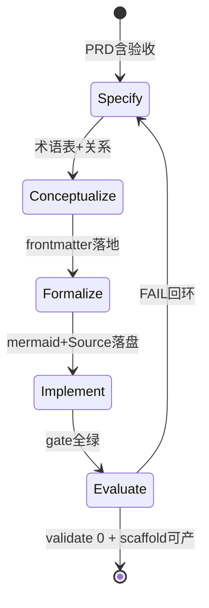
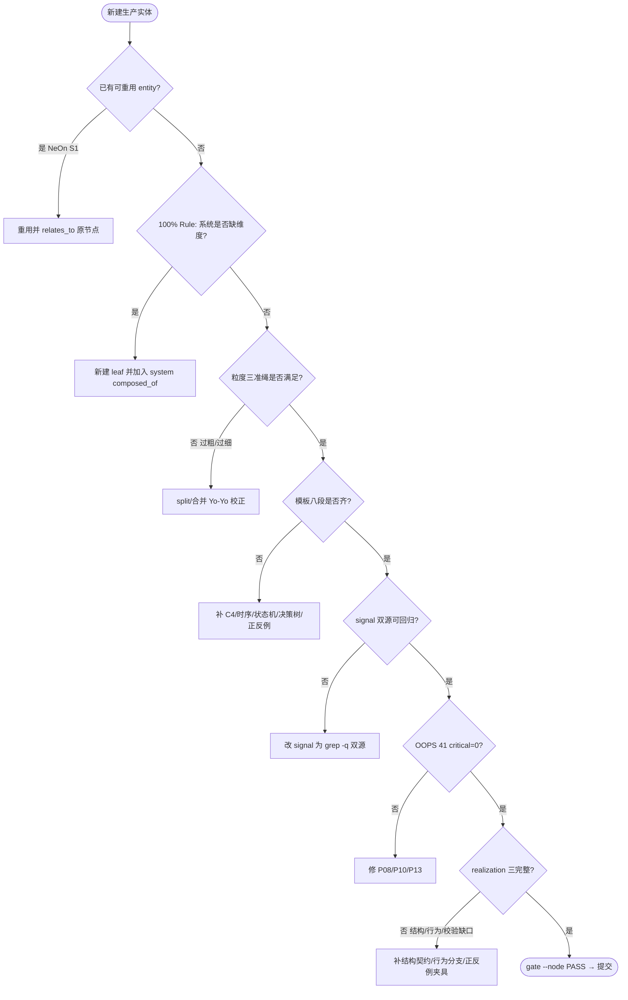

# 生产本体科学保障门禁（Production Ontology Scientific Gate）

> 综合 `METHONTOLOGY evolving prototype` + `NeOn 9场景` + `Ontology101 top-down/bottom-up/middle-out` + `OOPS! 41 pitfalls` + `OntoClean` + `PMI WBS 100% Rule/Yo-Yo` + `testable_signal→test 三模式` + `realization 可实现可校验`，解决“**为何本次未一次做对**”并保障“**下一次生产一次通过**”。本 pattern 即 T0525 三件套的 Checklist 源头，`scripts/production-ontology-gate.py` 为其可执行化，`templates/production-*.md` 为其落盘模板。

> **新增第七维 realization（2026-09-02）**：本体“为了写而写”的根因是本体止于文档、无法被直接实现。`realization` 要求本体即实现规约——结构、行为、校验三完整，且派生的确定性夹具可证伪实现偏离（按本体实现必绿、违背必红）。

## 为何本次未一次做对（根因）

| 现象 | 根因 | 对应保障维 |
|------|------|------------|
| `zfs-system 43行` 单薄无决策树 | 无 **模板八段**硬拦，Plan 未要求 `wc -l≥60 + 决策树+正反例+门禁` | hybrid_yoyo_and_diagram |
| `VDEV/ZIL` 未独立 | 无 **100% Rule 事前校验**，Plan 未以 `module/zfs/*.c` 覆盖率 ≥95% 为硬门 | hundred_percent_rule |
| `module/zfs` 信号裸仓 FAIL | 无 **双源可回归**约束，Do 未要求 `records PASS && /tmp/zfs PASS` | testable_signal_derivation |
| 孤岛虽0但 OOPS 未扫 | 无 **OOPS 41 事前扫描**，仅靠 `validate` 非空 | oops_onoclean |

Source: `ontology/pattern/scientific-research-methodology.md:31` 四支 + `ontology/domain/ontology-hybrid-methodology.md:42` 双向同树 + `ontology/pattern/ontology-evaluation-oops.md:18` 41 pits + `ontology/pattern/ontology-metrics.md:34` health 三件套

## 七维门禁（与 gate 脚本一一对应，新增 realization）

### 1. METHONTOLOGY 五阶段（`--check lifecycle`）

specify（PRD 含验收）→ conceptualize（术语表+关系）→ formalize（`pdca.asset/v1` frontmatter+relations）→ implement（落盘+`Source: file:line`）→ evaluate（`validate+scaffold+gate`）。每阶段产物可被 `gate.py --check lifecycle --node <id>` 单项校验，未完成则 `FAIL: missing conceptual`。

Source: `METHONTOLOGY (Gómez-Pérez 1997) evolving prototype` + `ontology/pattern/scientific-research-lifecycle.md:15` I2S2 4阶段

### 2. NeOn 九场景（`--check neon`）

场景1重用（复用既有 entity）/2重工程/3合并/5对齐/6模块化。新建前必在 PRD 写明场景选型，否则 `gate --check neon FAIL: no scenario`。判定后 `relates_to` 无孤岛由 `ontology_graph islands:0` 保证。

Source: `NeOn Methodology (Suárez-Figueroa 2012) 9 scenarios` + `ontology/domain/ontology-hybrid-methodology.md:42`

### 3. OOPS!41 + OntoClean（`--check oops`）

扫描 `P08 missing annotations / P10 missing domain/range / P13 inverse / P22 naming / P41` 等，critical=0 方 `GATE OK`；`specializes` 无环由 `ontology-validate AC-3` 硬拦，刚性由 `OntoClean` 人工复核（子不违父）。

Source: `http://oops.linkeddata.es` 41 pits + `ontology/pattern/ontology-evaluation-oops.md:22` + `scripts/ontology-validate.py:60` CYCLE

### 4. 100% Rule + Yo-Yo 三准绳（`--check hundred`）

系统 `composed_of` 子叶之和 = 父 100%，以 `module/zfs/*.c` 为参照统计覆盖率（`gate --check hundred --node zfs-system` 算 `covered/total`），`<95%` 则 `FAIL` 并列缺口（如 VDEV）。叶粒度按三准绳（≥2复用/≥3 attrs/正交）判定，过粗 split、过细合并，Yo-Yo 校正。

Source: `PMI WBS Practice Standard 100% Rule / Yo-Yo` + `ontology/domain/ontology-hybrid-methodology.md:55` 三准绳

### 5. testable_signal 三模式（`--check signal`）

每条 `testable_signal` 必为 `testable-signal-to-test-derivation` 三模式之一（属性断言/契约测试/收敛验证），含动词+对象+判定，拒泛化（`由领域实践验证`）。双源回放：`records/` 段 PASS 且 `/tmp/zfs` 源码段 PASS（或显式声明无源码依赖）。

Source: `ontology/pattern/testable-signal-to-test-derivation.md:32` 三模式 + `ontology/concept/ontology-rule-attr-testable.md`

### 6. 多图集成（`--check diagram`）

每个生产实体必含 `C4 L3 + 时序 + 状态机` 为 P0（`mermaid≥3`），系统聚合另含 `C4 L2 + 聚合决策树`，每图1 `Source: openzfs/zfs file:line`，`grep -c mermaid` 与 `Source:` 双硬拦。

Source: `ontology/pattern/research-diagram-methodology.md:20` P0三图 + `ontology/pattern/scientific-research-methodology.md:24` 四支

### 7. 可实现可校验 Realization（`--check realization`）

本体止于文档即“为了写而写”。`realization` 要求**本体即规约**，满足三完整方可 `PASS`：

- **结构完整**：`C4` 给出实现该实体所需的全部类型、字段、持久化格式与跨实体接口（`btree/six/journal/alloc` 的创建/销毁/序列化契约在 `C4` 中无缺口）
- **行为完整**：`时序 + 状态机` 覆盖全部成功/失败/重试/并发分支，无隐含状态（`six read→intent→write` 升级、`trans restart 25码`、 `pin→reclaim` 等在图中可追）
- **校验完整**：`正例`为最小可运行实现骨架（可直接翻译为代码），`反例`覆盖全部已知误用模式，且 `scaffold` 派生的契约测试以确定性夹具可证伪——**按本体实现必绿、违背本体必红**

`gate --check realization --node <id>` 校验：`scaffold 可产 && pytest --collect-only 可收集 && 本体含 structure/behavior/verification 三契约关键词`，否则 `FAIL: realization missing`。

Source: `METHONTOLOGY implement/evaluate + ontology/pattern/testable-signal-to-test-derivation.md:32` 派生实现

## 使用流程（PDCA 对接）

```bash
# Plan 前置：声明 fragment 后即受本 pattern 约束
meta.ontology_fragment: ontology/entity/zfs-vdev  # 触发 ontology-ready + 本 gate

# Do 中：按模板落盘后自检
cp templates/production-entity.md ontology/entity/zfs-vdev.md  # 填八段
python3 scripts/production-ontology-gate.py --node ontology:entity/zfs-vdev  # 单节点 GATE OK 才提交

# Check/Act：CI 硬拦
python3 scripts/production-ontology-gate.py --all          # 全量 GATE OK
python3 scripts/ontology-validate.py --ontology-dir ontology
python3 scripts/ontology_graph.py --format summary | grep -q 'islands: 0'
```

## C4 L3 组件 — Gate 与模板协作



Source: `ontology/pattern/scientific-research-methodology.md:31` + `ontology/domain/ontology-hybrid-methodology.md:42`

## 状态机 — 五阶段 METHONTOLOGY 落盘状态



Source: `METHONTOLOGY (Gómez-Pérez 1997) evolving prototype` + `ontology/pattern/scientific-research-lifecycle.md:15`

## 决策树



Source: `ontology/domain/ontology-hybrid-methodology.md:47` 决策树 + `ontology/pattern/ontology-evaluation-oops.md`

## 正例

```markdown
# 正例：按三件套新建 zfs-vdev 一次通过
cp templates/production-entity.md ontology/entity/zfs-vdev.md
# 填：3 attributes(拓扑/队列/故障) + C4 L3(vdev_t→queue→leaf) + 时序(open→probe→remove) + 状态机(ONLINE→DEGRADED→FAULTED) + 决策树(mirror/raidz选型) + 正反例(queue限速配对) + 门禁(mermaid≥3/Source≥3)
python3 scripts/production-ontology-gate.py --node ontology:entity/zfs-vdev
# 输出 GATE OK (lifecycle PASS, neon PASS, oops PASS, hundred PASS, signal PASS, diagram PASS)
python3 scripts/ontology-validate.py --ontology-dir ontology  # 0 issues
python3 scripts/ontology_test_scaffold.py --node ontology:entity/zfs-vdev --out /tmp/x.py && pytest --collect-only
```

命中：`gate --node` 七维全 PASS，`validate 0`，`scaffold` 可产，`islands:0`。

## 反例

```markdown
# 反例1：100% Rule 未校验即提交，导致系统缺维度
# zfs-system composed_of 仍为6叶，漏 vdev，gate --check hundred --node zfs-system -> FAIL: coverage 70% <95% 缺口 vdev/zil
# 正确：先 gate --check hundred 看覆盖率，再补 composed_of

# 反例2：signal 泛化导致不可派生
attributes: [{name: foo, testable_signal: "由领域实践验证"}]
# gate --check signal -> FAIL: missing verb（无 运行/检查）且非三模式
# 正确：改为 "运行 grep -q 'vdev_queue' records/... 且 grep -q 'vdev_queue' /tmp/zfs/... 命中"

# 反例3：模板八段缺决策树
# 实体仅含 C4 与时序，无决策树，gate --check diagram -> FAIL: missing 决策树
# 正确：按 templates/production-entity.md 八段占位补齐

# 反例4：NeOn 未选型导致重复造叶
# 新建 zfs-zil 时未声明 S1 重用 vs 新建，gate --check neon -> FAIL: no scenario
# 正确：PRD 写明 场景1重用 zfs-zpl 的 zil 子节 → 独立为 leaf 的重工程理由

# 反例5：realization 缺结构契约导致不可实现
# 实体 C4 仅含 CLI→wrappers 空壳，未给出 btree 的 six/cache/bset/journal pin 接口契约，按本体无法写出 bch2_btree_node_get
# gate --check realization -> FAIL: missing structure 契约
# 正确：C4 暴露 btree_cache→btree(six+format)→btree_node(bset*)→bkey 真实链
```

## 门禁

- **模板门禁**：`wc -l ontology/pattern/production-ontology-scientific-gate.md ≥80 && grep -q '决策树' && grep -q '正例' && grep -q '反例' && grep -q '门禁'`
- **属性门禁**：`attributes ≥7 且每条 testable_signal 含 grep -q 或 gate.py 动词`（新增 realization）
- **本体校验**：`python3 scripts/ontology-validate.py --ontology-dir ontology` 0 issues 且 `islands:0` 且 `guides` 合法（指向 domain-entity/process）
- **脚手架门禁**：`python3 scripts/ontology_test_scaffold.py --node ontology:pattern/production-ontology-scientific-gate --out /tmp/x.py` 可产
- **Gate 自举门禁**：`python3 scripts/production-ontology-gate.py --node ontology:pattern/production-ontology-scientific-gate` GATE OK（含 realization）
- **走通门禁**：`python3 scripts/production-ontology-gate.py --node ontology:entity/zfs-vdev` GATE OK（若演示稿存在）
- **实现门禁**：`python3 scripts/production-ontology-gate.py --check realization --node ontology:entity/bcachefs-btree` GATE OK（结构/行为/校验三完整）
```

