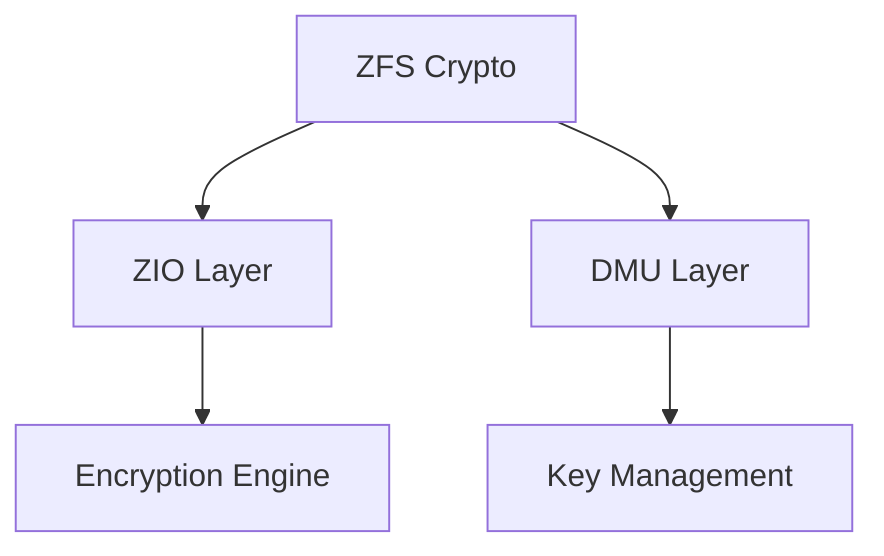
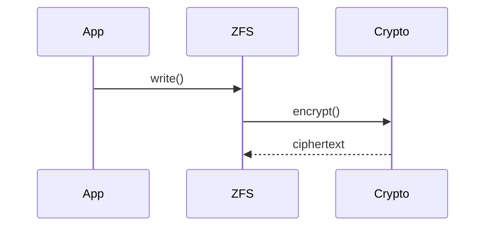
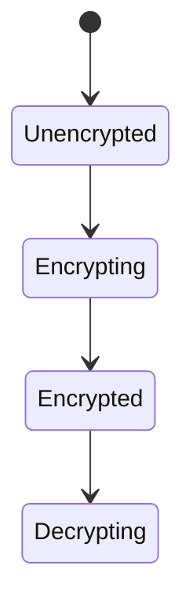

# 调研图示方法论（Research Diagram Methodology）

> **准则**：所有 `research` 报告必含多图 `mermaid` inline，架构师一图建心智模型，ZFS Crypto为首个示范。

## 图集（尽可能多，mermaid）

### P0 必含（3图）

**1. 架构图 C4 L2（Container）**



*Source: `zfs.git/module/zfs/zio.c:120` + `OpenZFS docs`*

**2. 逻辑图 时序/流程**



*Source: `dmu.c:80`*

**3. 生命周期图 状态机**



*Source: `OpenZFS Crypto Design`*

### P1 扩展（按需）

- **数据流图** `graph LR`（明文→加密→存储）
- **部署图** `graph TD`（Pool→Dataset→Key）
- **C4 L1 Context**（用户→ZFS→存储）

## 通用模板

`templates/research-report.md` 含上列6图 `mermaid` 占位，`grep -c '```mermaid'` ≥3 硬拦于 `skill-research` 门禁。

## 可验证性

每图 `Source:` 行必须为可复核 `primary source`（源码行 `file:line` 或官方doc URL），否则 `OOPS!` 式审查 `P08 missing provenance`。

## 门禁

`skill-research` 增加 `grep -c mermaid ≥3` 且每图含 `Source:`，`ci-ontology-gate` 可 `GATE OK`。
