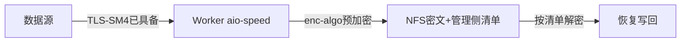

# SM4 NFS 文件存储加密子模式

> 源：`sm4-storage-encryption` 的 `NFS` 四场景之一；落改重验 `records/T2125-0910-guomi-storage-research2/`（结论 `confirmed`）

## 架构

Source: `file: records/T2125-0910-guomi-storage-research2/evidence/research-report.md:§3.3`

## 落改要点（F/143）

- 现状：全仓无 `--enc-algo`；`--encrypt` 系静态 XOR（`rpc-common.cpp:446`），不得计入合规；传输 `--tls-algorithm TLS_SM4_GCM_SM3` 已具备不动。
- 清单四字段：算法/nonce/长度/校验和由备份管理侧维护；半写按清单识别清理重传。
