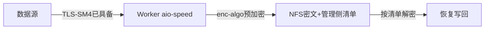

# SM4 NFS 文件存储加密子模式

> 源：`sm4-storage-encryption` 的 `NFS` 四场景之一；方案文档`§3.3`

## 架构

Source: `file: /home/black/Public/aio/F/143/存储国密加密技术方案.md:§3.3`

## 落改要点（F/143）

- 现状约束：全仓无 `enc-algo` 语义；静态 XOR 非合规，不计入合规；传输 TLS 已具备，保持不变。
- 清单模型：算法/nonce/长度/校验和四字段由管理侧清单维护；半写按清单识别清理，下次重传收敛。
